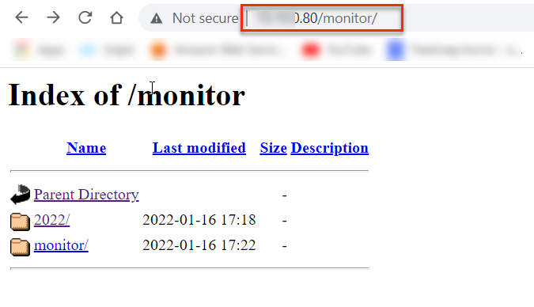
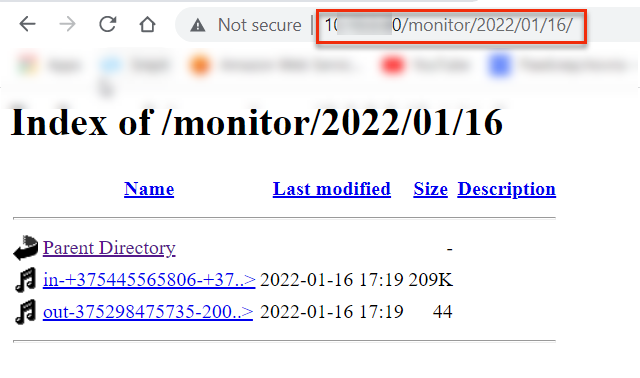
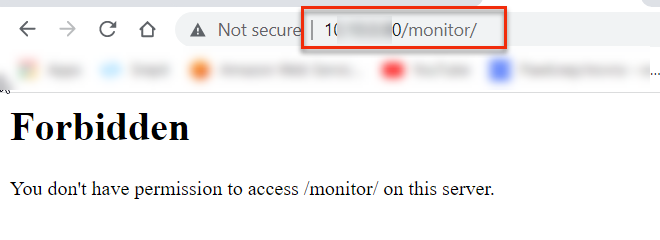
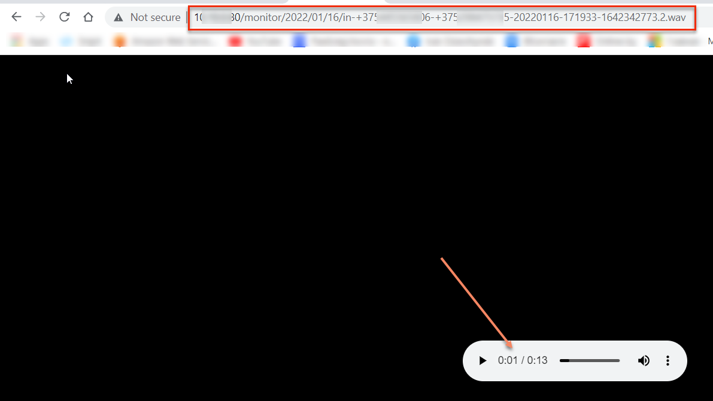

# How to Configure the Integration of Asterisk + FreePBX with Bitrix24 CRM Using the Callbee Service

!!! warning "Important warning"
    *To enable integration, you need to __follow__ the steps in this instruction one by one __in the order in which they are described.__*

!!! warning "Important warning"
    *__The visual placement__ of some elements in the integration settings __may vary__ depending on the follow-up adjustments*

## Software requirements:

__Asterisk + FreePBX,__ hereinafter referred to as __PBX__

* __Asterisk__ version __13.\*.\* or higher__
* __FreePBX__ version __13.\*.\* or higher__
* __Static IP address__ (must be purchased from your Internet service provider) to access the PBX directly via the Internet

The integration is carried out by connecting the __Callbee__ cloud service to the PBX using the __Asterisk Managment Interface (AMI)__ via the __TCP protocol.__ __AMI__ accepts connections on a __network port__ (by default,__TCP port 5038__)


## Network Settings

!!!Info
    * The port forwarding setup interface differs depending on the router used in your network. Updated instructions on port forwarding for your router are available online.*

In order for the __Callbee__ service to connect to your __PBX__, you should have a "__whitelisted__" __static IP address__ or a domain name with an __A__ record indicating __your IP address__, and the following two ports should be forwarded to the __PBX__ using __NAT__:

* __an external port__ (e.g. 50380) forwarded to __TCP port 5038__ - to access the PBX via AMI (Security warning! We recommend opening the port by allowing connection from the IP addresses specified in the [list](/en/#service-ip-address-list))
* __an external port__ (e.g. 50381) forwarded to __TCP port 80__ (the standard port of the PBX web server) – for downloading call records

## Settings for Call Recording


For the call records to be available for downloading, you need to run __two commands __on the
telephony application server__, connecting to it via __SSH__:
    
``` sh
ln -s /var/spool/asterisk/monitor/ /var/www/html/monitor
```
Running the command above will create __a symbolic link__ to the directory storing __the call records.__ The call records directory will be accessible at __http://server_address/monitor__




``` sh
touch /var/www/html/.htaccess && echo "Options -Indexes" > /var/www/html/.htaccess
```
Running the command above (__for security reasons__) __will restrict access and hide __the call records directory__ at __http://адрес_сервера/monitor__ 

  
However, __you will be able to access__ the call records for integration __via the direct link__


## Installing and Configuring the Callbee Application in Bitrix24

!!!Info
    *To set up the integration, any edition of cloud or self-hosted version of Bitrix24 is required.*
* Log in to your Bitrix24 corporate portal under an __ administrator account__.
* In Bitrix24 __main menu__, go to __Applications__:

  

* In the __Category__ search bar, select __Telephony integration__ or __VoIP__

  
  
  
* Go to the __Callbee__ application page and click __Install __:
  
  


####  Adding Employees’ Extension Phone Numbers in Bitrix24

* Go to __Employees (1)__
* Open __an Employee profile (2)__
  
* Add the __employee’s extension phone number(3)__
  


 
!!! warning "Important warning"
    *__Further Bitrix24 configuration__ should be performed __after__  Asterisk + FreePBX have been configured*

## Asterisk + FreePBX Configuration

!!! warning "Important warning"

    * __Extensions__ can be __three-digit__ or __four-digit__ (__222__ or __2222__).
    * _On all inbound routes__, the expected __incoming DID number__ should be __at least five-digit__, it can be a line number in __international format__ (example: __+375291111111__).
    * __All inbound routes__ and __outbound routes__ __must have__ call recording __enabled__.
    * __Callbee does not alter__ the incoming phone number. Incoming phone numbers will be forwarded to Bitrix24 __as received by the PBX.__(We recommend using the PBX to convert all incoming phone numbers to a __uniform international format__). 
    * When a call is made in Bitrix24 via the click-to-call feature, the PBX receives the phone number in the __international format.__
    * For the integration to work correctly, we recommend leaving the __default PBX settings__ except for the ones specified in this instruction.
    * If an incoming call __does not reach__ the PBX or an outgoing call goes to the line, __no entities will be created in Bitrix24.__
    * The integration __does not guarantee__ the correct operation of features when using the FreePBX __Ring Groups__ module to configure the distribution of incoming calls in the PBX. For all integration features to work correctly, we recommend using __Queues__ instead of __Ring Groups.__

####  Asterisk AMI Configuration

To connect to the __Asterisk AMI__, __a user’s AMI__ needs to be created on the __Asterisk__ side. This could be done in __two__ ways:

* __Method 1__ via __CLI__:

    In the file at __/etc/asterisk/manager_custom.conf__ add (as an example):

    ``` conf
    [callbee] 
    secret=password                       # Substitute ‘password’ with your own password
    deny=0.0.0.0/0.0.0.0 
    permit=127.0.0.1/255.255.255.0
    permit=89.108.65.246/255.255.255.255
    permit=31.24.92.54/255.255.255.255
    permit=46.101.225.17/255.255.255.255
    read=system,call,log,verbose,command,agent,user,config,command,dtmf,reporting,cdr,dialplan,originate,message
    write=system,call,log,verbose,command,agent,user,config,command,dtmf,reporting,cdr,dialplan,originate,message
    writetimeout = 500
    ```

    Then __run__ the command
    ``` sh
    asterisk -rx "manager reload"
    ```

* __Method 2__ via the __FreePBX__ User Interface:

    * __Asterisk API__ module should be installed
    * In the menu, select __Settings(1)__  -> __Asterisk Manager Users(2)__
    
    * Click __Add Manager__
    * In the __General__ tab, enter a __login__, set a __ cryptographically strong password__, and
__add the access rights__ in __Permit__, entering the __IP addresses__ of the __Callbee 89.108.65.246, 31.24.92.54, 46.101.225.17__ servers to the __AMI interface__
    
    * In the __Permissions__ tab, set all the toggles to __Yes__
    


#### Inbound Routes Configuration in FreePBX

Example of standard configuration:

* Go to __Connectivity -> Inbound Routes__

* Click the __General__ tab

* Click the __Advanced__ tab, set the value of the __Pause Before Answer__ parameter to __"2"__


!!!Info
    *To enable smart routing, you need to __leave time to receive a response from the CRM system__ to a request for an existing contact having an identified phone number. To do this, __you need__ to set a delay on the __Pause Before Answer__ routes (for example, a two-second delay).*

* In the __Other__ tab, set the __Call Recording__ parameter to __Yes__ 


!!!Info
    *This configuration is performed __to record calls upon receiving them in the CRM system__.*

#### Outbound Routes Configuration in FreePBX


!!! warning "Important warning"
    *The __Route CID__ field should be left blank*

Example of standard configuration:

* Go to __Connectivity -> Outbound Routes__

* Click the __Route Settings__ tab

* Go to the __Additional Settings__ tab


!!!Info
    * This configuration is performed __ to record calls upon receiving them in the CRM system__.*

####  Extensions Configuration in FreePBX

!!! warning "Important warning"
    * __Extensions__ should be __three-digit__ or __four-digit__ (__208__ or __2080__)
    * The __Outbound CID__ field should be left __to its default setting__
    * __Extensions__ should be set up using the __CHAN_SIP__ or __PJ_SIP__ drivers
    
    * Leave the call recording settings __as default__ (the records are recorded __while routing__)
    


##  Enabling the Integration on Callbee Side

After performing __all the configuration__ as described above, you need to __enable__ the service.

#### Enabling the Integration on Callbee Side Manually

* Click the __Install__ button in the __BITRIX24 WITH ASTERISK__ tab.

* Fill in __all the fields required__ for integration

    * __Bitrix24 Domain (1)__ -  Enter the __domain name__ of your Bitrix24 __(without https://)__
    * __Asterisk AMI Host (2)__ - Enter the __external IP address__ of the AMI interface or its domain name
    * __Asterisk AMI Port (3)__ - Enter the __external port__ of the AMI interface
    * __Asterisk AMI Username (4)__ - Enter the __AMI Username__ (See [AMI Asterisk Configuration](#asterisk-ami-configuration)) 
    * __Asterisk AMI Secret (5)__ - Enter the __AMI Secret__ (See [AMI Asterisk Configuration](#asterisk-ami-configuration)) 

#### Enabling the Integration on Callbee Side Using an Installer

* Click __Install Integration__

* Select __Bitrix24__ in the __CRM__ field
* Select __Asterisk__ in the __Platform__ field

* Fill in all the __required fields__

    * __Asterisk AMI Host (1)__ - Enter the __external IP address__ of the AMI interface or its domain name
    * __Asterisk AMI Port (2)__ - Enter the __external port__ of the AMI interface
    * __Asterisk AMI Username (3)__ - Enter the __AMI Username__ (See [AMI Asterisk Configuration]((#asterisk-ami-configuration)))
    * __Asterisk AMI Secret (4)__ - Enter the __AMI Secret__ (See [AMI Asterisk Configuration]((#asterisk-ami-configuration)))

#### Configuring the Integration on Callbee Side for Each Separate PBX Line (Available in Pro Version and Demo Mode)


  * __Use B24 users table (1)__ - __Transfer of the integration extensions settings from Bitrix24 to Callbee.__
  * __Record URL (2)__ - __Link for call records__. Using this URL, Bitrix24 will save a recording of the call. __This link__ should __always be available__. 
  
!!! warning "Important warning"
    If the __PBX telephony server__ is located in the __same LAN__ as the __self-hosted version__ of Bitrix24, you can enter the local IP address of the PBX, but in this case the availability indicator will turn red (indicating an incorrect URL).
    


  * __Ignore Lines (DID) Numbers (3)__ - Enter the __DID__ number(s) __separated by a comma and a single space__ which the integration __should ignore__. This feature allows you __not to respond__ to phone numbers not related to work in the CRM system. For example, direct dial numbers of the accounting or administrative department.
  * __Line (DID) (4)__ - Department/division phone number. A phone number for __incoming calls__ that need to be referred to a __division/department__ (the number is taken from the __DID Number__ field in the __FreePBX settings__)
  * __Description (5)__ - Line (DID) __description__. It will be used to fill in the __Line__ field in a __Contact card__ and a __Deal card__ in __Bitrix24__. If the Description field is left __blank__, the __line phone number (DID)__ will be forwarded
  * __Manager ID For Missed Calls (6)__ - __Bitrix24 user ID__ for __missed calls__ (a user responsible for missed calls from new customers not registered in Bitrix24). You can set a different value for each line. __This field should not be left blank!__

!!! info
    You can find the __Manager ID__ by opening the __employee's Bitrix24 profile__ in the __address bar of your browser__
    
    In the screenshot above, the __Manager ID__ value is set to __1__


  * __Smart Call (7)__ - Enabling smart routing (transferring a call to a designated employee) __with working hours indicated__. __Outside of the smart routing schedule__ __the call__ will be transferred according to the __default route__. This feature is most often used to play a message to a customer that he got through after hours.
  * __Manager time in bitrix24 (8)__ - Enabling __work schedule__ for smart routing __from Bitrix24__
  * __Auto Lead (Deal) (9)__ - Enabling __automatic creation__ of leads or deals (+ contacts) in Bitrix24 (depending on the Bitrix24 mode of operation)
  * __Add to chat bitrix24 (10)__ - Enabling the __displaying of information__ about all calls in the Bitrix24 __chat__
  * __Add DID Lines (11)__ - Adding a line for customization
  * __SAVE AND RESTART (12)__ - __Saving__ the settings while __simultaneously restarting__ the integration


#### Configuring the Integration on Callbee Side for Each Extension

!!! warning "Important warning"
    *To configure the __extensions__ using the __Callbee__ service, you need to __enable__ the __Use B24 users table__ toggle*
    

* Go to __integration settings__, click __Settings__

* __Enable__ the __Use B24 users table__ toggle

* After enabling the __Use B24 users table__ button, the __Bitrix24 users__ menu item will appear, go to it


* __Go to settings (1)__ - Go to the settings page
* __Integration Info (2)__ - Integration information
* __Show active users (3)__ - Filter to display __active__ users
* __Save and restart (4)__ - __Saving__ the settings and __restarting__ the integration
* __Search (5)__ - Searching for entries in the settings table
* __Active (6)__ - Enabling the __user (employee) settings__ via Callbee. __Activating the commercial license__ for this __user__ (__active users__ should __not exceed the number of licenses__). If the toggle is set to __Off__, the integration will __ignore__ this user, even if the extension phone number is entered, and all other fields are filled in.
* __Bitrix ID (7)__ - User (employee) ID __in Bitrix 24__
* __Name (8)__ - User (employee) name __in Bitrix24__
* __Internal Number (9)__ - __User’s (employee’s) extension phone number in __FreePBX__
* __External Number (10)__  -  The __personal phone number__ of the user (employee) who will __make calls on a mobile device__ using the __Bitrix24 click-to-call feature__. When using the click-to-call feature  on a mobile device, a call will be made in __both__ directions - to the __user (employee) __ and the __customer__ of your company. The number is used to __interact__ with the Bitrix24 application on a mobile device and __make calls__ using the click-to-call feature.
* __Smart Call (11)__ - Enabling smart routing (transferring a call to a designated employee) __with working hours indicated__. __Outside of the smart routing schedule__ __the call__ will be transferred according to the __default route__. This feature is most often used to play a message to a customer that he got through after hours.
* __B24 Time (12)__ - Enabling the user’s (employee’s) __work schedule__ for smart routing __from Bitrix24__
* __Add to Chat (13)__ - Enabling the __displaying of information__ about all calls in the Bitrix24 __chat__
* __Auto Answer (14)__ - Enabling the __auto answer__ feature on a __SIP phone__ (hardware or software (softphone). When making calls using the click-to-call feature via __Callbee__,  the call is initially __routed__ as an __incoming call__ to a __SIP phone__ (hardware or software), and after it is __received__, an __outgoing call__ is made to a customer of your company. Enabling this feature will allow a __SIP phone__ (hardware or software) to receive a call __automatically__, __without the involvement__ of a user (employee). It can be enabled if the __SIP phone__ (hardware or software) __supports this feature__ (for example, Yealink SIP phones with the latest firmware) 
* __Multiple Registration (15)__ - Enabling the __Multiple Registration__ feature allows you to use the click-to-call feature when you have __a number of SIP phones__ (hardware or software)

!!! warning "Important warning"
    

    When this feature is __enabled__, the __auto answer__ feature (from the previous paragraph) is __automatically disabled__.

## Bitrix24 Configuration.

!!! warning "Important warning"
    *If you do not see the items __described below__, please __check the correctness of the implementation of previous settings!!!__*


* In __Bitrix24 main menu__, go to __Telephony __  
  

* Then select __Configure telephony > Telephony settings (1)__
  
* In Telephony settings, click __Default outbound number (2) -> Application: Asterisk and Yeastar Callbee.io__ 

Then click __Save __


__Integration setup is completed!__
