# Настройка интеграции Asterisk + FreePBX c CRM Битрикс24 при помощи сервиса Callbee

!!! warning "Важное замечание"
    *Для подключения интеграции необходимо __поочередно выполнить__ пункты данного руководства __в той последовательности, как они описаны.__*

!!! warning "Важное замечание"
    *__Визуальное размещение__ некоторых элементов в настройках интеграции __может изменяться__ в зависимости от доработок*

## Необходимые требования:

__Asterisk + FreePBX__ далее __АТС__

* __Asterisk__ не старше версии __13.\*.\*__
* __FreePBX__ не старше версии __13.\*.\*__
* __Статический IP адрес__ (необходимо приобрести у вашего интернет-провайдера) для прямого доступа к АТС из сети Интернет

Интеграция осуществляется при помощи подключения облачного сервиса __Callbee__ к АТС при помощи __Asterisk Managment Interface (AMI)__ посредством __TCP протокола.__ __AMI__ принимает __подключения__, устанавливаемые на __сетевой порт__ (по умолчанию - __TCP порт 5038__)


## Сетевые настройки

Для того чтобы сервис __Callbee__ мог подключится к вашей __АТС__, у вас обязательно должен быть "__белый__" __статический IP адрес__ либо доменное имя с __A__-записью на __ваш IP адрес__, и проброшены через __NAT__ к __АТС__ следующие два порта:

* __внешний порт__ (например 50380) на порт __5038 TCP__ - для доступа к АТС по AMI (Замечание по  безопасности!  Рекомендуем открывать порт разрешив подключение с IP адресов указанных в [списке](/#ip))
* __внешний порт__ (например 50381) на порт __80 TCP__ (стандартный порт веб - сервера АТС) - для выгрузки записей разговоров

Для того чтобы запись разговоров была доступна для скачивания, необходимо на __сервере
телефонии__ выполнить две команды подключившись по __SSH__:
    
``` sh
ln -s /var/spool/asterisk/monitor/ /var/www/html/monitor
touch /var/www/html/.htaccess && echo "Options -Indexes" > /var/www/html/.htaccess
```

!!!Info
    *Интерфейс настройки проброса портов отличается в зависимости от используемого в вашей сети маршрутизатора. Актуальную инструкцию по пробросу портов под ваш маршрутизатор вы можете найти в интернете.*    

## Установка и настройка приложения Callbee в Битрикс24

!!!Info
    *Для настройки интеграции вам необходимо иметь: Облачный или коробочный Битрикс24 любой редакции.*
* Войдите в свой корпоративный портал Битрикс24 __пользователем с правами администратора__.
* В __меню__ Битрикс24 перейдите на страницу __«Приложения»__:

  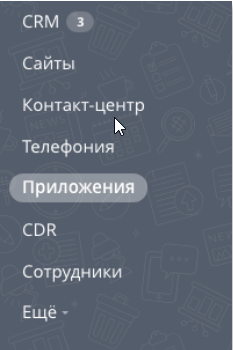

* В строке поиска __«Категория»__ выберете __«Интеграция с телефонией»__ или __«IP- телефония»__

  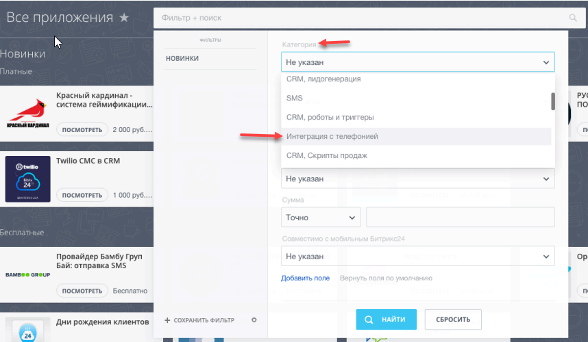
  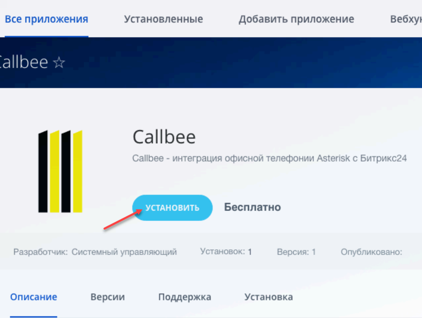
  
* Перейдите на страницу приложения __«Callbee»__ и нажмите кнопку __«Установить»__:
  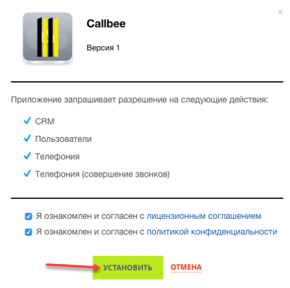
  


####  Добавление внутренних телефонов у сотрудников в Битрикс24

* Перейдите на __страницу Сотрудники (1)__
* Откройте __профиль Сотрудника (2)__
  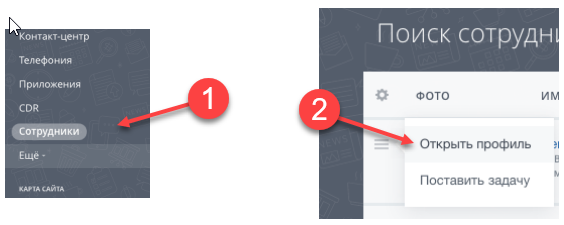
* Внесите __внутренний номер__ телефона __сотрудника (3)__
  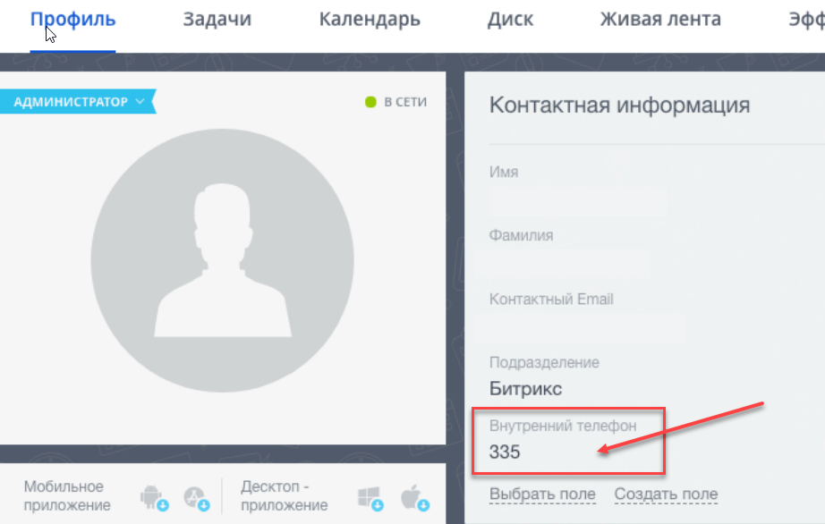


 
!!! warning "Важное замечание"
    *__Дальнейшую настройку__ Битрикс24 необходимо производить __после__ настройки Asterisk + FreePBX*

## Настройка Asterisk + FreePBX

!!! warning "Важное замечание"

    * __Внутренние номера (Extensions)__ могут быть __трехзначными__ или __четырехзначными__ (__222__ или __2222__).
    * __На всех входящих маршрутах (Inbound Routes)__ ожидаемый __входящий номер DID__ должен быть __не менее 5 цифр__, это может быть номер линии в __международном формате__ (например: __+375291111111__).
    * __На всех входящих (Inbound Routes)__ и __исходящих маршрутах (Outbound Routes)__ __обязательно__ должны быть __включены__ записи разговоров.
    * Сервис __Callbee не изменяет__ входящий номер телефона. Входящий номер телефона будет проброшен в Битрикс24 __том виде в каком он поступил на АТС.__(Рекомендуется средствами АТС приводить все входящие номера телефонов к __единому международному формату__). 
    * При звонке по клику из Битрикс24 на АТС поступает номер телефона в __международном формате.__
    * Для корректной работы интеграции мы рекомендуем настройки на АТС, которые не указаны в данной инструкции, __оставить по умолчанию.__ 
    * Если входящий вызов __не попадает__ на АТС или исходящий вызов уходит в линию, то никакие сущности в Битрикс24 создаваться __не будут.__
    * Интеграция __не гарантирует__ корректную работу функций при использовании модуля FreePBX __Ring Groups__ для настройки распределения входящих вызовов в АТС. Для корректной работы всех функций интеграции рекомендуем вместо __Ring Groups__ использовать __Queues__


####  Настройка AMI Asterisk

Для подключения к __AMI Asterisk__ нужно создать __AMI пользователя__ на стороне __Asterisk.__ Это можно сделать __двумя__ способами:

* __Способ 1__ через __CLI__:

    В файле __/etc/asterisk/manager_custom.conf__ добавить (например):

    ``` conf
    [callbee] 
    secret=password                       # Вместо password указываем свой пароль
    deny=0.0.0.0/0.0.0.0 
    permit=127.0.0.1/255.255.255.0
    permit=89.108.65.246/255.255.255.255
    permit=31.24.92.54/255.255.255.255
    permit=46.101.225.17/255.255.255.255
    read=system,call,log,verbose,command,agent,user,config,command,dtmf,reporting,cdr,dialplan,originate,message
    write=system,call,log,verbose,command,agent,user,config,command,dtmf,reporting,cdr,dialplan,originate,message
    writetimeout = 500
    ```

    После чего __выполнить__ команду
    ``` sh
    asterisk -rx "manager reload"
    ```

* __Способ 2__ через интерфейс __FreePBX__:

    * Должен быть установлен модуль __Asterisk API__
    * Выберете пункт меню __«Settings»(1)__  -> __«Asterisk Manager Users»(2)__
    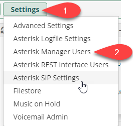
    * Нажмите __«Add Manager»__
    * Во вкладке __«General»__ указать __имя__ учетной записи, задать __криптостойкий пароль__ и
__добавить доступ__ в пункт __«Permit»__, указав __IP адреса__ серверов __Callbee 89.108.65.246, 31.24.92.54, 46.101.225.17__ к __AMI-интерфейсу__
    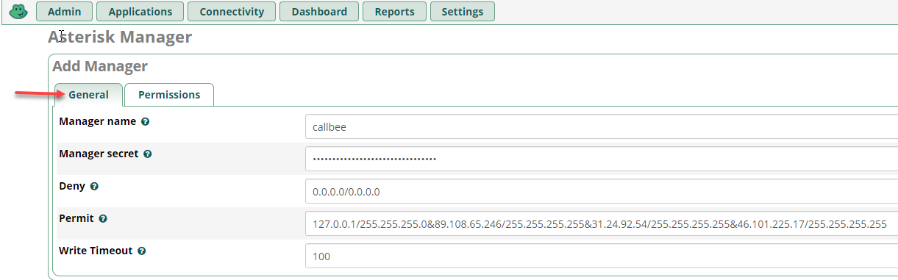
    * Во вкладке __«Permissions»__ установить все переключатели в положение __«Yes»__
    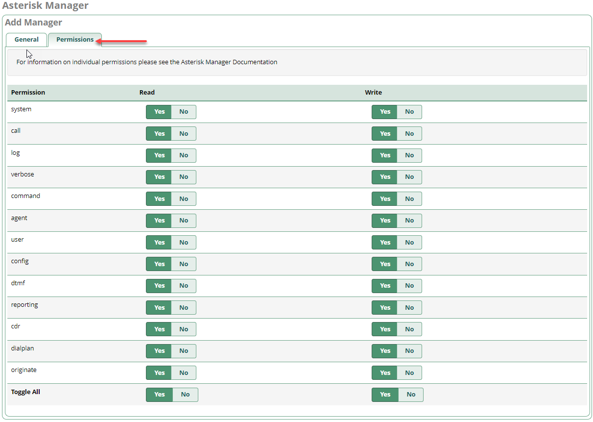


#### Настройка «Входящей маршрутизации (Inbound Routes)» в FreePBX

Пример стандартной настройки:

* Перейдите __«Connectivity» -> «Inbound Routes»__
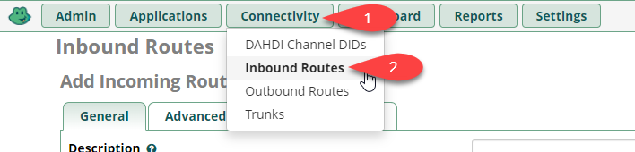
* Вкладка __«General»__
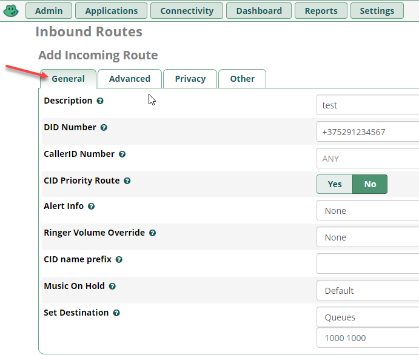
* Вкладка __«Advanced»__, на параметре __«Pause Before Answer»__ устанавливаем значение равным __"2"__
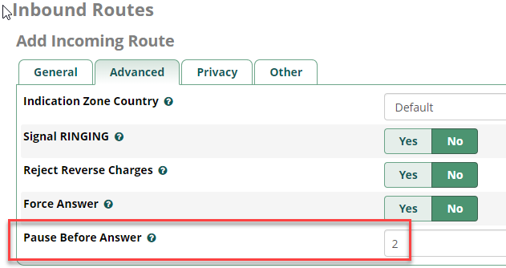

!!!Info
    Для работы умной маршрутизации необходимо __успеть получить ответ от CRM__ на запрос наличия существующего контакта с определившимся номером телефона. Для этого __необходимо__ выставлять задержку на маршрутах __«Pause Before Answer»__ (например 2 сек)

* Вкладка __«Other»__, значение параметра __«Call Recording»__ устанавливаем __«Yes»__ 


!!!Info
    *Данная настройка выполняется для __получения записей разговоров в CRM__*

#### Настройка «Исходящей маршрутизации (Outbound Routes)» в FreePBX


!!! warning "Важное замечание"
    *Поле __Route CID__ должно быть пустым*

Пример стандартной настройки:

* Перейдите __«Connectivity» -> «Outbound Routes»__
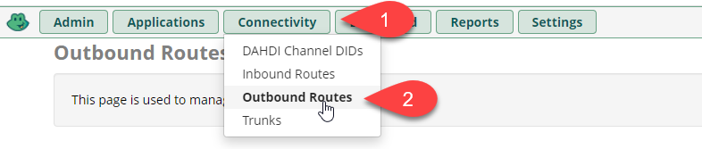
* Вкладка __«Route Settings»__

* Вкладка __«Additional Settings»__
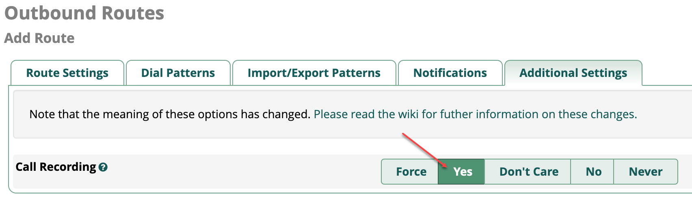

!!!Info
    *Данная настройка выполняется для __получения записей разговоров в CRM__*

####  Настройка «Внутренних номеров(Extensions)» в FreePBX

!!! warning "Важное замечание"
    * __Внутренние номера («Extensions»)__ должны быть __трех-__ или __четырехзначные__ (__208__ или __2080__)
    * __«Outbound CID»__ оставить __по умолчанию__
    * __Внутренние номера__ необходимо настраивать с использованием драйвера __CHAN_SIP__ или __PJ_SIP__
    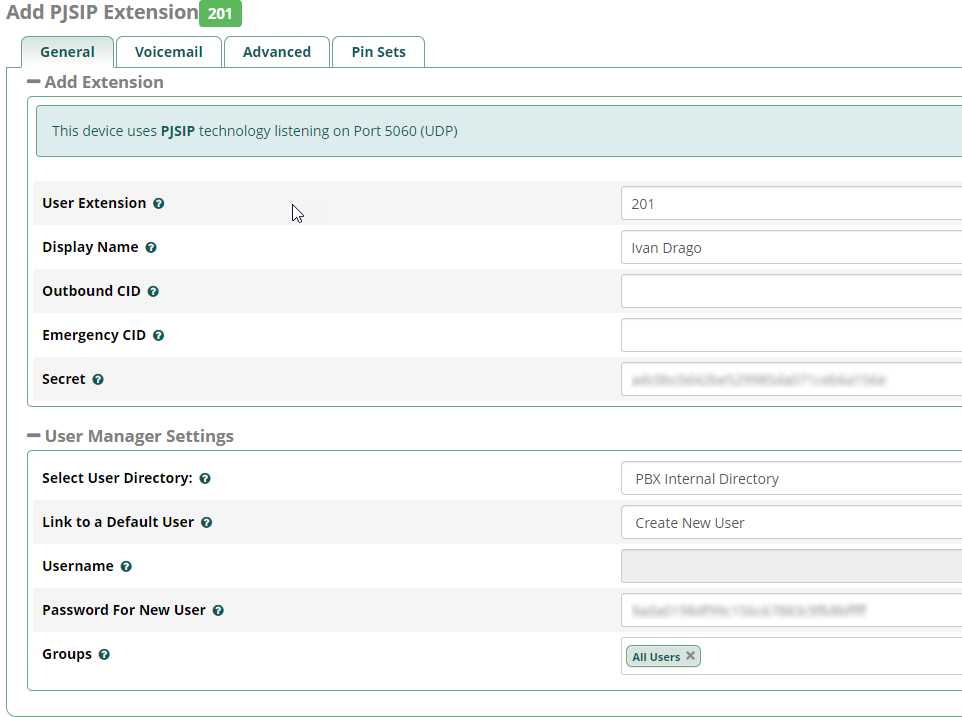
    * Настройку __записей разговоров__ оставить __по умолчанию__ (записи записываются __на маршрутах__)
    


##  Подключение интеграции на стороне сервиса Callbee

После проведения __всех настроек__ описанных выше необходимо произвести __подключение__ сервиса.

#### Подключение интеграции на стороне сервиса Callbee вручную

* Нажмите кнопку __BITRIX24 WITH ASTERISK «Install»__
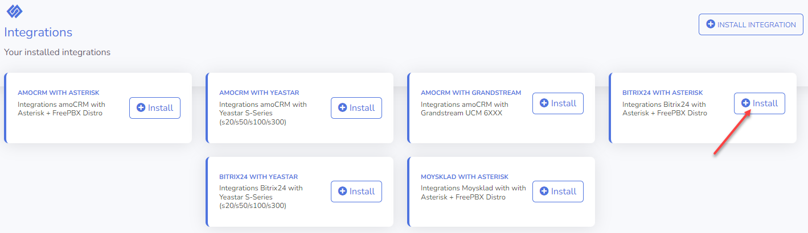
* Заполните __все необходимые__ пункты для интеграции
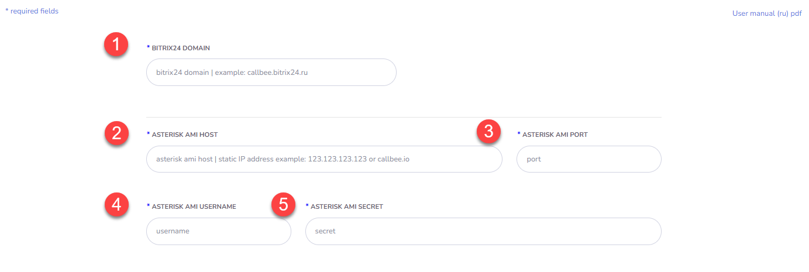
    * __Bitrix24 Domain (1)__ -  Указываем __доменное имя__ вашего Битрикс24 __(без https://)__
    * __Asterisk AMI Host (2)__ - Указываем __внешний ip-адрес__ AMI интерфейса, или его доменное имя
    * __Asterisk AMI Port (3)__ - Указываем __внешний порт__ AMI интерфейса
    * __Asterisk AMI Username (4)__ - Указываем __AMI Username__ (Смотрите раздел [Настройка AMI Asterisk](#настройка-ami-asterisk)) 
    * __Asterisk AMI Secret (5)__ - Указываем __AMI Secret__ (Смотрите раздел [Настройка AMI Asterisk](#настройка-ami-asterisk))

#### Подключение интеграции на стороне сервиса Callbee через установщик

* Нажмите __«Install Integration»__
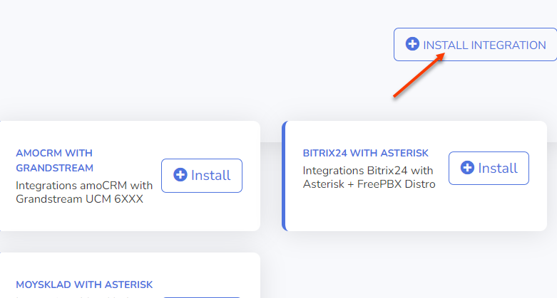
* Выберите __Bitrix24__ в поле __CRM__
* Выберите __Asterisk__ в поле __Platform__
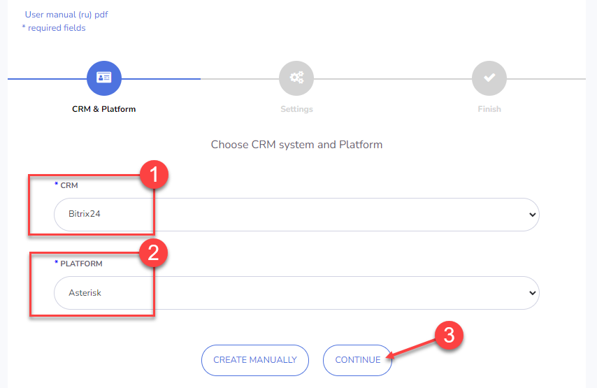
* Заполните все __необходимые поля__
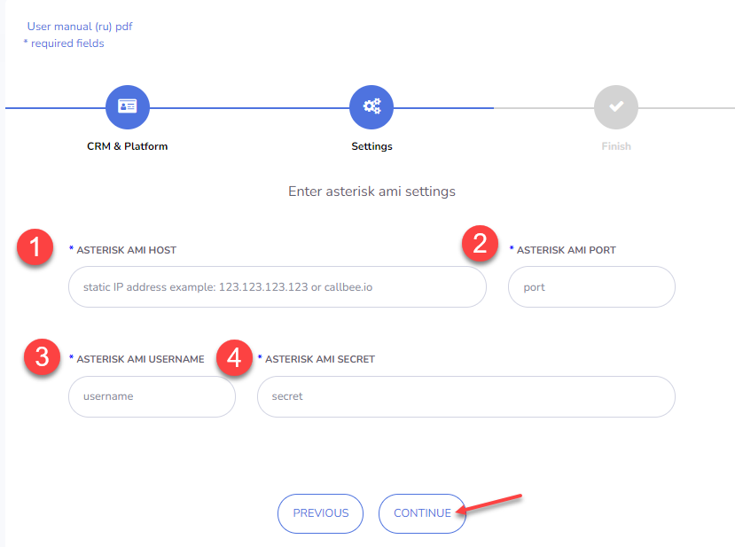
    * __Asterisk AMI Host (1)__ - Указываем __внешний ip-адрес__ AMI интерфейса, или его доменное имя
    * __Asterisk AMI Port (2)__ - Указываем __внешний порт__ AMI интерфейса
    * __Asterisk AMI Username (3)__ - Указываем __AMI Username__ (Смотрите раздел __Настройка AMI Asterisk__)
    * __Asterisk AMI Secret (4)__ - Указываем __AMI Secret__ (Смотрите раздел __Настройка AMI Asterisk__)

#### Настройка интеграции на стороне сервиса Callbee для каждой линии АТС в отдельности (доступно в pro-версии и demo-режиме)


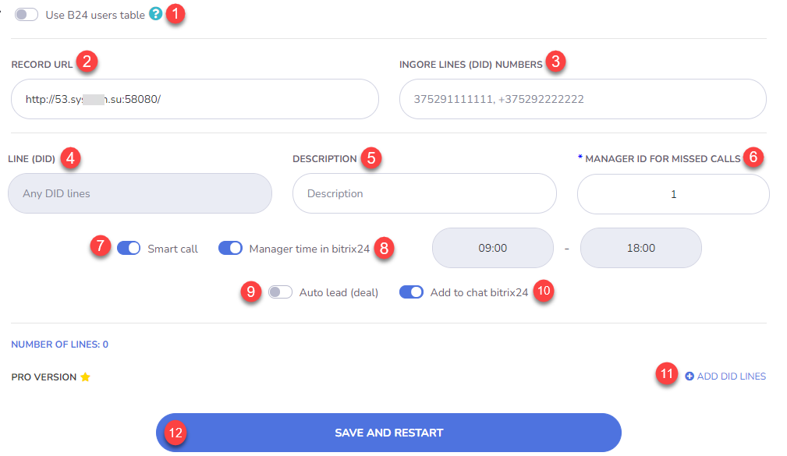
  * __Use B24 users table (1)__ - __Перенос настройки внутренних номеров интеграции из Битрикс24 в Callbee.__
  * __Record URL (2)__ - __Ссылка__ для __записей разговоров__. По данной ссылке Битрикс24 будет __сохранять себе__ запись разговора. __Ссылка__ должна быть __всегда доступна__. 
  
!!! warning "Важное замечание"
    Если __сервер телефонии АТС__ находится в __одной локальной сети__ с __коробочной версией__ Битрикс24, то __можно__ указывать __локальный IP-адрес АТС__, но в таком случае __индикатор доступности__ будет гореть __красным__ цветом (указывать что ссылка некорректна).
    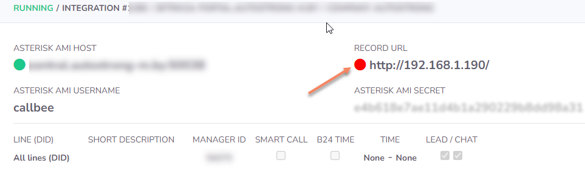


  * __Ignore Lines (DID) Numbers (3)__ - Указываем __DID__ номер(а) __через запятую и один пробел__, на которые интеграция __не будет__ реагировать. Эта функция позволяет __не реагировать__ на номера, не относящиеся к работе в CRM. Например прямые номера бухгалтерии или администрации.
  * __Line (DID) (4)__ - Номер подразделения отдела. Номер для __входящих звонков__, который относится к __подразделению/отделу__ (номер берется из настроек __FreePBX__ поля __DID Number__ )
  * __Description (5)__ - __Описание__ линии (DID), будет заполнять поле __Линия__ в __карточке Контакта__ и __Сделки__ в __Битрикс24__, если оставить поле Description __пустым__ будет проброшен __номер линии (DID)__ 
  * __Manager ID For Missed Calls (6)__ - __ID пользователя в Битрикс24__ для __пропущенных вызовов__ (ответственный пользователь за пропущенные вызовы для новых клиентов, которых нет в Битрикс24). Можно устанавливать для каждой линии свое значение. __Это поле не должно быть пустым!__

!!! info
    Посмотреть какой __Manager ID__ можно открыв __профиль сотрудника__ в Битрикс24 в __адресной строке__ Вашего __браузера__
    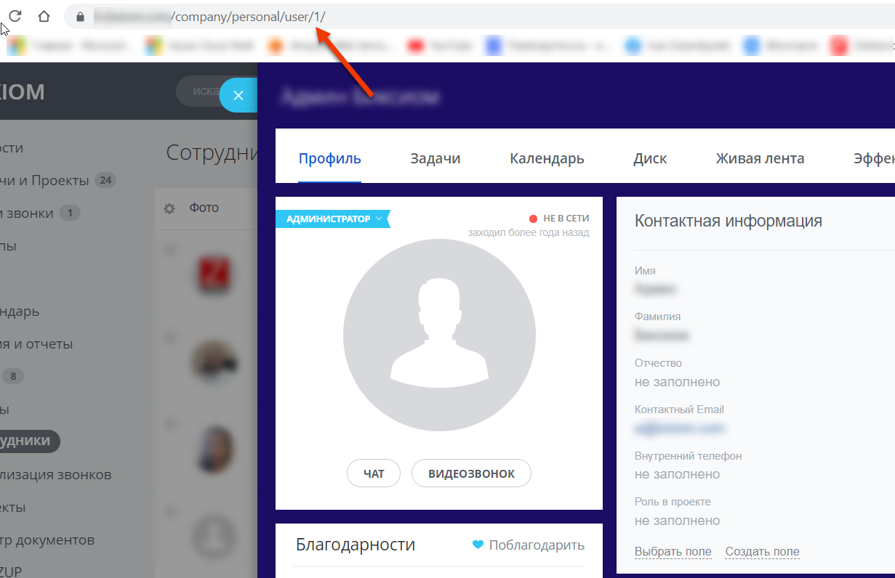
    На скриншоте выше значение __Manager ID__ равно __1__


  * __Smart Call (7)__ - Включение __умной маршрутизации__ (перевод звонка на ответственного сотрудника) __с указанием времени работы__. __Вне графика работы__ умной маршрутизации __звонок__ будет идти по __маршруту по умолчанию__. Чаще всего применяется для того, чтобы проиграть клиенту сообщение о том, что он дозвонился в нерабочее время.
  * __Manager time in bitrix24 (8)__ - Включение __графика работы__ для умной маршрушизации __из Битрикс24__ 
  * __Auto Lead (Deal) (9)__ - Включение __автоматического создания__ лидов или сделок (+контакт) Битрикс24 (в зависимочсти от режима работы Битрикс24)
  * __Add to chat bitrix24 (10)__ - Включение __отображения информации__ о всех звонках в __чате__ Битрикс24
  * __Add DID Lines (11)__ - Добавление линии для настройки
  * __SAVE AND RESTART (12)__ - __Сохранение__ настроек с __одновременнным перезапуском__ интеграции


#### Настройка интеграции на стороне сервиса Callbee для каждого внутреннего номера.

!!! warning "Важное замечание"
    *Для настройки __внутренних номеров__ через сервис __CallBee__ нужно __включить__ переключатель __«Use B24 users table»__*
    

* Заходим в __настройки интеграции__, нажимаем __«Settings»__
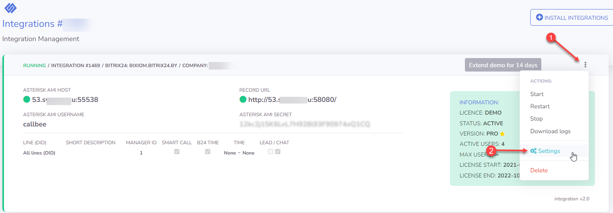
* __Включаем__ переключатель __«Use B24 users table»__

* После включения __«Use B24 users table»__ появится пункт меню __«Bitrix24 users»__, переходим в него

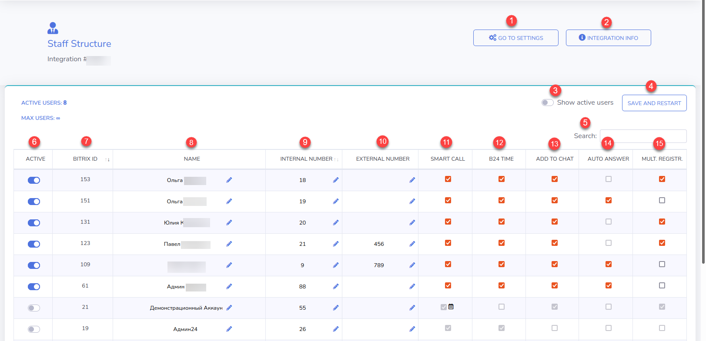
* __Go to settings (1)__ - Переход на страницу настроек
* __Integration Info (2)__ - Информация о интеграции
* __Show active users (3)__ - Фильтр для отображения __активных__ пользователей
* __Save and restart (4)__ - __Сохранение__ настроек и __перезапуск__ интеграции
* __Search (5)__ - Поиск записей в таблице настроек
* __Active (6)__ - Включение __настроек для пользователя (сотрудника)__ через сервис CallBee. __Акитвация коммерческой лицензии__ для этого __пользователя__ (__актиных пользователей__ должно быть __не больше количества лицензий__) Елси переключатель стоит в режиме __off__ то интеграция будет __игнорировать__ это пользователя, даже если у него прописан внутренний номер и заполнены все остальные поля. 
* __Bitrix ID (7)__ - ID пользователя (сотрудника) __в Битрикс24__
* __Name (8)__ - Имя пользователя (сотрудника) __в Битрикс24__
* __Internal Number (9)__ - __Внутренний номер__ пользователя (сотрудника) во __FreePBX__
* __External Number (10)__  -  __Личный номер__ пользователя (сотрудника) что будет совершать __звонки по клику из Битрикс24__ на __мобильном устройстве__. При звонке по клику на мобильном устройстве будет осуществляться вызов __в обе__ стороны - __пользовтателю (сотруднику)__ и __клиенту__ Вашей компании. Номер используется для __взаимодействия__ приложения Битрикс24 на мобильном устройстве и __осуществления вызовов__ звонком по клику.
* __Smart Call (11)__ - Включение __умной маршрутизации__ (перевод звонка на ответственного сотрудника) с указанием __времени работы__. __Вне графика__ работы умной маршрутизации звонок будет идти по маршруту __по умолчанию.__ Чаще всего применяется для того, чтобы проиграть клиенту сообщение о том, что он дозвонился в нерабочее время.
* __B24 Time (12)__ - Включение __графика работы__ для пользователя (сотрудника) __из Битрикс24__ для умной маршрутизации
* __Add to Chat (13)__ - Включение __отображения информации__ о всех звонках в __чате Битрикс24__
* __Auto Answer (14)__ - Включение __автоответа__ на __SIP-телефоне__, (аппаратном или программном (софтфон). При звонке по клику с использованием сервиса __CallBee__  первоначально звонок __приходит__ как __входящий__ на __SIP-телефон__ (аппаратный или программный) и после его __приема__ происходит __исходящий вызов__ клиенту Вашей компании. Включение данной функции позволит __SIP-телефону__ (аппаратному или программному) принимать звонок __автоматически, без участия__ пользователя (сотрудника). В том случае если __SIP-телефон__ (аппаратный или программный) __поддерживает данный фуннкционал__ (например SIP-телефоны Yealink с актуальной прошивкой)  
* __Multiple Registration (15)__ - Включение функции __Multiple Registration__ позволяет пользоваться звонком по клику при наличии __нескольких SIP-телефонов__ (аппаратных или программных)

!!! warning "Важное замечание"
    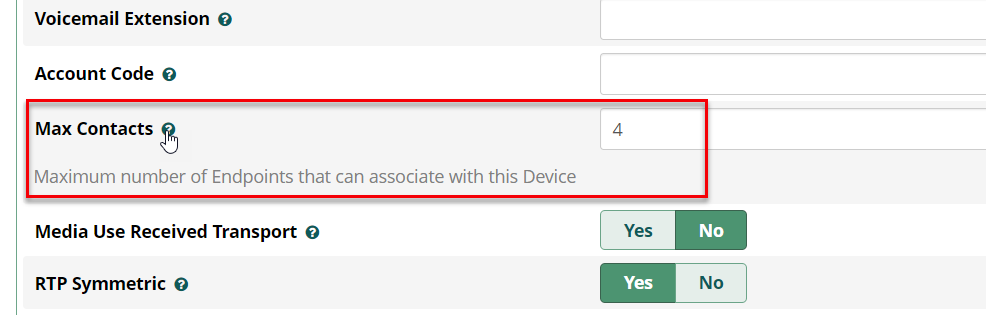

    __При включении__ данной функции __автоматически отключается__ функция __автоответа__ (из предыдущего пункта)


## Настройка в Битрикс24.

!!! warning "Важное замечание"
    *Если пункты, описанные ниже у Вас __отуствуют__, то следует __проверить корректность предыдущих настроек!!!__*


* В __меню Битрикс24__ перейдите на страницу __«Телефония»__
  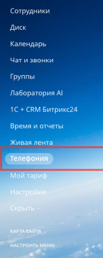
* Далее выбрать __«Настройка телефонии» (1)__
  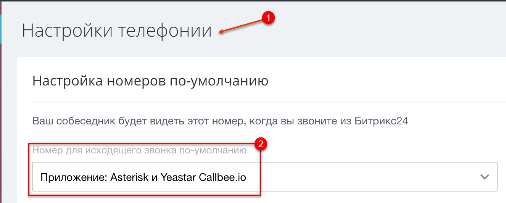
* Настройках телефонии необходимо выбрать в пункте __«Номер для исходящего
звонка по-умолчанию (2)» -> «Приложение Asterisk и Yeastar Callbee.io»__ 

Далее нажимаем __«Сохранить»__


__Настройка интеграции завершена!__    