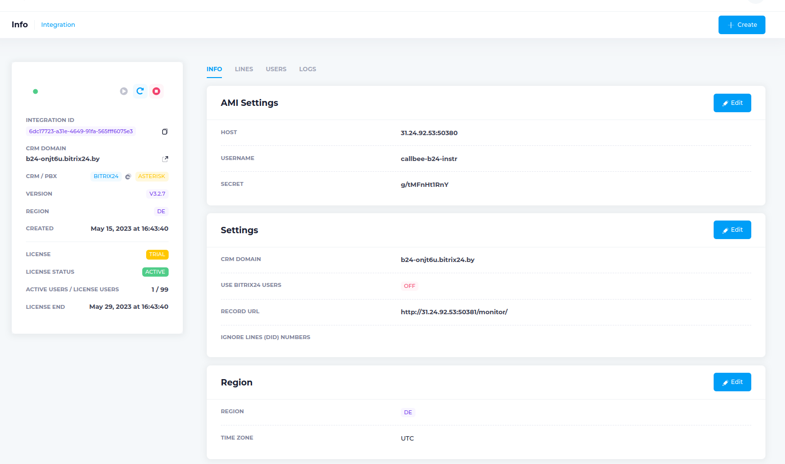

# Настройка интеграции Asterisk + FreePBX c CRM Битрикс24 при помощи сервиса Callbee

!!! warning "Важное замечание"
    *Для подключения интеграции необходимо __поочередно выполнить__ пункты данного руководства __в той последовательности, как они описаны.__*

!!! warning "Важное замечание"
    *__Визуальное размещение__ некоторых элементов в настройках интеграции __может изменяться__ в зависимости от доработок*

## Необходимые требования:

__Asterisk + FreePBX__ далее __АТС__

* __Asterisk__ версия __13.\*.\*__ или выше
* __FreePBX__ версия __13.\*.\*__ или выше
* __Статический IP адрес__ (необходимо приобрести у вашего интернет-провайдера) для прямого доступа к АТС из сети Интернет

Интеграция осуществляется при помощи подключения облачного сервиса __Callbee__ к АТС при помощи __Asterisk Managment Interface (AMI)__ посредством __TCP протокола.__ __AMI__ принимает __подключения__, устанавливаемые на __сетевой порт__ (по умолчанию - __TCP порт 5038__)


## Сетевые настройки

!!!Info
    *Интерфейс настройки проброса портов отличается в зависимости от используемого в вашей сети маршрутизатора. Актуальную инструкцию по пробросу портов под ваш маршрутизатор вы можете найти в интернете.*

Для того чтобы сервис __Callbee__ мог подключится к вашей __АТС__, у вас обязательно должен быть "__белый__" __статический IP адрес__ либо доменное имя с __A__-записью на __ваш IP адрес__, и проброшены через __NAT__ к __АТС__ следующие два порта:

* __внешний порт__ (например 50380) на порт __5038 TCP__ - для доступа к АТС по AMI (Замечание по  безопасности!  Рекомендуем открывать порт разрешив подключение с IP адресов указанных в [списке](/#ip))
* __внешний порт__ (например 50381) на порт __80 TCP__ (стандартный порт веб - сервера АТС) - для выгрузки записей разговоров

## Настройка записи разговоров


Для того чтобы запись разговоров была доступна для скачивания, необходимо на __сервере
телефонии__ выполнить __две команды__ подключившись по __SSH__:
    
``` sh
ln -s /var/spool/asterisk/monitor/ /var/www/html/monitor
```
Выполение команды выше создаст __символьную ссылку__ на каталог с __записями разговоров.__ Каталог с записями станет доступен по адресу __http://адрес_сервера/monitor__


``` sh
touch /var/www/html/.htaccess && echo "Options -Indexes" > /var/www/html/.htaccess
```
Выполнение команды выше (выполняется в __целях безопасности__) __скроет доступ__ к __каталогу с записями__ разговоров по адресу __http://адрес_сервера/monitor__ 

  
но __прямой доступ__ к записям для интегарции __останется__


## Установка и настройка приложения Callbee в Битрикс24

!!!Info
    *Для настройки интеграции вам необходимо иметь: Облачный или коробочный Битрикс24 любой редакции.*
* Войдите в свой корпоративный портал Битрикс24 __пользователем с правами администратора__.
* В __меню__ Битрикс24 перейдите на страницу __«Приложения»__:

  

* В строке поиска __«Категория»__ выберете __«Интеграция с телефонией»__ или __«IP- телефония»__

  
  
  
* Перейдите на страницу приложения __«Callbee»__ и нажмите кнопку __«Установить»__:
  
  


####  Добавление внутренних телефонов у сотрудников в Битрикс24

* Перейдите на __страницу Сотрудники (1)__
* Откройте __профиль Сотрудника (2)__
  
* Внесите __внутренний номер__ телефона __сотрудника (3)__
  


 
!!! warning "Важное замечание"
    *__Дальнейшую настройку__ Битрикс24 необходимо производить __после__ настройки Asterisk + FreePBX*

## Настройка Asterisk + FreePBX

!!! warning "Важное замечание"

    * __Внутренние номера (Extensions)__ могут быть __трехзначными__ или __четырехзначными__ (__222__ или __2222__).
    * __На всех входящих маршрутах (Inbound Routes)__ ожидаемый __входящий номер DID__ должен быть __не менее 5 цифр__, это может быть номер линии в __международном формате__ (например: __+375291111111__).
    * __На всех входящих (Inbound Routes)__ и __исходящих маршрутах (Outbound Routes)__ __обязательно__ должны быть __включены__ записи разговоров.
    * Сервис __Callbee не изменяет__ входящий номер телефона. Входящий номер телефона будет проброшен в Битрикс24 __том виде в каком он поступил на АТС.__(Рекомендуется средствами АТС приводить все входящие номера телефонов к __единому международному формату__). 
    * При звонке по клику из Битрикс24 на АТС поступает номер телефона в __международном формате.__
    * Для корректной работы интеграции мы рекомендуем настройки на АТС, которые не указаны в данной инструкции, __оставить по умолчанию.__ 
    * Если входящий вызов __не попадает__ на АТС или исходящий вызов уходит в линию, то никакие сущности в Битрикс24 создаваться __не будут.__
    * Интеграция __не гарантирует__ корректную работу функций при использовании модуля FreePBX __Ring Groups__ для настройки распределения входящих вызовов в АТС. Для корректной работы всех функций интеграции рекомендуем вместо __Ring Groups__ использовать __Queues__


#### Настройка AMI Asterisk

Для подключения к __AMI Asterisk__ нужно создать __AMI пользователя__ на стороне __Asterisk.__ Это можно сделать __двумя__ способами:

* __Способ 1__ через __CLI__:

    В файле __/etc/asterisk/manager_custom.conf__ добавить (например):

    ``` conf
    [callbee] 
    secret=password                       # Вместо password указываем свой пароль
    deny=0.0.0.0/0.0.0.0 
    permit=127.0.0.1/255.255.255.0
    permit=89.108.65.246/255.255.255.255
    permit=31.24.92.54/255.255.255.255
    permit=46.101.225.17/255.255.255.255
    read=system,call,log,verbose,command,agent,user,config,command,dtmf,reporting,cdr,dialplan,originate,message
    write=system,call,log,verbose,command,agent,user,config,command,dtmf,reporting,cdr,dialplan,originate,message
    writetimeout = 500
    ```

    После чего __выполнить__ команду
    ``` sh
    asterisk -rx "manager reload"
    ```

* __Способ 2__ через интерфейс __FreePBX__:

    * Должен быть установлен модуль __Asterisk API__
    * Выберете пункт меню __«Settings»(1)__  -> __«Asterisk Manager Users»(2)__
    
    * Нажмите __«Add Manager»__
    * Во вкладке __«General»__ указать __имя__ учетной записи, задать __криптостойкий пароль__ и
__добавить доступ__ в пункт __«Permit»__, указав __IP адреса__ серверов __Callbee 89.108.65.246, 31.24.92.54, 46.101.225.17__ к __AMI-интерфейсу__
    
    * Во вкладке __«Permissions»__ установить все переключатели в положение __«Yes»__
    


#### Настройка «Входящей маршрутизации (Inbound Routes)» в FreePBX

Пример стандартной настройки:

* Перейдите __«Connectivity» -> «Inbound Routes»__

* Вкладка __«General»__

* Вкладка __«Advanced»__, на параметре __«Pause Before Answer»__ устанавливаем значение равным __"2"__


!!!Info
    *Для работы умной маршрутизации необходимо __успеть получить ответ от CRM__ на запрос наличия существующего контакта с определившимся номером телефона. Для этого __необходимо__ выставлять задержку на маршрутах __«Pause Before Answer»__ (например 2 сек)*

* Вкладка __«Other»__, значение параметра __«Call Recording»__ устанавливаем __«Yes»__ 


!!!Info
    *Данная настройка выполняется для __получения записей разговоров в CRM__*

#### Настройка «Исходящей маршрутизации (Outbound Routes)» в FreePBX


!!! warning "Важное замечание"
    *Поле __Route CID__ должно быть пустым*

Пример стандартной настройки:

* Перейдите __«Connectivity» -> «Outbound Routes»__

* Вкладка __«Route Settings»__

* Вкладка __«Additional Settings»__


!!!Info
    *Данная настройка выполняется для __получения записей разговоров в CRM__*

####  Настройка «Внутренних номеров(Extensions)» в FreePBX

!!! warning "Важное замечание"
    * __Внутренние номера («Extensions»)__ должны быть __трех-__ или __четырехзначные__ (__208__ или __2080__)
    * __«Outbound CID»__ оставить __по умолчанию__
    * __Внутренние номера__ необходимо настраивать с использованием драйвера __CHAN_SIP__ или __PJ_SIP__
    
    * Настройку __записей разговоров__ оставить __по умолчанию__ (записи записываются __на маршрутах__)
    


##  Подключение интеграции на стороне сервиса Callbee

После проведения всех настроек описанных выше необходимо произвести подключение интеграции. Перейдите на сайт 
[my.callbee.io](https://my.callbee.io) и нажмите кнопку __«Create an Account»__.


### Создание учетной записи
#### Заполните все необходимые пункты для создания учетной записи:
* __(1) Full name__ - Укажите Ваше имя. 
* __(2) Phone__ - Укажите номер телефона по которому с Вами можно связаться.
* __(3) Company__ - Укажите название Вашей компании. 
* __(4) Email__ - Укажите почтовый ящик по которому с Вами можно связаться.
* __(5) Password__ - Задайте криптостойкий пароль.
* __(6) Confirm Password__ - Продублируйте (подтвердите) заданный пароль.
* __(7)__ Поставьте маркер напротив пункта - "Я принимаю соглашение об использовании персональных данных и лицензионное соглашение". 
* __(8)__ Нажмите __«Submit»__ - после этого на указанный Вами __Email__ будет выслано сообщение с активационной ссылкой. 


* В указанном Вами почтовом ящике откройте сообщение от __Support Callbee__, перейдите по активационной ссылке.
Далее используйте указанный вами __Email__ и пароль для входа.   
__Переходя по ссылке Вы связываете почтовый ящик и профиль в callbee, связь необходима для восстановления пароля и получения уведомлений от сервиса Callbee.__
 
 


* Авторизовавшись в кабинете Callbee 
для создания интеграции нажмите кнопку __«Create»__ 


### Создание интеграции
#### Вы перешли к созданию интеграции, заполните все необходимые пункты:
* #### __(1) CRM&PBX__
* __(1.1) CRM System__ - Выберете CRM систему с которой необходимо создать интеграцию.
* __(1.2) Bitrix24 Domain__ - Укажите доменное имя вашего Битрикс24 (без https://).
* __(1.3) PBX__ - Выберете тип автоматической телефонной станции. 
* __(1.4) «Continue»__ - переход на следующую стадию настройки. 
 
 

* #### __(2) AMI__
* __(2.1) Asterisk AMI Host__ - Укажите внешний ip-адрес AMI интерфейса (или его доменное имя) и внешний порт AMI интерфейса, в формате указанном в поле (2.1).
* __(2.2) Asterisk AMI Username__ - Укажите AMI Username (Смотрите раздел [Настройка AMI Asterisk](#ami-asterisk)).
* __(2.3) Asterisk AMI Secret__ - Укажите AMI Secret (Смотрите раздел [Настройка AMI Asterisk](#ami-asterisk)).
* __(2.4) «Continue»__ - переход на следующую стадию настройки. 


* #### __(3) ASTERISK__
* __(3.1) Record URL__ - Ссылка для записей разговоров. По данной ссылке Битрикс24 будет сохранять себе запись разговора. Ссылка должна быть всегда доступна.
* __(3.2) Ignore Trunks__ - Указываются DID номер(а), на которые интеграция не будет реагировать. Эта функция позволяет не реагировать на номера, не относящиеся к работе в CRM. Например прямые номера бухгалтерии или администрации.
* __(3.3) «Continue»__ - переход на следующую стадию настройки. 


* #### __(4) MAIN LINE__
* __(4.1) Manager ID For Missed Calls__ - Укажите ID пользователя в Битрикс24, для пропущенных вызовов (ответственный пользователь за пропущенные вызовы для новых клиентов, которых нет в Битрикс24). Можно устанавливать для каждой линии свое значение. __Это поле не должно быть пустым!__
* __(4.2) Smart Call__ - Включение умной маршрутизации (перевод звонка на ответственного сотрудника) с указанием времени работы. Вне графика работы умной маршрутизации звонок будет следовать маршруту по умолчанию. Чаще всего применяется для того, чтобы проиграть клиенту сообщение о том, что он дозвонился в нерабочее время.
* __(4.3) Manager time in bitrix24__ - Включение графика работы для умной маршрушизации из Битрикс24.
* __(4.4) Work Time__ - Укажите время работы. 
* __(4.5) Auto Lead__ - Включение автоматического создания лидов или сделок (+контакт) в Битрикс24 (в зависимочсти от режима работы Битрикс24).
* __(4.6) Add to chat bitrix24__ - Включение отображения информации о всех звонках в чате Битрикс24.
* __(4.7) «Continue»__ - переход на следующую стадию настройки интеграции. 


* #### __(5) REGION__
* __(5.1) Region__ - Укажите ближайший к Вам регион из перечисленных в списке. 
* __(5.2) Auto Mode__ - Данная настройка предусматривает автоматическую смену региона при необходимости. 
* __(5.3) Time Zone__ - Укажите Ваш часовой пояс.  
* __(5.4) «Сreate»__ - Нажимая данную кнопку Вы создаете интеграцию с указанной Вами CRM системой. После создания интеграции Вы можете редактировать ранее заполненные поля. 
 * Готово! Интеграция создана.


* Для перехода к настройкам интеграции нажмите на кнопку указанную на скриншоте. 


### Настройка интеграции
#### В интеграции предусмотрены 4 вкладки:
* __INFO__ (Информация и общие настройки), 
* __LINES__ (Настройка входящих звонков по номеру), 
* __USERS__ (Настройка отдельных пользователей), 
* __LOGS__ (Просмотр текущих логов).

#### __INFO__:
* __(1)__ В левом поле отображается общая информация об интеграции.
Кнопками __(1.1)__, __(1.2)__, __(1.3)__ предусмотрены: запуск, перезапуск и остановка интеграции. 
В частности, здесь можно посмотреть: срок окончания договора интеграции, количество активных 
лицензий и количество подключенных пользователей. 
* __(2) AMI Settings__ можно редактировать используя кнопку __«Edit»__. 
В данном поле производится настройка связи с Asterisk. 
* __(3) Settings__  можно редактировать используя кнопку __«Edit»__. 
В данном поле производится настройка связи с Вашей CRM-системой. 
Активируется таблица __USERS__. Указывается ссылка для записей разговоров и производится добавление номеров, которые не будут учитываться CRM-системой.
* __(4) Region__ можно редактировать используя кнопку __«Edit»__. 
Отвечает за настройку региона ноды и часового пояса.



#### Таблица __LINES__: 
Данная таблица предназначена для настройки функций входящих звонков как для всех, так и для конкретного номера.
Строка __«All lines»__ подразумевает настройку для всех входящих номеров зарегистрированных на АТС.
Для гибкой настройки входящих вызовов можно добавлять линии с конкретными номерами, при помощи кнопки __«Add Line»__. 

* __Настройки линии:__ 
Для того что бы редактировать настройки линии нажмите кнопку __«EDIT»__.
Далее можно настраивать необходимые функции выставляя маркер в поле под названием функции. 
* __(1) Line DID__ - Номер для входящих звонков, который относится к подразделению/отделу (номер берется из настроек FreePBX поля DID Number).
* __(2) Description__ - Описание линии __(DID)__, будет заполнять поле Линия в карточке Контакта и Сделки в Битрикс24, если оставить поле __Descriptio__ пустым будет проброшен номер линии __(DID)__.
* __(3) User ID__ - ID пользователя в Битрикс24 для пропущенных вызовов (ответственный пользователь за пропущенные вызовы для новых клиентов, которых нет в Битрикс24). Можно устанавливать для каждой линии свое значение. __Это поле не должно быть пустым!__
* __(4) Smart call__ -  Включение умной маршрутизации (перевод звонка на ответственного сотрудника) с указанием времени работы. Вне графика работы умной маршрутизации звонок будет идти по маршруту по умолчанию. Чаще всего применяется для того, чтобы проиграть клиенту сообщение о том, что он дозвонился в нерабочее время.
* __(5) Manager time__ - Включение графика работы умной маршрушизации из Битрикс24. 
* __(6) Smart call by time__ - Настраиваемый график работы умной маршрушизации. 
* __(7) Auto Lead__ - Включение автоматического создания лидов или сделок (+контакт) в Битрикс24 (в зависимочсти от режима работы Битрикс24).
* __(8) Add to chat__ - Включение отображения информации о всех звонках в чате Битрикс24.


!!!Info
    *Настройка графика работы умной маршрушизации производится либо через  __MANAGER TIME__, либо через __SMART CALL BY TIME__.*  


#### Таблица __USERS__: 
Данная таблица отвечает за настройку функций при входящем звонке для конкретных сотрудников (выборочно). 
Таблица __USERS__  имеет приоритет над таблицей __LINES__. Это значит, что звонок будет проходить по правилам настройки пользователя в таблице __USERS__, даже если пользователь находится в списке маршрутизации
таблицы __LINES__. 

 
!!!Info
    *Если Вам необходим приоритет линий, то Вы можете обратиться с этим запросом в техническую поддержку __Callbee__.*  


!!!Info
    *В настройках предусмотрено полное отключение таблицы __USERS__. Для того что бы включать или отключать таблицу необходимо перейти в панель __INFO__ __(Settings)__. 
    Нажать кнопку __«Edit»__ и поменять значение в строке __Use Bitrix24 Users__. 
    Затем сохранить изменения кнопкой __«Save Changes»__.*  


* Для того что бы редактировать настройки пользователя нажмите кнопку __«Edit»__.
* __(1) Active__ - Данная кнопка предназначена для включения пользователя в режим индивидуальной маршрутизации. 
* __(2) User ID__ - Поле в котором содержится __ID__ пользователя из __Битрикс24__.
* __(3) Name__ - Имя пользователя. 
* __(4) Number__ - Внутренний номер сотрудника на АТС и в __Битрикс24__. 
* __(5) Mobile__ - Мобильный номер сотрудника. 
* __(6) Smart Call__ - Включение умной маршрутизации (перевод звонка на ответственного сотрудника) с указанием времени работы.
Вне графика работы умной маршрутизации звонок будет идти по маршруту по умолчанию. Чаще всего применяется для того, чтобы
проиграть клиенту сообщение о том, что он дозвонился в нерабочее время.
* __(7) Manager Time__ - Включение графика работы для пользователя (сотрудника) из __Битрикс24__ для умной маршрутизации.
* __(8) Chat__ - Включение отображения информации о всех звонках в чате __Битрикс24__.
* __(9) AA__ - Включение автоответа на SIP-телефоне, аппаратном или программном (софтфон). При звонке по клику с использованием сервиса __CallBee__ первоначально звонок приходит как входящий на SIP-телефон (аппаратный или программный) и после его приема происходит исходящий вызов клиенту Вашей компании. Включение данной функции позволит SIP-телефону (аппаратному или программному) принимать звонок автоматически, без участия пользователя (сотрудника). В том случае если SIP-телефон (аппаратный или программный) поддерживает данный фуннкционал (например SIP-телефоны Yealink с актуальной прошивкой).
* __(10) MR__ - Включение функции __Multiple Registration__ позволяет пользоваться звонком по клику при наличии нескольких SIP-телефонов (аппаратных или программных).


#### Добавление нового пользователя в таблицу __USERS__:
Для того что бы добавить нового пользователя в таблицу __USERS__ необходимо сделать перезапуск таблицы при помощи ее отключения и включения (с сохранением настроек). 
Необходимо:

* Перейти в панель __INFO -> Settings__
* Нажать кнопку __«Edit»__ и поменять значение в строке __Use Bitrix24 Users__ на __«Off»__
* Сохранить изменения __«Save Changes»__
* После сохранения необходимо заново включить таблицу (нажать кнопку __«Edit»__ и поменять значение в строке __Use Bitrix24 Users__ на __«On»__, далее сохранить изменения __«Save Changes»__). 


## Настройка в Битрикс24.

!!! warning "Важное замечание"
    *Если пункты, описанные ниже у Вас __отсутствуют__, то следует __проверить корректность предыдущих настроек!!!__*


* В __меню Битрикс24__ перейдите на страницу __«Телефония»__  
  

* Далее выбрать __«Настройка телефонии» (1)__
  
* Настройках телефонии необходимо выбрать в пункте __«Номер для исходящего
звонка по-умолчанию (2)» -> «Приложение Asterisk и Yeastar Callbee.io»__ 

Далее нажимаем __«Сохранить»__


__Настройка интеграции завершена!__    