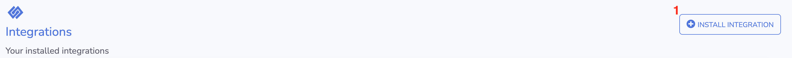
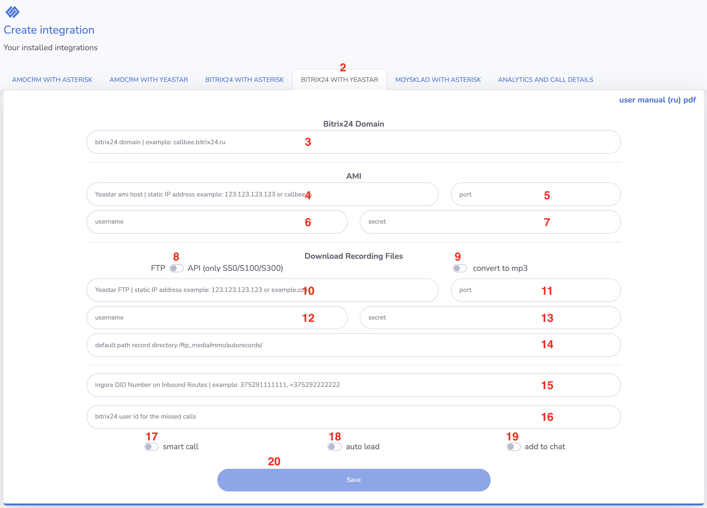
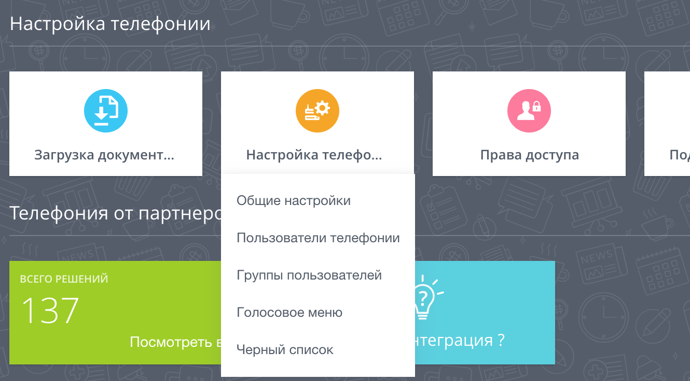
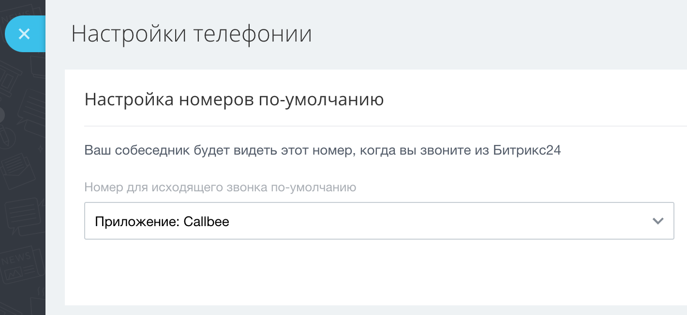

# Настройка интеграции IP-АТС Yeastar S серии с Битрикс24 при помощи сервиса Callbee

## Необходимые требования

* IP-АТС серии S серии (S20, S50, S100, S300).
* Статический IP адрес (необходимо приобрести у вашего интернет-провайдера).
* Облачный или коробочный Битрикс24 любой редакции.
* Для коробочного Битрикс24 необходим валидный SSL сертификат.

## Важные замечания

* Интеграция поддерживает внутренние номера до 4-х знаков включительно.
* Интеграция не преобразует формат телефонных номеров, необходимо работать в международном формате как в Битрикс24, так и на АТС.

## Работа интеграции

Интеграция реализует связь по AMI протоколу с вашей IP-АТС Yeastar S серии и REST API вашего Битрикс24, а также осуществляет на стороне нашегосервера конвертацию файлов аудиозаписей разговоров из формата wav (записи разговоров создаются на IPАТС Yeastar только в формате wav) в формат mp3.

Важно понимать, что голосовой SIP трафик за рамки вашей АТС никуда не выходит.

Интеграция взаимодействует с Битрикс24 по REST API: отправляет запросы на поднятие карточки звонка, проверку номера телефона и проброс записи разговора с АТС.

!!! info
    *Для подключения интеграции необходимо поочередно выполнить пункты данного руководства в той последовательности, как они описаны.*

## 1. Настройка IP-АТС Yeastar

### 1.1 Настройка сетевых служб

Открываем админ панель АТС и переходим в раздел Настройки - Система – Безопасность далее переходим во вкладку Сетевые службы и настраиваем следующее:

!!! info "для Yeastar S20"

    * Активируем пункт __Включить FTP__
    * Активируем пункт __Включить TFTP__

!!! info "для Yeastar S50/S100/S300"

    * Меняем протокол с HTTPS на HTTP

    Смену протокола следует производить если не установлен валидный сертификат

* Активируем пункт __Включить AMI__
* Изменяем стандартные __Имя пользователя__ и __Пароль__ (эти имя пользователя и пароль нужно будет прописать в личном кабинете Callbee)
* В появившемся поле __Разрешённые IP/Маска__ прописываем IP адрес 89.108.65.246 и маску 255.255.255.255

### 1.2 Настройка хранилища данных

!!! info "для Yeastar S20"

Переходим в раздел __Настройки - Система - Хранилища данных__ и переходим во вкладку __File Share__:

* Активируем __Активировать FTP доступ__
* Активируем __Активировать файловое хранилище__

### 1.3 Настройка API

!!! info "для Yeastar S50/S100/S300"

Переходим в раздел __Настройки АТС - Настройки АТС - API__:

* Активируем __API__
* Активируем пункт __Монитор АТС__ всех номеров и линий

## 2. Сетевые настройки

Для того, чтобы интеграция могла подключится к вашей АТС, у вас обязательно должен быть статический IP адрес и проброшены через NAT к АТС следующие порты:

* __5038 TCP__ – для доступа к AMI Yeastar
* __21 TCP__ – для доступа к FTP Yeastar (для Yeastar S20)
* __8088 (порт к WEB интерфейсу по умолчанию) HTTP/HTTPS__ – для доступа к API Yeastar

!!! info
    Интерфейс настройки проброса портов сильно отличается в зависимости от используемого в вашей сети маршрутизатора. Актуальную инструкцию по пробросу портов под ваш маршрутизатор вы можете найти на официальном сайте производителя маршрутизатора.

## 3. Первичная настройка Битрикс24

### 3.1 Установка приложения

Войдите в свой корпоративный портал Битрикс24 пользователем с правами администратора.

* В меню Битрикс24 перейдите на страницу __Приложения__ выберите категорию __IP-телефони__ и найдите приложение __Callbee__
* Перейдите на страницу приложения __Callbee__ и нажмите кнопку __Установить__
* Далее необходимо ознакомиться и согласиться с лицензионным соглашением и политикой конфиденциальности, отметив эти пункты, и нажать кнопку __УСТАНОВИТЬ__

<a href="https://www.bitrix24.ru/apps/?app=5757539.callbee" target="_blank">Сallbee</a> в каталоге приложений Битрикс24

### 3.2 Настройка внутренних номеров пользователей

* Перейти на страницу __Сотрудники__
* Открыть профиль __Сотрудника__
* Внести внутренний телефон сотрудника

## 4. Настройка интеграции в личном кабинете сервиса Callbee

После проведения всех настроек описанных выше необходимо произвести подключения интеграции.

### Описание пунктов настроек

* (1) Нажать на кнопку __Install integrations__
* (2) Выбрать вкладку __BITRIX24 WITH YEASTAR__
* (3) Доменное имя вашего Битрикс24 (без https://, например: callbee.bitrix24.ru)
* (4) AMI host - ваш статический IP адрес для подключения к AMI Yeastar
* (5) AMI port - ваш порт для подключения к AMI Yeastar (стандартный порт AMI 5038)
* (6) AMI username - имя пользователя AMI Yeastar
* (7) AMI secret - пароль AMI Yeastar
* (8) FTP (для Yeastar S20) / API (для Yeastar S50/S100/S300)
* (9) Конвертация записи в mp3

!!! info "для Yeastar S20"

    * (10) FTP host - ваш статический IP адрес для подключения к FTP Yeastar
    * (11) FTP port - ваш порт для подключения к FTP Yeastar (стандартный порт FTP 21)
    * (12) FTP username - имя пользователя к FTP Yeastar
    * (13) FTP secret - пароль к FTP Yeastar
    * (14) Path records directory - если оставить поле пустым, будет использоваться стандартный путь для хранении файлов записей разговоров /ftp_media mmc/autorecords/

!!! info "для Yeastar S50/S100/S300"

    * (10) API host - ваш статический IP адрес для подключения к API Yeastar
    * (11) API port - ваш порт для подключения к API Yeastar
    * (12) API username - имя пользователя к API Yeastar
    * (13) API secret - пароль к API Yeastar

* (15) Ignore trunks - DID номер(а) через запятую на входящим маршруте (интеграция будет игнорировать эти входящие маршруты)
* (16) ID пользователя в Битрикс24 для пропущенных вызовов (ответственный пользователь за пропущенные вызовы для новых клиентов, которых нет в Битрикс24)
* (17) Smart call - Включение умной маршрутизации (распределение вызова на ответственного пользователя)
* (18) Auto lead - Автоматически создает в Битрикс24 лид или сделку, в зависимости от настроек и режима работы CRM.
* (19) Add to chat - Сообщение о совершенном звонке сотруднику Битрикс24 в чат.
* (20) Save* - Сохранение настроек

!!! note
    * Перед сохранением всех настроек при первом подключении интеграции необходимо в соседней вкладке вашего браузера войти в Битрикс24 с правами администратора.

## 5. Дальнейшая настройка Битрикс24

### 5.1 Настройка телефонии в Битрикс24

* Перейти на страницу Телефония в Битрикс24
* Выбрать __Общие настройки__ в выпадающем меню Настройка телефонии

* В настройке номера по умолчанию в пункте __Номер для исходящего звонка по умолчанию__ выбрать __Приложение: Callbee__

* Обязательно, далее нажимаем __Сохранить__
