# Настройка интеграции IP-АТС Yeastar S серии с Битрикс24 при помощи сервиса Callbee

!!! info
    *Для подключения интеграции необходимо поочередно выполнить пункты данного руководства в той последовательности, как они описаны.*

## Необходимые требования

* IP-АТС серии S серии (S20, S50, S100, S300).
* Статический IP адрес (необходимо приобрести у вашего интернет-провайдера).
* Облачный или коробочный Битрикс24 любой редакции.
* Для коробочного Битрикс24 необходим валидный SSL сертификат.

## Важные замечания

* Интеграция поддерживает внутренние номера до 4-х знаков включительно.
* Интеграция не преобразует формат телефонных номеров, необходимо работать в международном формате как в Битрикс24, так и на АТС.

## Работа интеграции

Интеграция реализует связь по AMI протоколу с вашей IP-АТС Yeastar S серии и REST API вашего Битрикс24, а также осуществляет на стороне нашего сервера конвертацию файлов аудиозаписей разговоров из формата wav (записи разговоров создаются на IP-АТС Yeastar только в формате wav) в формат mp3.

Важно понимать, что голосовой SIP трафик за рамки вашей АТС никуда не выходит.

Интеграция взаимодействует с Битрикс24 по REST API: отправляет запросы на поднятие карточки звонка, проверку номера телефона и проброс записи разговора с АТС.

## 1. Настройка IP-АТС Yeastar

### 1.1 Настройка сетевых служб

Открываем админ панель АТС и переходим в раздел Настройки - Система – Безопасность далее переходим во вкладку Сетевые службы и настраиваем следующее:

!!! info "для Yeastar S20"

    * Активируем пункт __Включить FTP__
    * Активируем пункт __Включить TFTP__

!!! info "для Yeastar S50/S100/S300"

    * Меняем протокол с HTTPS на HTTP

    Смену протокола следует производить если не установлен валидный сертификат

* Активируем пункт __Включить AMI__
* Изменяем стандартные __Имя пользователя__ и __Пароль__ (эти имя пользователя и пароль нужно будет прописать в личном кабинете Callbee)
* В появившемся поле __Разрешённые IP/Маска__ прописываем IP адрес 89.108.65.246 и маску 255.255.255.255

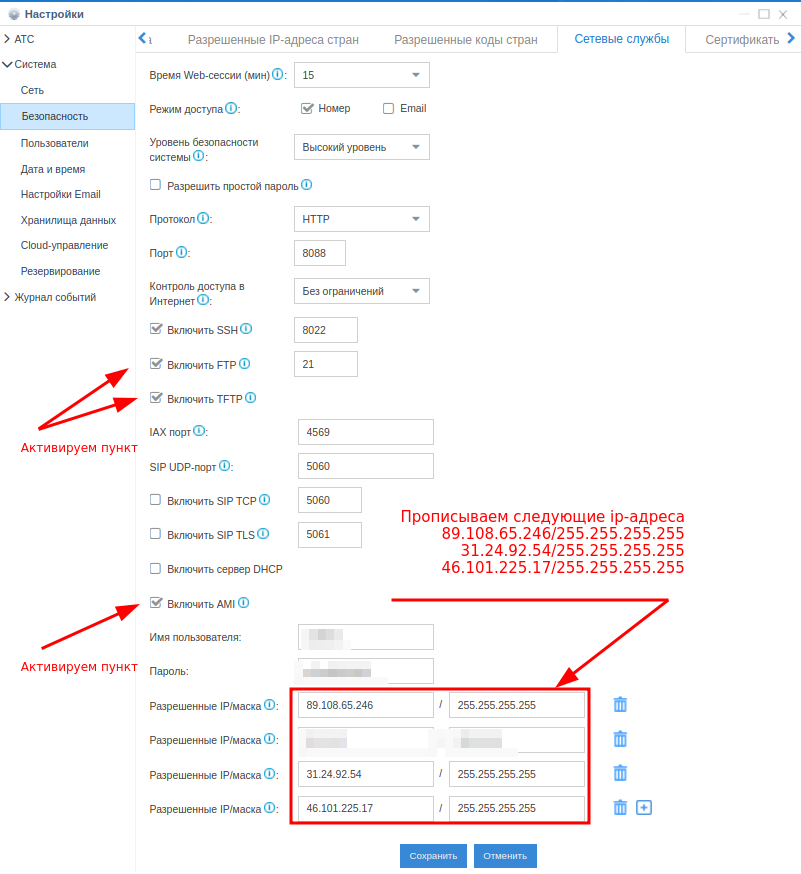

### 1.2 Настройка хранилища данных

!!! info "для Yeastar S20"

Переходим в раздел __Настройки - Система - Хранилища данных__ и переходим во вкладку __File Share__:

* Активируем __Активировать FTP доступ__
* Активируем __Активировать файловое хранилище__

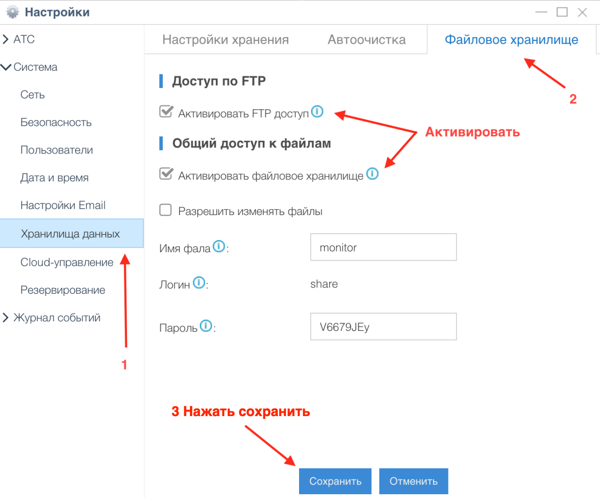

### 1.3 Настройка API

!!! info "для Yeastar S50/S100/S300"

Переходим в раздел __Настройки АТС - Настройки АТС - API__:

* Активируем __API__
* Активируем пункт __Монитор АТС__ всех номеров и линий

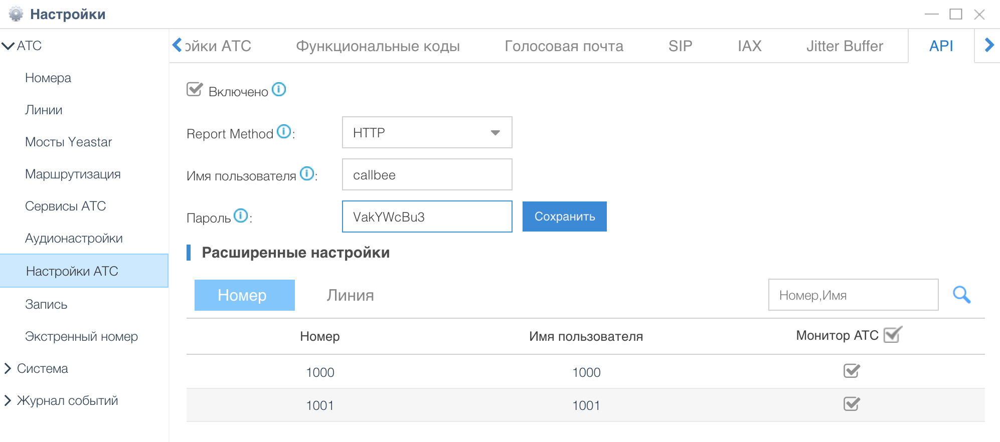

## 2. Сетевые настройки

Для того, чтобы интеграция могла подключится к вашей АТС, у вас обязательно должен быть статический IP адрес и проброшены через NAT к АТС следующие порты:

* __5038 TCP__ – для доступа к AMI Yeastar
* __21 TCP__ – для доступа к FTP Yeastar (для Yeastar S20)
* __8088 (порт к WEB интерфейсу по умолчанию) HTTP/HTTPS__ – для доступа к API Yeastar

!!! info
    Интерфейс настройки проброса портов сильно отличается в зависимости от используемого в вашей сети маршрутизатора. Актуальную инструкцию по пробросу портов под ваш маршрутизатор вы можете найти на официальном сайте производителя маршрутизатора.

## 3. Первичная настройка Битрикс24

### 3.1 Установка приложения

Войдите в свой корпоративный портал Битрикс24 пользователем с правами администратора.

* В меню Битрикс24 перейдите на страницу __Приложения__ выберите категорию __IP-телефони__ и найдите приложение __Callbee__
* Перейдите на страницу приложения __Callbee__ и нажмите кнопку __Установить__
* Далее необходимо ознакомиться и согласиться с лицензионным соглашением и политикой конфиденциальности, отметив эти пункты, и нажать кнопку __УСТАНОВИТЬ__

<a href="https://www.bitrix24.ru/apps/?app=5757539.callbee" target="_blank">Сallbee</a> в каталоге приложений Битрикс24

### 3.2 Настройка внутренних номеров пользователей

* Перейти на страницу __Сотрудники__
* Открыть профиль __Сотрудника__
* Внести внутренний телефон сотрудника

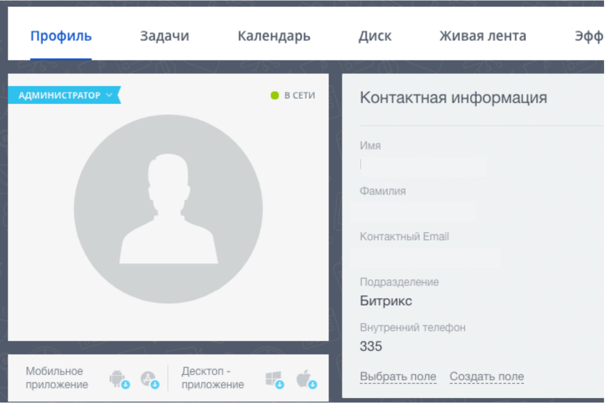

## 4. Настройка интеграции в личном кабинете сервиса Callbee

После проведения всех настроек описанных выше необходимо произвести подключения интеграции.

### 4.1 Подключение интеграции на стороне сервиса Callbee вручную

* Нажмите кнопку __BITRIX24 WITH YEASTAR «Install»__
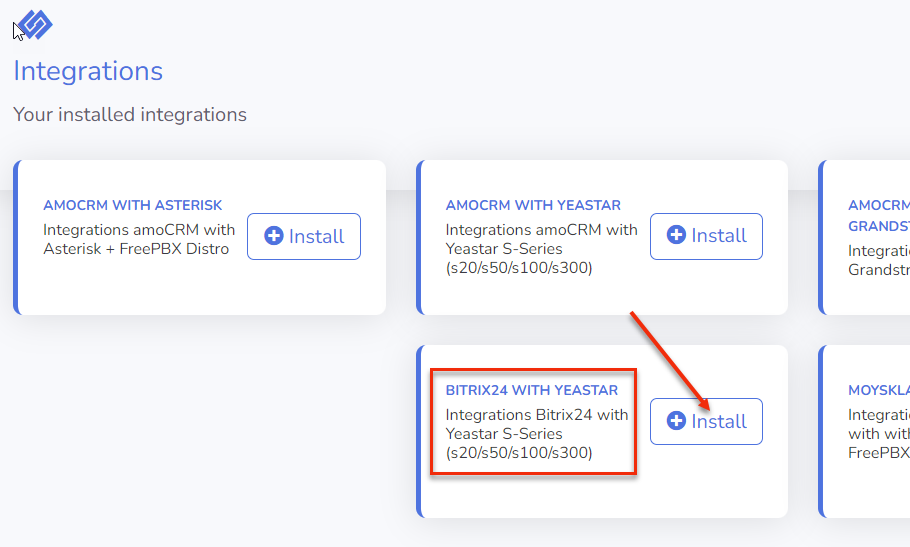

* Заполните __все необходимые__ пункты для интеграции  
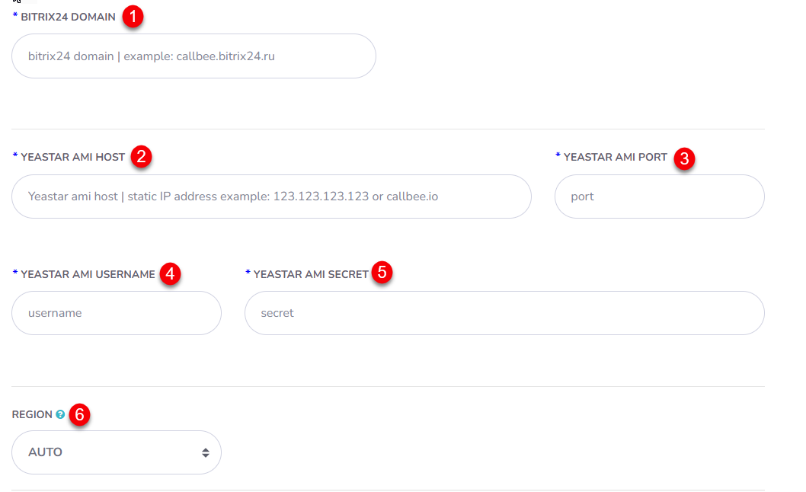

  * __Bitrix24 Domain (1)__ -  Указываем __доменное имя__ вашего Битрикс24 __(без https://)__
  * __Yeastar AMI host (2)__ - Указываем ваш __статический IP адрес__ для подключения к __AMI Yeastar__
  * __Yeastar AMI port (3)__ - Указываем ваш __порт__ для подключения к __AMI Yeastar__ (стандартный порт AMI __5038__)
  * __AMI username (4)__ - Указываем __имя пользователя__ AMI Yeastar
  * __AMI secret (5)__  - Указываем __пароль__ AMI Yeastar
  * __Region (6)__ - Выбор __ближайшего региона__ для подключения Yeastar
  
    !!!Info
        *Данная функция обеспечивает __наилучшую скорость взаимодействия Yeastar__ с сервисом __CallBee__*    
        *На выбор доступны __три региона__:*
        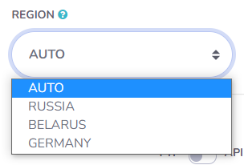
        
        * __Russia__ - подключение к узлу с интеграцией, расположенного в Российской Федерации
        * __Belarus__ - подключение к узлу с интеграцией, расположенного в Республике Беларусь
        * __Germany__ - подключение к узлу с интеграцией, расположенного в Германии
        * __AUTO__ - автоматическое подключение к любому узлу

### 4.2 Подключение интеграции на стороне сервиса Callbee через установщик

* Нажмите __«Install Integration»__

* Выберите __Bitrix24__ в поле __CRM__
* Выберите __Yeastar__ в поле __Platform__
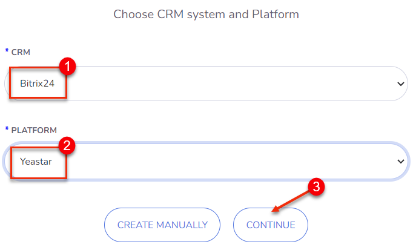
* Заполните все __необходимые поля__
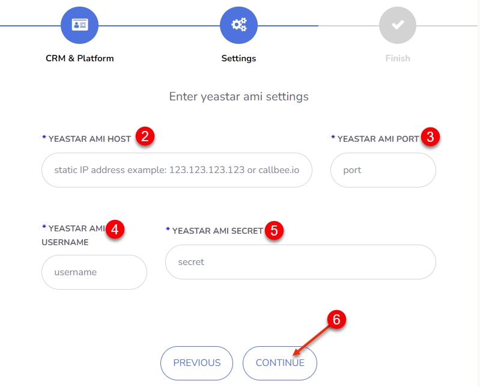
  * __Yeastar AMI host (2)__ - Указываем ваш __статический IP адрес__ для подключения к __AMI Yeastar__
  * __Yeastar AMI port (3)__ - Указываем ваш __порт__ для подключения к __AMI Yeastar__ (стандартный порт AMI __5038__)
  * __AMI username (4)__ - Указываем __имя пользователя__ AMI Yeastar
  * __AMI secret (5)__  - Указываем __пароль__ AMI Yeastar

### 4.3 Настройка записей разговоров
* Установите переключатель __FTP/API (7)__ в нужное положение в завимисти от __модели__ станции Yeastar       
  * __FTP__ (для __Yeastar S20__) / __API__ (для __Yeastar S50/S100/S300) (7)__ - положение зависит от __модели__ станции
  * __Convert to mp3 (8)__ - Конвертация записи в __mp3__

    !!! info "для Yeastar S20"
        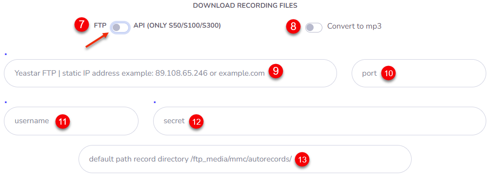

        * __FTP host (9)__ - ваш __статический IP адрес__ для подключения к FTP Yeastar
        * __FTP port (10)__ - ваш __порт__ для подключения к FTP Yeastar (стандартный порт FTP __21__)
        * __FTP username (11)__ - __имя пользователя__ к FTP Yeastar
        * __FTP secret (12)__ - __пароль__ к FTP Yeastar
        * __Path records directory (13)__ - если оставить __поле пустым__, будет использоваться __стандартный путь__ для __хранении файлов записей разговоров__ /ftp_media mmc/autorecords/

    !!! info "для Yeastar S50/S100/S300"
        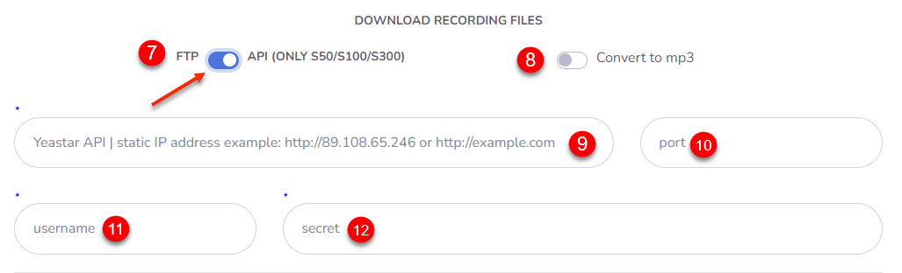

        * __API host (9)__ - ваш __статический IP адрес__ для подключения к API Yeastar
        * __API port (10)__ - ваш __порт__ для подключения к API Yeastar
        * __API username (11)__ - __имя пользователя__ к API Yeastar
        * __API secret (12)__ - __пароль__ к API Yeastar
        
### 4.4 Настройка интеграции на стороне сервиса Callbee для каждой линии АТС в отдельности (доступно в pro-версии и demo-режиме)
* Заполните необходимые поля
    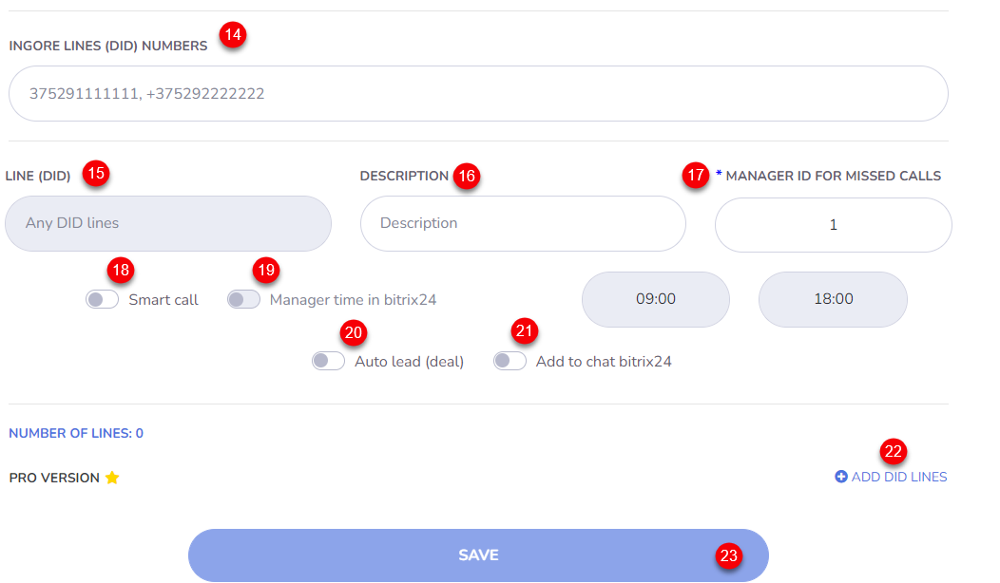
  * __Ignore Lines (DID) Numbers (14)__ - Указываем __DID__ номер(а) __через запятую и один пробел__, на которые интеграция __не будет__ реагировать. Эта функция позволяет __не реагировать__ на номера, не относящиеся к работе в CRM. Например прямые номера бухгалтерии или администрации.
  * __Line (DID) (15)__ - Номер подразделения отдела. Номер для __входящих звонков__, который относится к __подразделению/отделу__ (номер берется из настроек __FreePBX__ поля __DID Number__ )
  * __Description (16)__ - __Описание__ линии (DID), будет заполнять поле __Линия__ в __карточке Контакта__ и __Сделки__ в __Битрикс24__, если оставить поле Description __пустым__ будет проброшен __номер линии (DID)__
  * __Manager ID For Missed Calls (17)__ - __ID пользователя в Битрикс24__ для __пропущенных вызовов__ (ответственный пользователь за пропущенные вызовы для новых клиентов, которых нет в Битрикс24). Можно устанавливать для каждой линии свое значение. __Это поле не должно быть пустым!__

    !!! info
         Посмотреть какой __Manager ID__ можно открыв __профиль сотрудника__ в Битрикс24 в __адресной строке__ Вашего __браузера__
        
         На скриншоте выше значение __Manager ID__ равно __1__   

  * __Smart Call (18)__ - Включение __умной маршрутизации__ (перевод звонка на ответственного сотрудника) __с указанием времени работы__. __Вне графика работы__ умной маршрутизации __звонок__ будет идти по __маршруту по умолчанию__. Чаще всего применяется для того, чтобы проиграть клиенту сообщение о том, что он дозвонился в нерабочее время.
  * __Manager time in bitrix24 (19)__ - Включение __графика работы__ для умной маршрушизации __из Битрикс24__ 
  * __Auto Lead (Deal) (20)__ - Включение __автоматического создания__ лидов или сделок (+контакт) Битрикс24 (в зависимочсти от режима работы Битрикс24)
  * __Add to chat bitrix24 (21)__ - Включение __отображения информации__ о всех звонках в __чате__ Битрикс24
  * __Add DID Lines (22)__ - Добавление линии для настройки
  * __SAVE (23)__ - __Сохранение__ настроек интеграции

### 4.5 Настройка интеграции на стороне сервиса Callbee для каждого внутреннего номера.

!!! warning "Важное замечание"
    *Для настройки __внутренних номеров__ через сервис __CallBee__ нужно __включить__ переключатель __«Use B24 users table»__*
    

* Заходим в __настройки интеграции__, нажимаем __«Settings»__

* __Включаем__ переключатель __«Use B24 users table»__

* После включения __«Use B24 users table»__ появится пункт меню __«Bitrix24 users»__, переходим в него

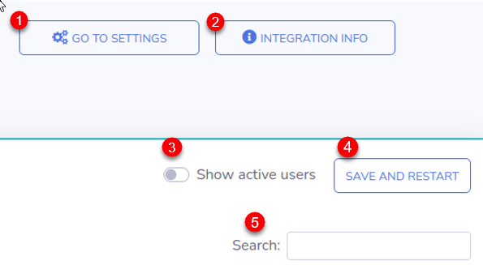
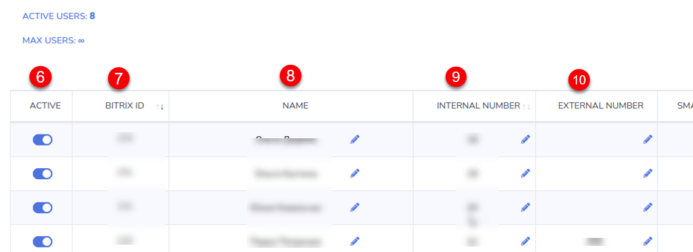
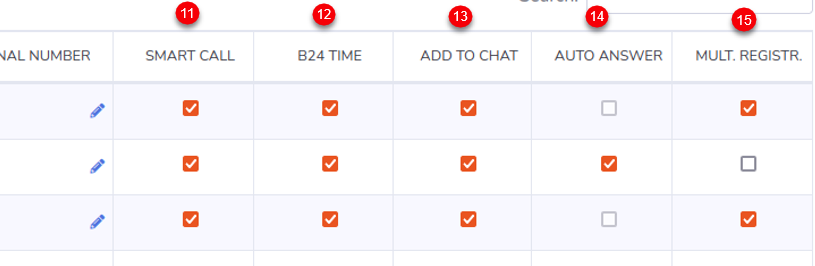
* __Go to settings (1)__ - Переход на страницу настроек
* __Integration Info (2)__ - Информация о интеграции
* __Show active users (3)__ - Фильтр для отображения __активных__ пользователей
* __Save and restart (4)__ - __Сохранение__ настроек и __перезапуск__ интеграции
* __Search (5)__ - Поиск записей в таблице настроек
* __Active (6)__ - Включение __настроек для пользователя (сотрудника)__ через сервис CallBee. __Акитвация коммерческой лицензии__ для этого __пользователя__ (__актиных пользователей__ должно быть __не больше количества лицензий__) Если переключатель стоит в режиме __off__ то интеграция будет __игнорировать__ это пользователя, даже если у него прописан внутренний номер и заполнены все остальные поля. 
* __Bitrix ID (7)__ - ID пользователя (сотрудника) __в Битрикс24__
* __Name (8)__ - Имя пользователя (сотрудника) __в Битрикс24__
* __Internal Number (9)__ - __Внутренний номер__ пользователя (сотрудника)
* __External Number (10)__  -  __Личный номер__ пользователя (сотрудника) что будет совершать __звонки по клику из Битрикс24__ на __мобильном устройстве__. При звонке по клику на мобильном устройстве будет осуществляться вызов __в обе__ стороны - __пользовтателю (сотруднику)__ и __клиенту__ Вашей компании. Номер используется для __взаимодействия__ приложения Битрикс24 на мобильном устройстве и __осуществления вызовов__ звонком по клику.
* __Smart Call (11)__ - Включение __умной маршрутизации__ (перевод звонка на ответственного сотрудника) с указанием __времени работы__. __Вне графика__ работы умной маршрутизации звонок будет идти по маршруту __по умолчанию.__ Чаще всего применяется для того, чтобы проиграть клиенту сообщение о том, что он дозвонился в нерабочее время.
* __B24 Time (12)__ - Включение __графика работы__ для пользователя (сотрудника) __из Битрикс24__ для умной маршрутизации
* __Add to Chat (13)__ - Включение __отображения информации__ о всех звонках в __чате Битрикс24__
* __Auto Answer (14)__ - Включение __автоответа__ на __SIP-телефоне__, (аппаратном или программном (софтфон). При звонке по клику с использованием сервиса __CallBee__  первоначально звонок __приходит__ как __входящий__ на __SIP-телефон__ (аппаратный или программный) и после его __приема__ происходит __исходящий вызов__ клиенту Вашей компании. Включение данной функции позволит __SIP-телефону__ (аппаратному или программному) принимать звонок __автоматически, без участия__ пользователя (сотрудника). В том случае если __SIP-телефон__ (аппаратный или программный) __поддерживает данный фуннкционал__ (например SIP-телефоны Yealink с актуальной прошивкой)  
* __Multiple Registration (15)__ - Включение функции __Multiple Registration__ позволяет пользоваться звонком по клику при наличии __нескольких SIP-телефонов__ (аппаратных или программных)

!!! warning "Важное замечание!"
    *__Перед сохранением__ всех настроек при __первом подключении__ интеграции необходимо __в соседней вкладке__ вашего браузера __войти в Битрикс24__ с __правами администратора.__*

## 5. Дальнейшая настройка Битрикс24

### 5.1 Настройка телефонии в Битрикс24

* В __меню Битрикс24__ перейдите на страницу __«Телефония»__  
  

* Далее выбрать __«Настройка телефонии» (1)__
  
* Настройках телефонии необходимо выбрать в пункте __«Номер для исходящего
звонка по-умолчанию (2)» -> «Приложение Asterisk и Yeastar Callbee.io»__ 

Далее нажимаем __«Сохранить»__

__Настройка интеграции завершена!__ 
