# Настройка интеграции Asterisk + FreePBX c amoCRM при помощи сервиса Callbee

!!! info
    *Для подключения интеграции необходимо поочередно выполнить пункты данного руководства в той последовательности, как они описаны.*

## Необходимые требования

Asterisk + FreePBX далее АТС

* Asterisk не старше версии 13.\*.\*
* FreePBX не старше версии 13.\*.\*
* Статический IP адрес (необходимо приобрести у вашего интернет-провайдера) для прямого доступа к АТС из сети Интернет

Интеграция осуществляется при помощи подключения облачного сервиса Callbee к АТС при помощи Asterisk Managment Interface (AMI) посредством TCP протокола. AMI принимает подключения, устанавливаемые на сетевой порт (по умолчанию - TCP порт 5038)

## Сетевые настройки

Для того чтобы сервис Callbee мог подключится к вашей АТС, у вас обязательно должен быть "__белый__" статический IP адрес либо доменное имя с __A__ записью на ваш IP адрес, и проброшены через __NAT__ к АТС следующие два порта:

* внешний порт (например 35038) на порт 5038 TCP - для доступа к АТС по AMI (Замечание по   безопасности! Рекомендуем открывать порт разрешив подключение с IP адресов указанных в [списке](/#ip))
* внешний порт (например 38080) на порт 80 TCP (стандартный порт веб - сервера АТС) - для выгрузки записей разговоров

Интерфейс настройки проброса портов отличается в зависимости от используемого в вашей сети маршрутизатора. Актуальную инструкцию по пробросу портов под ваш маршрутизатор вы можете найти в интернете.

## Настройка Asterisk + FreePBX

!!! info

    * Внутренние номера (Extensions) могут быть трехзначными или четырехзначными (222 или 2222).
    * На всех входящих маршрутах(Inbound Routes) ожидаемый входящий номер DID должен быть не менее 5 цифр, это может быть номер линии в международном формате (например: +375291111111).
    * На всех входящих (Inbound Routes) и исходящих маршрутах (Outbound Routes) обязательно должны быть включены записи разговоров.
    * Сервис Callbee не изменят входящий номер телефона. Входящий номер телефона будет проброшен в amoCRM том виде в каком он поступил на АТС.(Рекомендуется средствами АТС приводить все входящие номера телефонов к единому международному формату). 
    * При звонке по клику из amoCRM на АТС поступает номер телефона записанный из карточки сущности amoCRM. Необходимо чтобы АТС умела набирать этот номер (в этом формате) в линию.
    * Для корректной работы интеграции мы рекомендуем настройки на АТС, которые не указаны в данной инструкции, оставить по умолчанию. 
    * Интеграция не гарантирует корректную работу функций при использовании модуля FreePBX __Ring Groups__ для настройки распределения входящих вызовов в АТС. Для корректной работы всех функций интеграции рекомендуем вместо __Ring Groups__ использовать __Queues__

### Настройка AMI Asterisk

Для подключения к AMI Asterisk нужно создать AMI пользователя на стороне  Asterisk. Это можно сделать двумя способами:

* Способ 1 через __CLI__:

    В файле __/etc/asterisk/manager_custom.conf__ добавить, например:

    ``` conf
    [callbee] 
    secret=password
    deny=0.0.0.0/0.0.0.0 
    permit=127.0.0.1/255.255.255.0
    permit=89.108.65.246/255.255.255.255
    permit=31.24.92.54/255.255.255.255
    read=system,call,log,verbose,command,agent,user,config,command,dtmf,reporting,cdr,dialplan,originate,message
    write=system,call,log,verbose,command,agent,user,config,command,dtmf,reporting,cdr,dialplan,originate,message
    writetimeout = 500
    ```

    После чего выполнить команду
    ``` sh
    asterisk -rx "manager reload"
    ```
Конец действия

* Способ 2 через интерфейс __FreePBX__:
    1. Должен быть установлен модуль __Asterisk API__
    2. В пункте меню __Settings__ -> __Asterisk Manager Users__(1) -> __Add Manager__(2)
    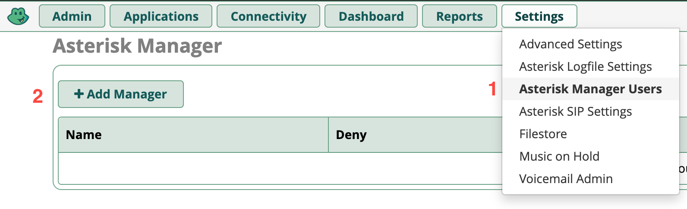
    3. Во вкладке __General__ заполнить поля как на примере
    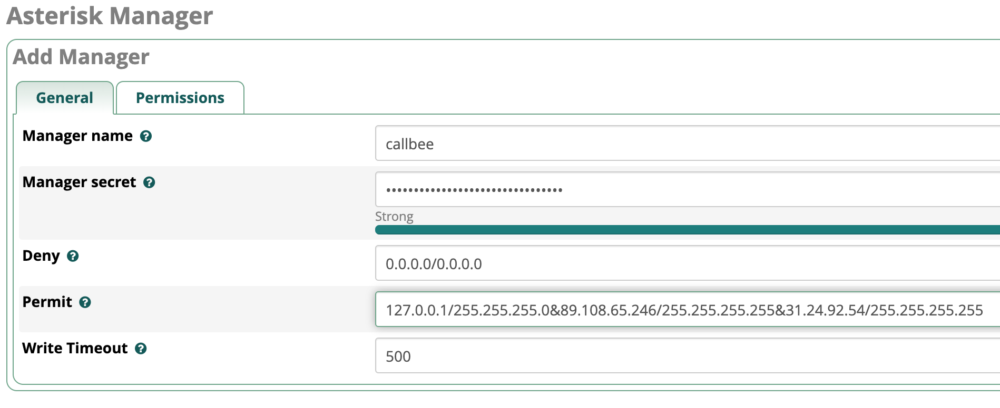
    4. Во вкладке __Permissions__ установить все переключатели в положение __Yes__
    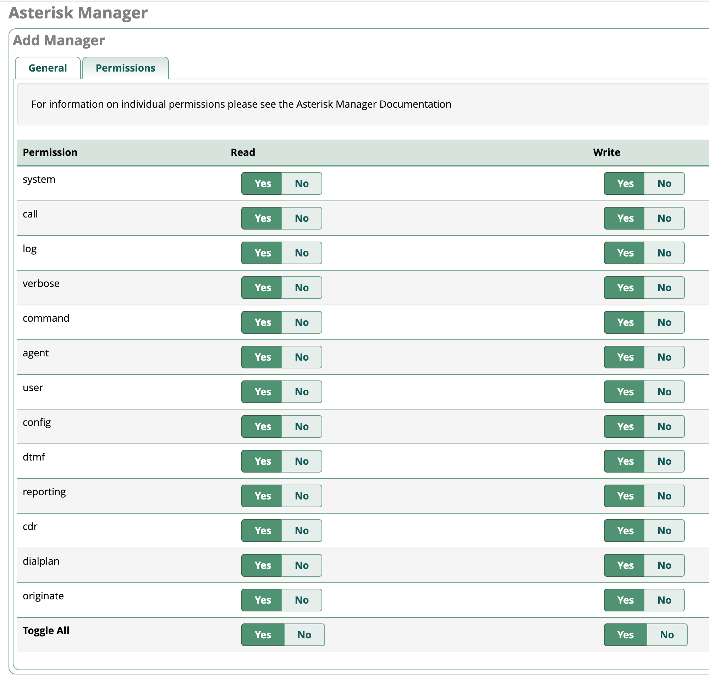

### Настройка транков (Trunks) в FreePBX

!!! warning "Важное замечание"

    * На данный момент интреграция работает только с __chan_SIP__ транками
    * Поле __Outbound CallerID__

Пример стандартной настройки
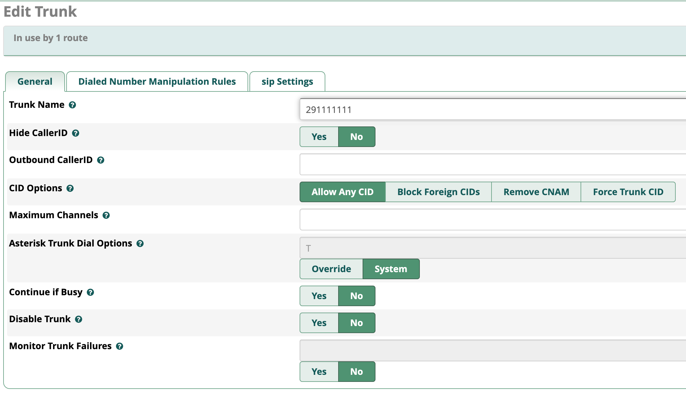

### Настройка Входящей маршрутизации (Inbound Routes) в FreePBX

Пример стандартной настройки
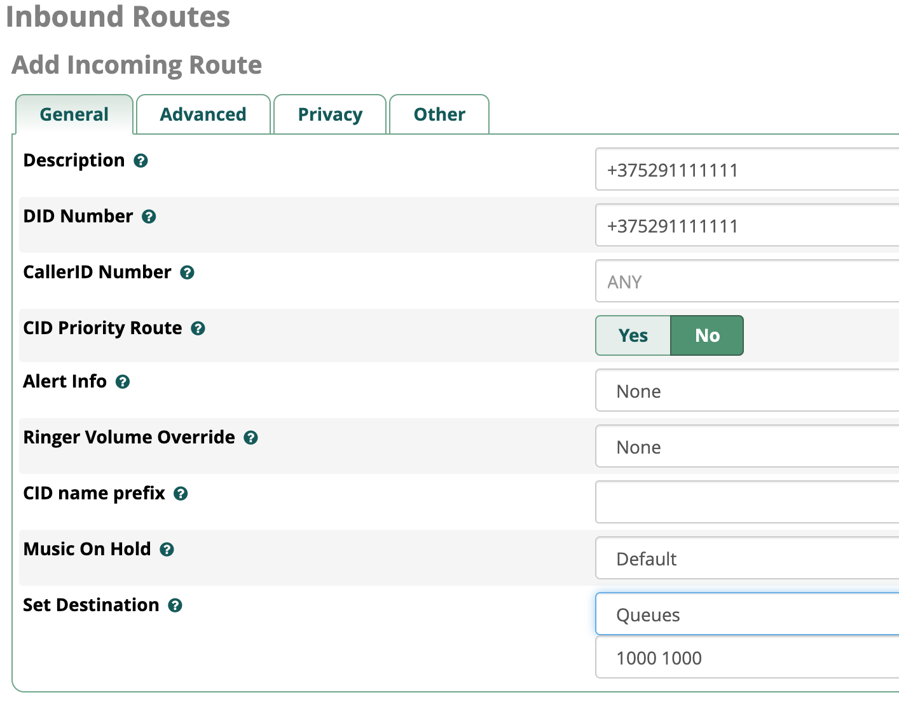

Для работы умной маршрутизации необходимо успеть получить ответ от CRM на запрос наличия существующего контакта с определившимся номером телефона. Для этого необходимо выставить задержку на маршрутах
__Advanced__ -> __Pause Before Answer__ (например 1 сек), 

С ростом базы контактов в amoCRM возможно задержку необходимо увеличить на 1-2 секунды.
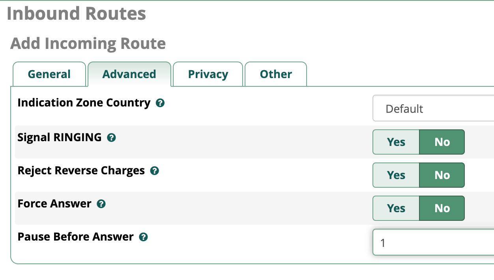

Для получения записей разговоров в CRM включаем записи разговоров на маршрутах __Other__ -> __Call Recording__ -> __Yes__
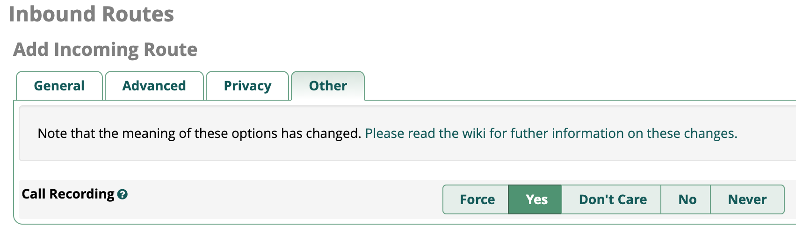

### Настройка Исходящей маршрутизации (Outbound Routes) в FreePBX

!!! warning "Важное замечание"
    Поле __Route CID__ должно быть пустым

Пример стандартной настройки
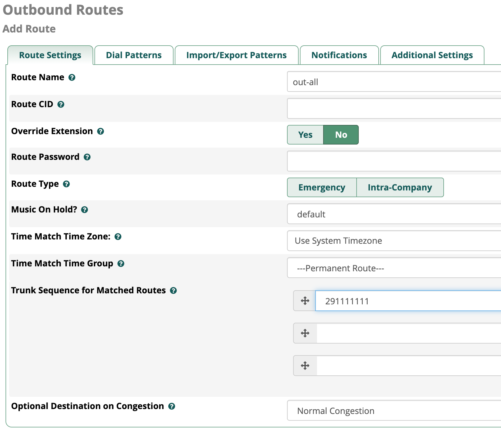

Для записи разговоров при исходящих вызовах на вкладке __Additional Settings__ включаем записи разговоров
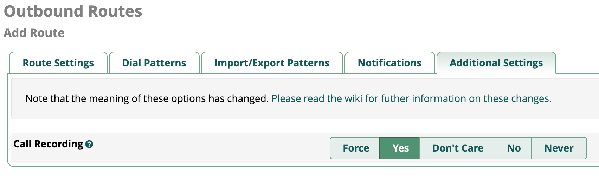

### Настройка Внутренних номеров (Extensions) в FreePBX

Пример настройки внутреннего номера 222:

* Есть поддержка драйвера __PJSIP__ и __CHAN_SIP__ для внутренних номеров
* __Outbound CID__ оставить по умолчанию
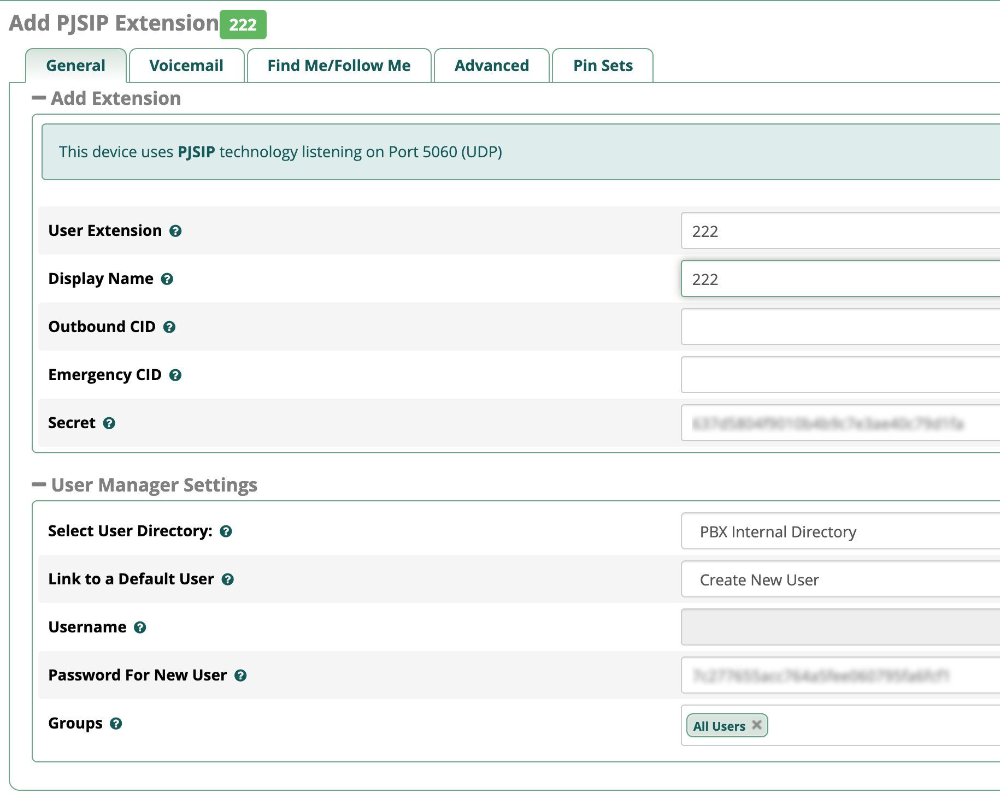
* настройку записей разговоров оставить по умолчанию (записи записываются на маршрутах)
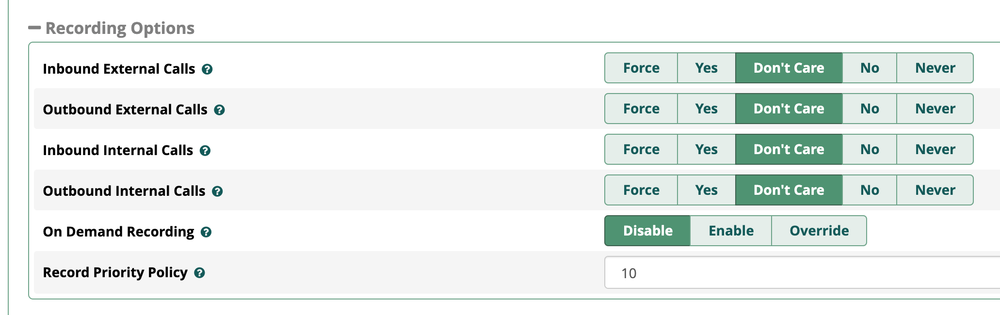

## Подключение интеграции на стороне сервиса Callbee

!!! info
    После проведения всех настроек описанных выше необходимо произвести подключение сервиса к Asterisk через AMI пользователя, которого мы создали ранее (см. Выше)

В личном кабинете сервиса Callbee для интеграции с amoCRM необходимо:

* Во вкладке __Integration__ нажить на кнопку __Install integration__ и выбрать вкладку __AMOCRM WITH ASTERISK__ либо нажать кнопку __Install__ на блоке с типом интеграции __AMOCRM WITH ASTERISK__
* Заполнить все необходимые пункты для интеграции

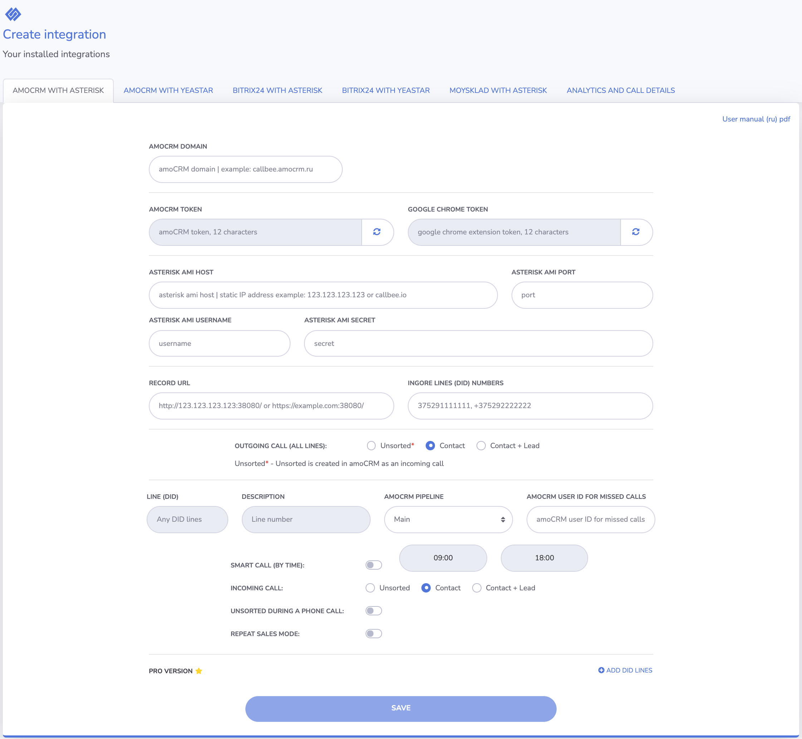

* В поле __amoCRM Domain__ обязательно необходимо внести ваш домен amoCRM (например, callbee.amocrm.ru без https://)
* __amoCRM TOKEN__ - Токен для соединения с AmoCRM, этот токен необходимо будет вставить в соответствующее поле в виджете на стороне AmoCRM (токен должен быть из 12 символов, правее есть кнопка генерации токена – нажмите ее для создания токена). Настройка интеграции на стороне AmoCRM описана [далее](#amocrm)
* __Google Chrome TOKEN__ - Токен для соединения с расширением в браузере Google Chrome, этот токен необходимо будет вставить в параметрах расширения (токен должен быть из 12 символов, правее есть кнопка генерации токена – нажмите ее для создания токена). Настройка расширения описана [далее]#google-chrome
* __Asterisk AMI Host/Port/Username/Secret__ - Настройка подключения по AMI к ATC (IP-адрес сервера или доменное имя, порт, имя пользователя, пароль)
* __Record URL__ - Ссылка для записей разговоров. По данной ссылке amoCRM будет пытаться получить доступ к записи разговора, в момент попытки прослушивания записи из amoCRM. Ссылка должна быть всегда доступна.
* __Ignore lines(DID) numbers__ - DID номер(а) через запятую на входящим маршруте. Эта функция позволяет не реагировать на номера, не относящиеся к работе в CRM. например прямые номера бухгалтерии или администрации. Интеграция будет игнорировать эти входящие маршруты.
* __Outgoing calls (all lines)__ - Данная настройка позволяет выбрать какую сущность создавать при исходящем вызове НОВОМУ клиенту. __Неразобранное__, __Контакт__, __Контакт + Сделка__

!!! info
    Далее указываются настройки для линии (DID). В стандартной версии настройки применяются ко всем линиям по умолчанию. В Pro версии есть возможность устанавливать настройки для каждой линии индивидуально.

* __Line (DID)__ - Номер подразделения отдела; номер для входящих звонков, который относится к подразделению/отделу (номер берется из настроек FreePBX поля __DID Number__ и доступно для редактирования только в Pro версии)
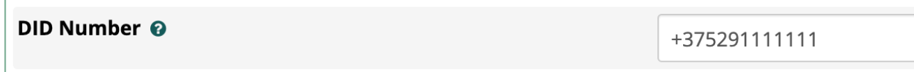
* __Description__ - Описание линии (DID) будет заполнять поле __Линия__ в карточке Контакта и Сделки в amoCRM, если оставить поле Description пустым, будет проброшен номер линии (DID) (доступно для редактирования только в Pro версии)
* __amoCRM pepline__ - Воронка в amoCRM. На момент создания интеграции по умолчанию выбирается основная воронка (Main), т.к. еще нет связи интеграции и amoCRM. Далее при корректном подключении интеграции при редактировании можно будет указать необходимую воронку из имеющихся #pepline
* __amoCRM user ID for missed calls__ - ID пользователя в amoCRM для пропущенных вызовов (ответственный пользователь за пропущенные вызовы для новых клиентов, которых нет в amoCRM). Можно устанавливать для каждой линии свое значение.
* __Smart call (by time)__ - Включение умной маршрутизации (перевод звонка на ответственного сотрудника) с указанием времени работы. Вне графика работы умной маршрутизации звонок будет идти по маршруту по умолчанию. Чаще всего применяется для того, чтобы проиграть клиенту сообщение о том, что он дозвонился в нерабочее время.
* __Incoming call__ - Настройка позволяет выбрать какую сущность создавать при входящем звонке от НОВОГО клиента __Неразобранное__, __Контакт__, __Контакт + Сделка__
* __Unsorted during a phone call__ - Создание неразобранного в amoCRM в момент ответа на входящий звонок. Данная настройка сделана для удобства работы с __Неразобранным__ при входящих звонках. Данная настройка позволяет создать неразобранное в начале звонка без записи разговора, для возможности начала работы с данной сделкой (принятие, заполнение полей). При завершении разговора в эту карточку __Неразобранного__ или __Сделки__ пробросится разговор. 
* __Repeat sales mode__ - Настройка автоматической регистрации повторных сделок. Данная настройка позволяет создавать повторные сделки с существующими клиентами, если в момент входящего звонка от существующего клиента с ним нет ни одной активной сделки. При повторном обращении клиента в __Сделке__в поле __Повторное обращение__ будет указано значение __Повторное__. Если данная настройка отключена, поле __Повторное обращение__ можно скрыть. Поле заполняется для аналитики и для возможности отображение в карточке в воронке для визуального различия в новыми сделками. 
* Нажать кнопку __Save__ и дождаться завершения подключения

## Подключение интеграции на стороне amoCRM

!!! warning "Внимание"

    * Просим обратить особое внимание - название, логотипы могут отличаться от скриншотов данного руководства
    * Интеграция будет работать только для внутренних номеров сотрудников, которые вы указали в настойках виджета

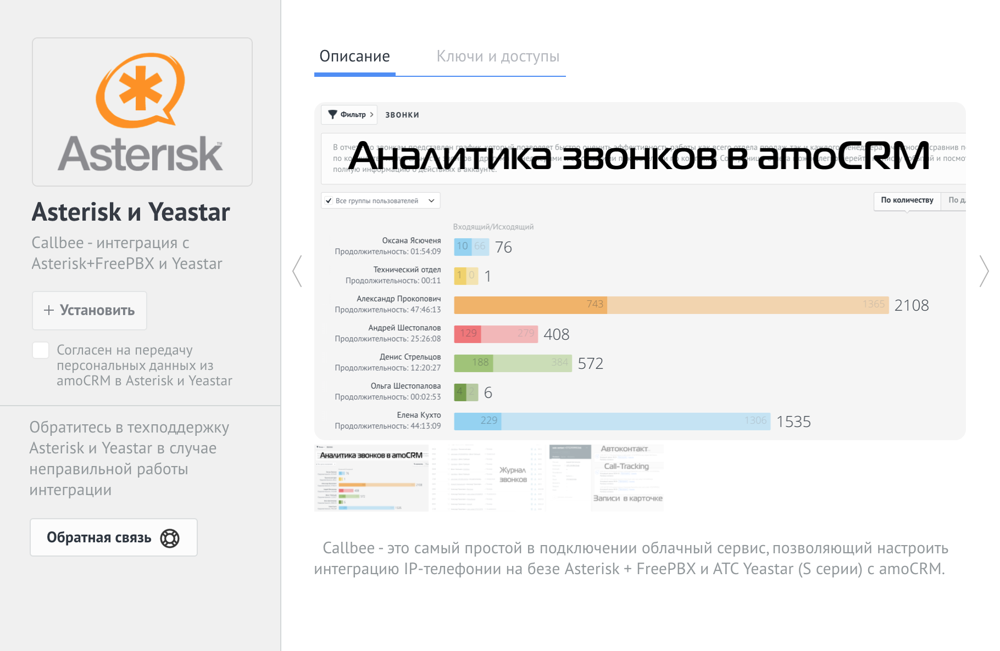

* В настройках amoCRM, выбрать пункт __Интеграции__, сверху в строке поиска ищем по названию __Callbee__, либо в разделе __Телефония__ найти интеграцию __Callbee__ (__Asterisk и Yeastar__), согласившись с условиями нажать на кнопку __Установить__
<!-- 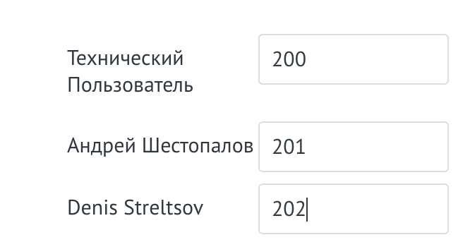 -->
* Далее необходимо прописать внутренние номера сотрудников.
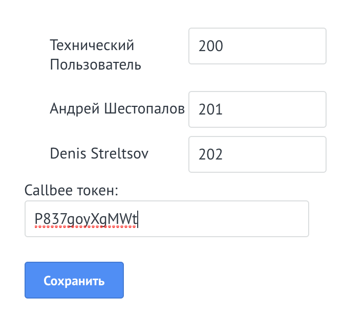
* В поле __Token__ Уникальный токен, необходимо скопировать из поля __AMOCRM TOKEN__ из настроек вашей интеграции в личном кабинете на сайте Callbee
* Сохранить настройки.
* В личном кабинете сервиса __Callbee__ после всех настроек на стороне amoCRM необходимо перезагрузить интеграцию.
* После перезагрузки вы можете выбрать в какие воронки будут создаваться сущности при входящем вызове #pepline

## Подключение и настройка расширения в браузере Google Chrome #google-chrome

Расширение __Callbee__ в google chrome используется для работы всех уведомлений о работе интеграции. Например, для оповещения о поступающих вызовах.

Установка:

* В магазине google chrome находим расширение __Callbee__ и устанавливаем его.
* Либо перейти по [ссылке](https://chrome.google.com/webstore/detail/callbee/belkefpbaepibinolmlpohpggbkiogco?hl=ru) и установить.

Настройка:
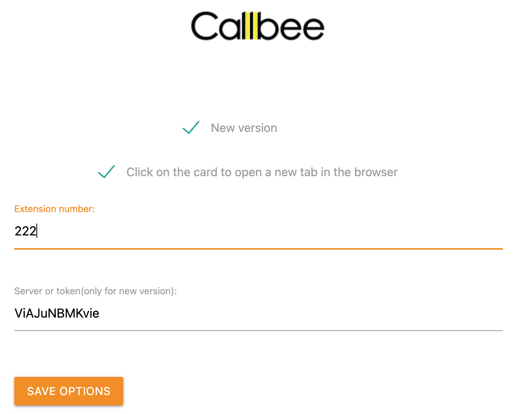

* __New version__ - Отметить пункт (обязательно).
* __Click on the card to open a new tab in the browser__ - Переход в карточку контакта по клику всплывающей карточки в новой вкладке браузера, по необходимости.
* __Extension number__ - Внутренний номер телефона сотрудника, на рабочем месте которого мы настраиваем данное расширение.
* __Server or token__ - Уникальный токен, необходимо скопировать из пункта __GOOGLE CHROME EXTENSION TOKEN__ из настроек вашей интеграции в личном кабинете Callbee (#google-chrome)
* Сохраняем настройки.

Статус расширения:


__ON__ - отображаются оповещения, работает умная маршрутизация для конкретного сотрудника


__OFF__ - отключены все оповещения, не работает умная маршрутизация для конкретного сотрудника

На данном этапе настройка считается выполненной. 

При возникновении вопросов обращайтесь за помощью в службу поддержки Callbee. Контакты указаны в Личном кабинете сервиса Callbee.io
