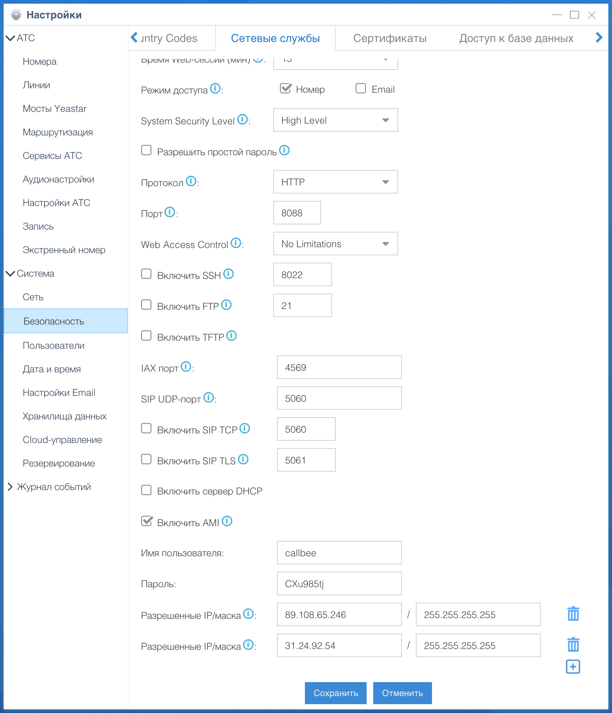
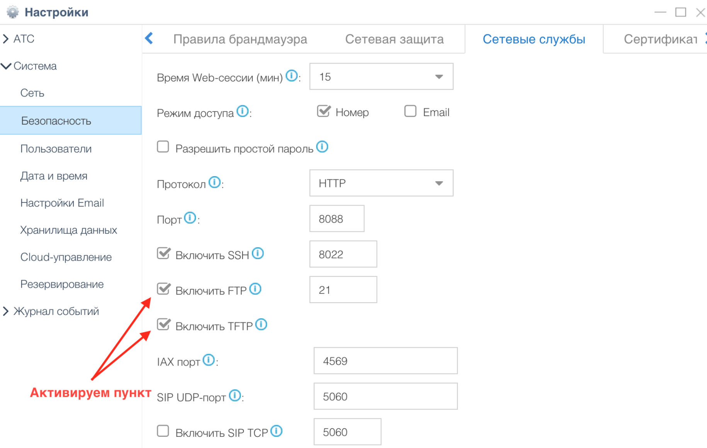
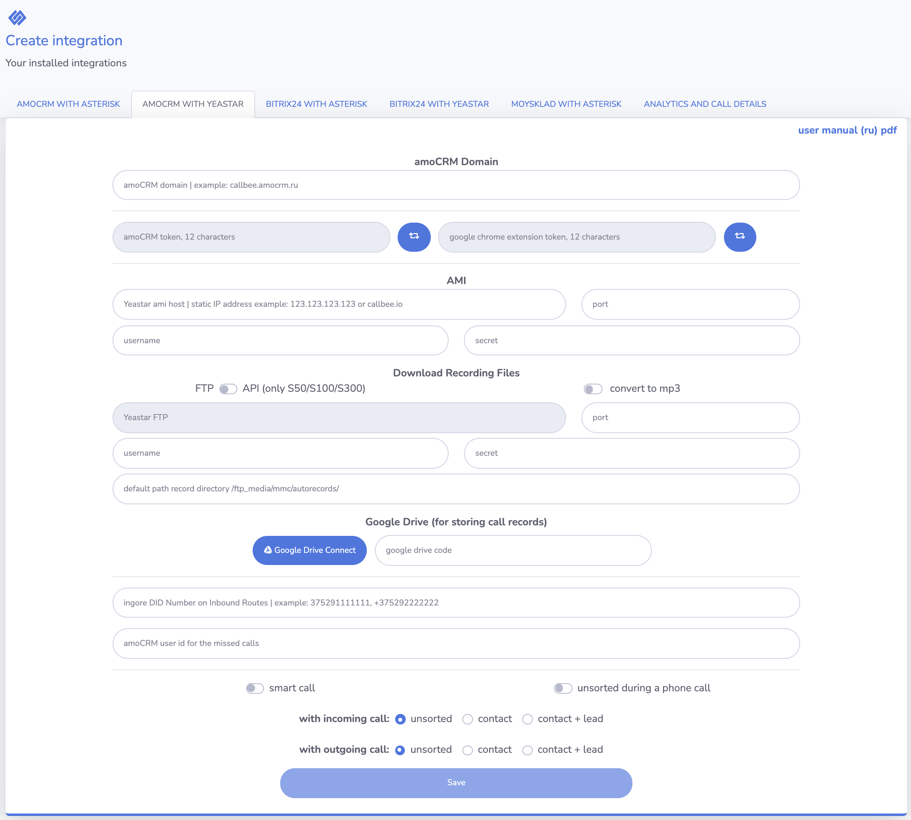
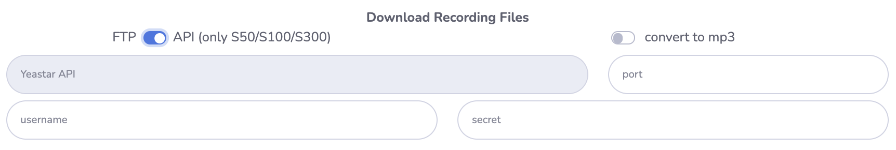
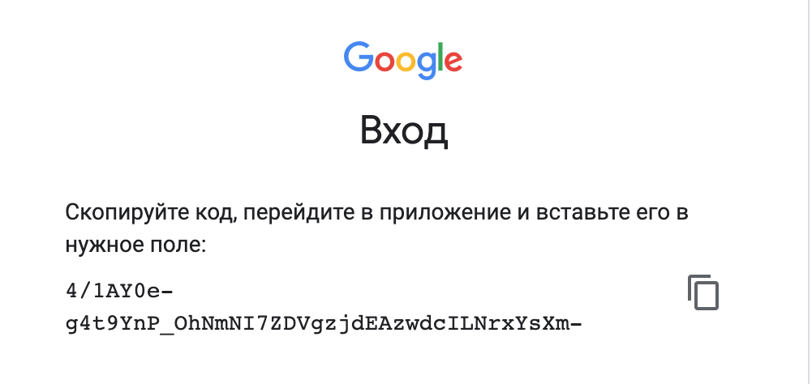

# Настройка интеграции IP-АТС Yeastar S серии с amoCRM при помощи сервиса Callbee

!!! info
    *Для подключения интеграции необходимо поочередно выполнить пункты данного руководства в той последовательности, как они описаны.*

## Необходимые требования

* IP-АТС серии S (S20, S50, S100, S300).
* Статический IP адрес (необходимо приобрести у вашего интернет-провайдера).

## Важные замечания

!!! info

    * Интеграция поддерживает внутренние номера до 4-х знаков включительно.
    * Интеграция не преобразует формат телефонных номеров, необходимо работать в международном формате как в amoCRM, так и на АТС.
    * Важно понимать, что голосовой SIP трафик за рамки вашей АТС никуда не выходит.

## Работа интеграции

Интеграция реализует связь по AMI протоколу с вашей IP-АТС Yeastar S серии и API amoCRM, а также осуществляет на стороне нашего сервера конвертацию файлов аудиозаписей разговоров из формата wav (записи разговоров создаются на IP-АТС Yeastar только в формате wav) в формат mp3 сохраняя их на __Google Drive__ и отправкой ссылки на аудиозапись разговора в amoCRM.

Интеграция имеет возможность получить запись разговора с IP-АТС по __FTP__ (для IP-АТС Yeastar S20) или __API__ (для IP-АТС Yeastar S50/S100/S300) в зависимости от настроек интеграции и самой IP-АТС.

Интеграция взаимодействует с amoCRM по API: отправляет запросы на проверку номера телефона, создание сущностей в amoCRM и проброс ссылки на запись разговора.

## 1. Настройка IP-АТС Yeastar

### 1.1 Настройка сетевых служб

Открываем админ панель АТС и переходим в раздел Настройки - __Система__ – __Безопасность__ далее переходим на вкладку __Сетевые службы__ и настраиваем следующее:

* Активируем пункт __Включить AMI__
* Изменяем стандартные __Имя пользователя__ и __Пароль__ (эти имя пользователя и пароль нужно будет прописать в личном кабинете Callbee)
* В появившемся поле __Разрешённые IP/Маска__ прописываем IP адреса из [списка](/#ip) разрешенных
* Меняем протокол с HTTPS на HTTP (Смену протокола следует производить если не установлен валидный сертификат)

!!! info "для Yeastar S20"

    * Активируем пункт __Включить FTP__
    * Активируем пункт __Включить TFTP__

### 1.2 Настройка хранилища данных

!!! info "для Yeastar S20"

Переходим в раздел __Настройки - Система - Хранилища данных__ и переходим во вкладку __File Share__:

* Активируем __Активировать FTP доступ__
* Активируем __Активировать файловое хранилище__

### 1.3 Настройка API

!!! info "для Yeastar S50/S100/S300"

Переходим в раздел __Настройки АТС - Настройки АТС - API__:

* Активируем __API__
* Активируем пункт __Монитор АТС__ всех номеров и линий

## 2. Сетевые настройки

Для того, чтобы интеграция могла подключится к вашей АТС, у вас обязательно должен быть статический IP адрес и проброшены через NAT к АТС следующие порты:

* __5038 TCP__ – для доступа к AMI Yeastar
* __21 TCP__ – для доступа к FTP Yeastar (для Yeastar S20)
* __8088 (порт к WEB интерфейсу по умолчанию) HTTP/HTTPS__ – для доступа к API Yeastar

!!! info
    Интерфейс настройки проброса портов сильно отличается в зависимости от используемого в вашей сети маршрутизатора. Актуальную инструкцию по пробросу портов под ваш маршрутизатор вы можете найти на официальном сайте производителя маршрутизатора.

## 3. Настройка интеграции в личном кабинете сервиса Callbee

В личном кабинете сервиса Callbee для интеграции с amoCRM необходимо:

* Во вкладке __Integration__ нажить на кнопку __Install integration__ и выбрать вкладку __AMOCRM WITH YEASTAR__ либо нажать кнопку __Install__ на блоке с типом интеграции __AMOCRM WITH YEASTAR__
* Заполнить все необходимые пункты для интеграции

* В поле __amoCRM Domain__ обязательно необходимо внести ваш домен amoCRM (например, callbee.amocrm.ru без https://)
* __amoCRM TOKEN__ - Токен для соединения с AmoCRM, этот токен необходимо будет вставить в интеграцию
на стороне AmoCRM (токен должен быть из 12 символов, правее есть кнопка генерации токена). Настройка интеграции на стороне AmoCRM описана [далее](#amocrm)
* __Google Chrome TOKEN__ - Токен для соединения с расширением в браузере Google Chrome, этот токен необходимо будет вставить в параметрах расширения (токен должен быть из 12 символов, правее есть кнопка генерации токена). Настройка расширения описана [далее](#5-google-chrome)
* __Asterisk AMI Host/Port/Username/Secret__ - Настройка подключения по AMI к ATC (IP-адрес сервера или доменное имя, порт, имя пользователя, пароль)
* __FTP__ или __API__

    !!! info "FTP для Yeastar S20"

        * __FTP host__ - ваш статический IP адрес для подключения к FTP Yeastar
        * __FTP port__ - ваш порт для подключения к FTP Yeastar (стандартный порт FTP 21)
        * __FTP username__ - имя пользователя к FTP Yeastar
        * __FTP secret__ - пароль к FTP Yeastar
        * __Path records directory__ - если оставить поле пустым, будет использоваться стандартный путь для хранении файлов записей разговоров /ftp_media mmc/autorecords/

    

    !!! info "API для Yeastar S50/S100/S300"

        * __API host__ - ваш статический IP адрес для подключения к API Yeastar
        * __API port__ - ваш порт для подключения к API Yeastar
        * __API username__ - имя пользователя к API Yeastar
        * __API secret__ - пароль к API Yeastar

* __Google Drive__ - Подключение __Google Drive__ к интеграции

    Нажимаем на __Google Drive Connect__
    

    Заходим под своим аккаунтом __Google__, далее нажимаем __Разрешить__
    

    Далее нажимаем __Разрешить__
    

    Копируем код и вставляем в поле __google drive code__
    

* __Convert to mp3__ - конвертировать аудиозаписи в mp3
* __Ignore DID numbers__ - DID номер(а) через запятую на входящим маршруте (интеграция будет игнорировать эти входящие маршруты)
* __amoCRM user ID for missed calls__ - ID пользователя в amoCRM для пропущенных вызовов (ответственный пользователь за пропущенные вызовы для новых клиентов, которых нет в amoCRM, например)
* __Smart call__ - Включение умной маршрутизации (перевод звонка на ответственного сотрудника)
* __Unsorted during a phone call__ - Создание неразобранного в amoCRM в момент ответа на входящий звонок
* __Incoming call__ - При входящем звонке создавать __Неразобранное__, __Контакт__, __Контакт + Сделка__
* __Outgoing calls__ - При исходящем звонке создавать __Неразобранное__, __Контакт__, __Контакт + Сделка__
* __Save__ - Сохранение настроек

## 4. Подключение интеграции на стороне amoCRM

!!! warning "Внимание"

    * Просим обратить особое внимание - название, логотипы могут отличаться от скриншотов данного руководства
    * Интеграция будет работать только для внутренних номеров, которые вы указали у сотрудников

* В настройках amoCRM, выбрать пункт __Интеграции__, сверху в строке поиска ищем по названию __Callbee__, либо в разделе __Телефония__ найти интеграцию __Callbee__ (__Asterisk и Yeastar__), согласившись с условиями нажать на кнопку __Установить__
<!--  -->
* Далее необходимо прописать внутренние номера сотрудников.

* В поле __Token__ Уникальный токен, необходимо скопировать из пункта __AMOCRM TOKEN__ из настроек вашей интеграции в личном кабинете
* Сохранить настройки.
* В личном кабинете сервиса __Callbee__ после всех настроек на стороне amoCRM необходимо перезагрузить интеграцию.

## 5. Подключение и настройка расширения в браузере Google Chrome

Расширение __Callbee__ в google chrome используется для оповещения сотрудника о поступающих вызовах.

Установка:

* В магазине google chrome находим расширение __Callbee__ и устанавливаем его.
* Либо перейти по [ссылке](https://chrome.google.com/webstore/detail/callbee/belkefpbaepibinolmlpohpggbkiogco?hl=ru) и установить.

Настройка:

* __New version__ - Отметить пункт (обязательно).
* __Click on the card to open a new tab in the browser__ - Переход в карточку контакта по клику всплывающей карточки в новой вкладке браузера, по необходимости.
* __Extension number__ - Внутренний номер телефона сотрудника.
* __Server or token__ - Уникальный токен, необходимо скопировать из пункта __GOOGLE CHROME EXTENSION TOKEN__ из настроек вашей интеграции в личном кабинете.
* Сохраняем настройки.

Статус расширения:

__ON__ - работает умная маршрутизация, отображаются оповещения

__OFF__ - отключены все оповещения, не работает умная маршрутизация

На данном этапе настройка считается выполненной.
