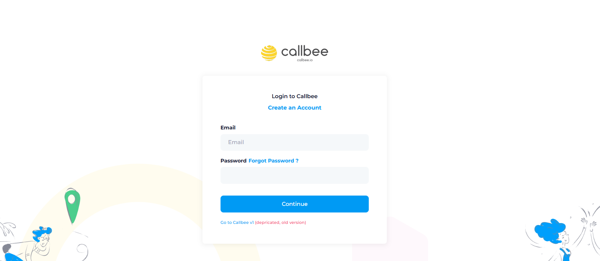
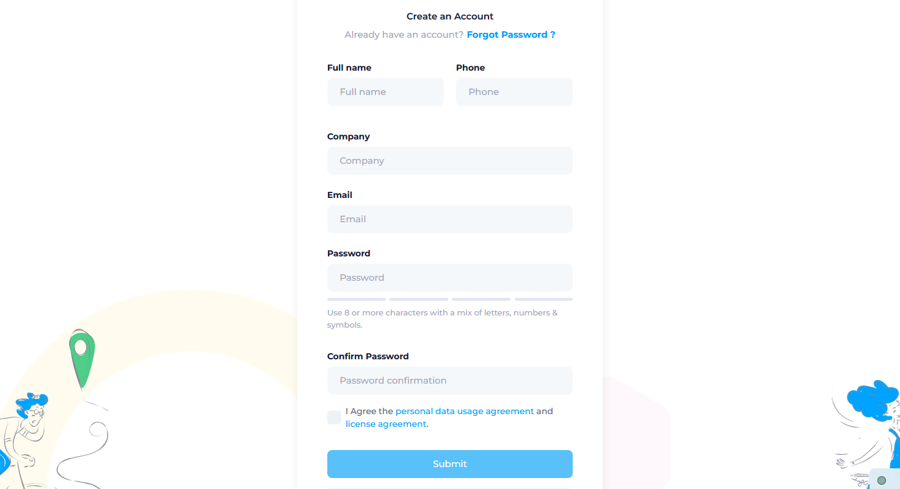
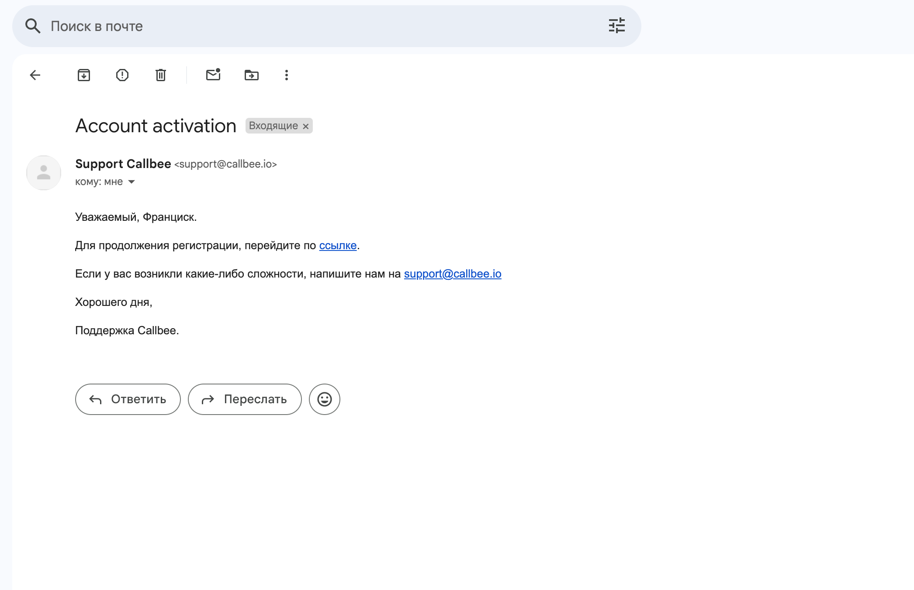
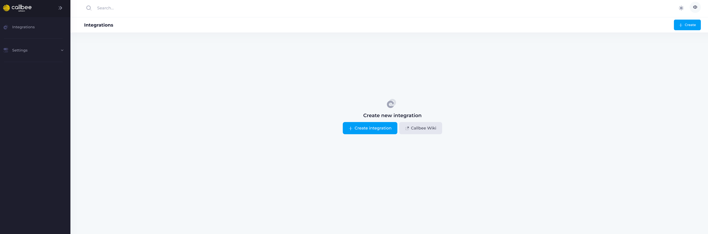

# Создание личного кабинета в callbee: Пошаговая инструкция

Эта инструкция проведет вас через процесс создания личного кабинета, чтобы вы могли начать пользоваться всеми преимуществами нашего сервиса интеграций.

## Шаг 1: Переход на страницу регистрации

1.  Откройте сайт [my.callbee.io](https://my.callbee.io/) в вашем браузере.
2.  Найдите и нажмите кнопку **"Create an Account/Создать аккаунт"** которая находится в центре главной страницы.

## Шаг 2: Заполнение формы регистрации

На странице регистрации вам будет предложено заполнить форму с вашими данными. Укажите следующую информацию:

*   **Имя и фамилия** Укажите ваши имя и фамилию. Это поможет нам персонализировать ваш опыт работы с callbee.
*   **Номер телефона** 
*   **Название компании :** Укажите название компании.
*   **УНП компании :** Укажите УНП компании.
*   **Электронная почта (E-mail):** Введите ваш действующий адрес электронной почты. Важно указать правильный адрес, так как на него будет отправлено письмо для подтверждения регистрации, а также он будет использован для получения уведомлений
*   **Пароль:** Создайте надежный пароль. Рекомендуем использовать пароль, состоящий как минимум из 8 символов, включающий прописные и строчные буквы, цифры и специальные символы (например, !@#$%^&*).
*   **Подтвердите пароль:** Повторно введите пароль для подтверждения.
*   **Ознакомьтесь с лицензионным соглашением и политикой обработки персональных данных:** : Перед регистрацией внимательно ознакомьтесь с Лицензионным соглашением и Политикой обработки персональных данных. Продолжая регистрацию, вы подтверждаете, что прочитали, поняли и согласны с условиями данных документов.  Если вы не согласны с каким-либо из условий, пожалуйста, прекратите регистрацию и свяжитесь с нами.

## Шаг 3: Подтверждение электронной почты

1.  После заполнения формы регистрации, проверьте свой почтовый ящик (входящие и папку "Спам").
2.  Найдите письмо от callbee с темой "Account activation/".
3.  Откройте письмо и перейдите по ссылке для подтверждения.

   *Внимание! Если вы не получили письмо в течение нескольких минут, проверьте папку "Спам" и убедитесь, что вы правильно указали свой e-mail адрес.*

## Шаг 4: Первый вход в личный кабинет

1.  После завершения регистрации и подтверждения электронной почты вы можете войти в свой личный кабинет. Для этого перейдите на сайт [my.callbee.io](https://my.callbee.io/).
2.  Введите свой e-mail и пароль, указанные при регистрации.
3.  Нажмите кнопку **"Продолжить"**.

## Шаг 5: Начните использовать callbee!

Поздравляем! Вы успешно создали свой личный кабинет. Теперь вы можете начать изучать возможности callbee и настраивать его под свои задачи.
