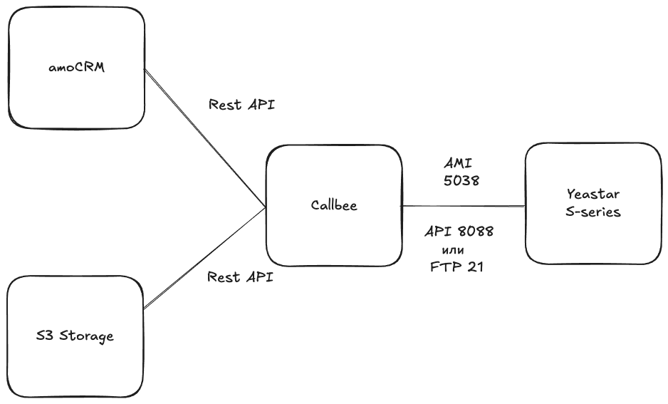
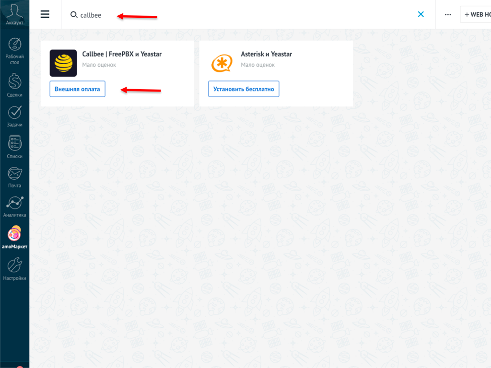
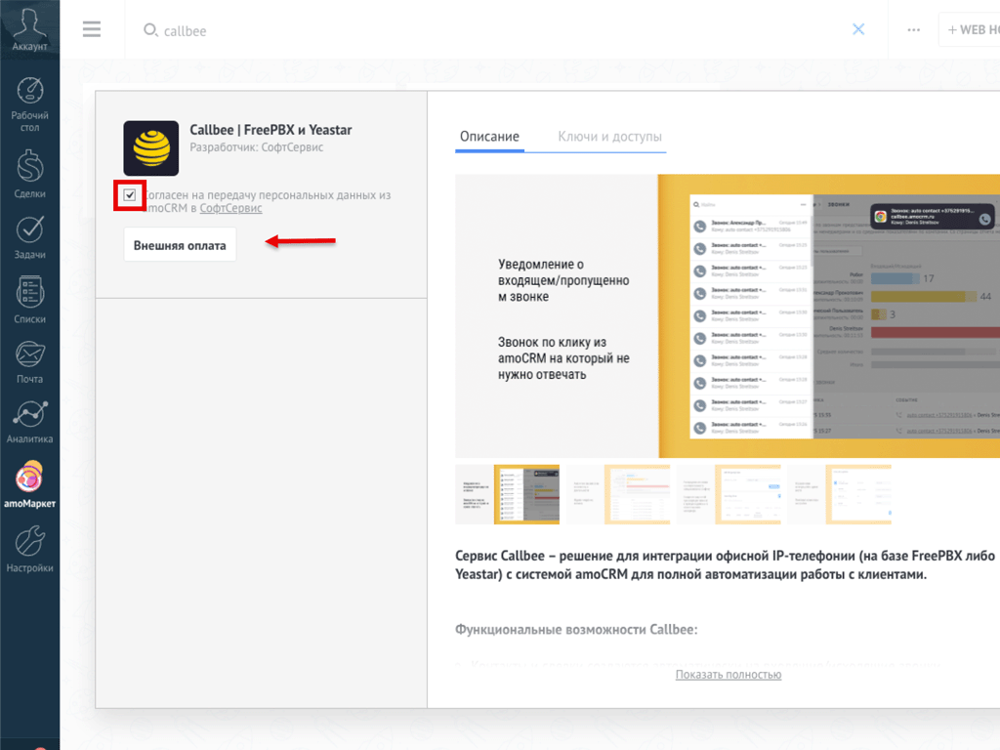
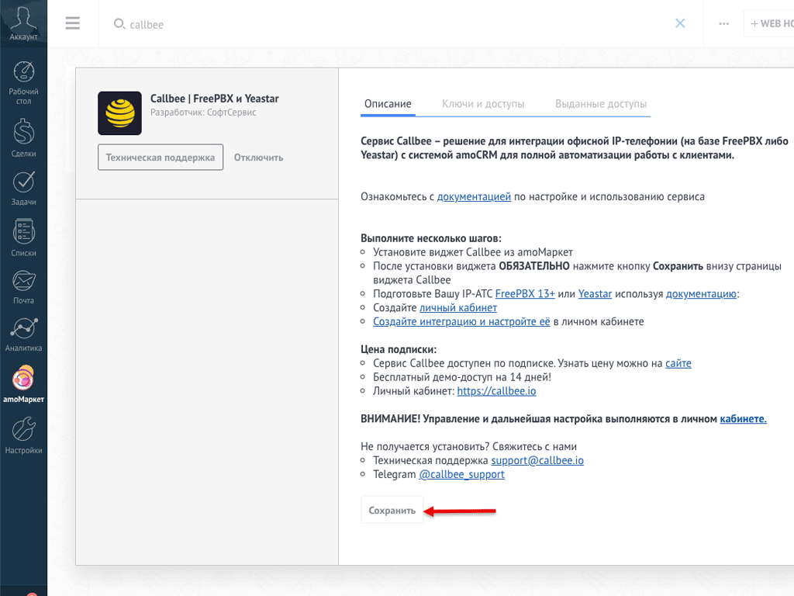
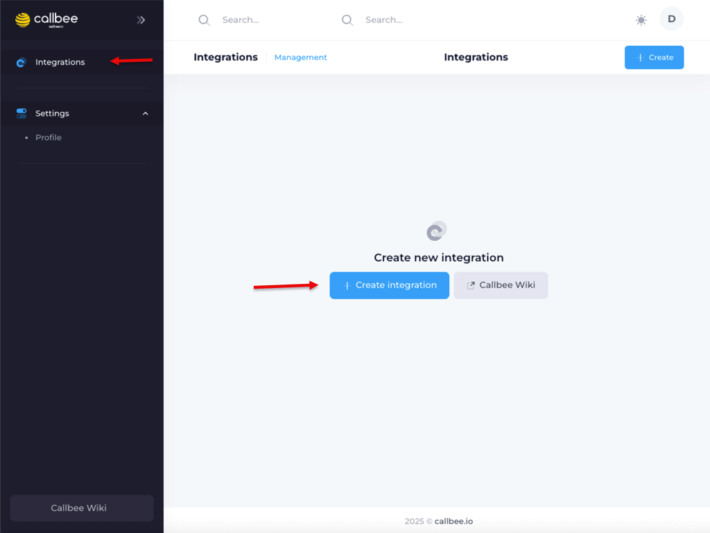
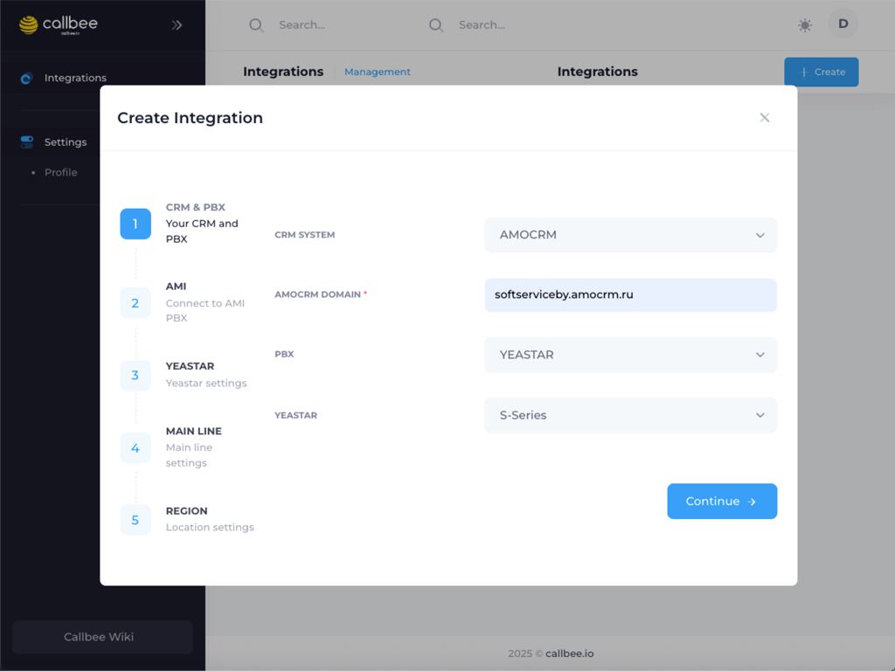
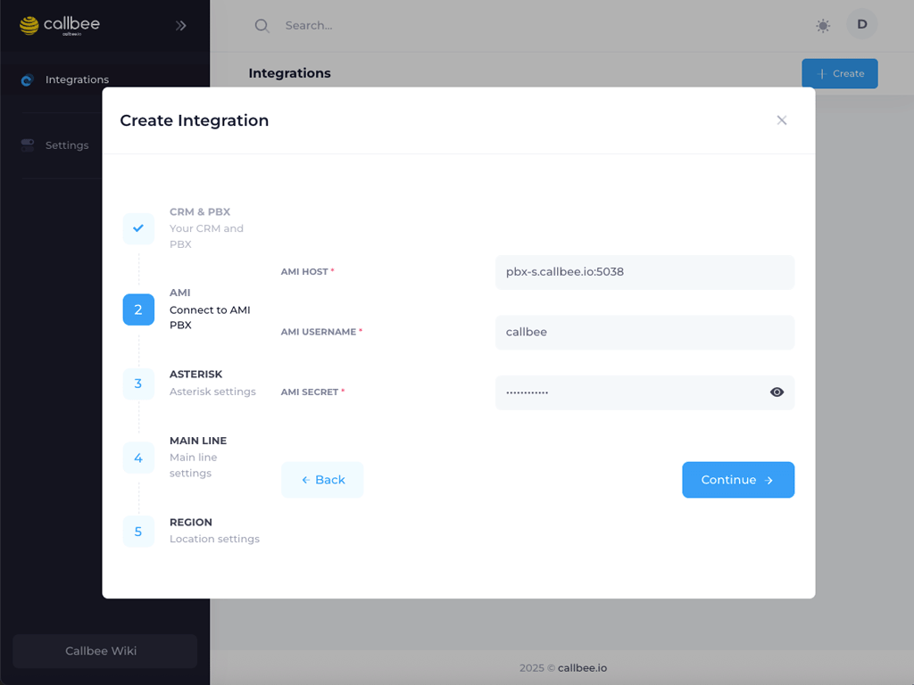
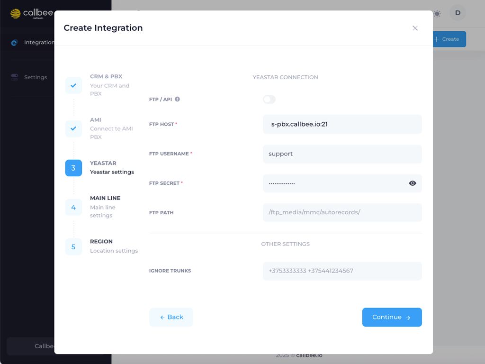
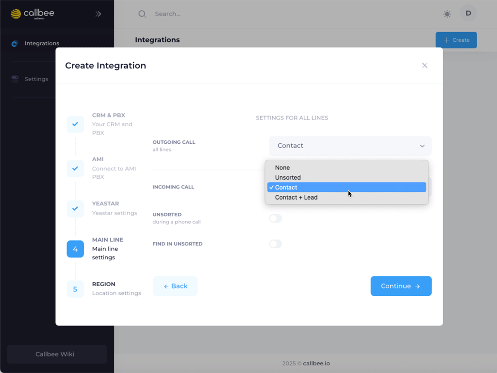

<div style="border: 1px solid #e0a800; background-color: #fff8e1; padding: 1em; border-radius: 0.5em; margin-bottom: 1.5em;">
  <div style="display: flex; align-items: flex-start;">
    <div style="color: #f0ad4e; font-weight: bold; font-size: 1.5em; margin-right: 0.5em; line-height: 1.2;">
      &#9432;
    </div>
    <div style="flex-grow: 1;">
      <p style="margin: 0; padding: 0;">
        Для подключения интеграции необходимо поочередно выполнить пункты данного руководства в той последовательности, как они описаны.
      </p>
      <!-- Если нужна ссылка, добавьте ее здесь -->
    </div>
  </div>
</div>
## Схема взаимодействия сервиса
Представленная схема демонстрирует, как происходит взаимодействие между amoCRM, IP-АТС Yeastar и сервисом Callbee.


## Необходимые требования
*   Freepbx 13 версии и выше.
*   Статический IP-адрес
*   Личный кабинет Callbee.
*   Активная лицензия Битрикс24.
*   Активная подписка на Битрикс24.Маркет для пользователей из России.
*   Доступ к TCP портам 5038.
## 1. Установка виджета Callbee | FreePBX и Yeastar в amoCRM
*  Находим виджет **Callbee | FreePBX и Yeastar** в amoМаркет.
    
*  Устанавливаем виджет, подтвердив согласие с политикой обработки персональных данных и нажав кнопку **"Внешняя оплата"**.
    
*  После успешной установки виджета нажмите кнопку **"Сохранить"**.
    
**Поздравляем!** Вы установили виджет Callbee | FreePBX и Yeastar.
## 2. Настраиваем подключение сервиса к IP-АТС
<div style="border: 1px solid #e0a800; background-color: #fff8e1; padding: 1em; border-radius: 0.5em; margin-bottom: 1.5em;">
  <div style="display: flex; align-items: flex-start;">
    <div style="color: #f0ad4e; font-weight: bold; font-size: 1.5em; margin-right: 0.5em; line-height: 1.2;">
      &#9432;
    </div>
    <div style="flex-grow: 1;">
      <p style="margin: 0; padding: 0;">
        Успешность интеграции зависит от корректной настройки подключения сервиса к AMI, а также к API или FTP станции Yeastar. Пожалуйста, помните, что для модели S20 API недоступно.
      </p>
    </div>
  </div>
</div>
## 2. Настраиваем подключение сервиса к IP-АТС
<div style="border: 1px solid #e0a800; background-color: #fff8e1; padding: 1em; border-radius: 0.5em; margin-bottom: 1.5em;">
  <div style="display: flex; align-items: flex-start;">
    <div style="color: #f0ad4e; font-weight: bold; font-size: 1.5em; margin-right: 0.5em; line-height: 1.2;">
      &#9432;
    </div>
    <div style="flex-grow: 1;">
      <p style="margin: 0; padding: 0;">
        Успешность интеграции зависит от корректной настройки подключения сервиса к AMI, а также к API или FTP станции Yeastar. Пожалуйста, помните, что для модели S20 API недоступно.
      </p>
    </div>
  </div>
</div>

### 2.1 Настройка сетевых служб - AMI через CLI. Вариант 1

Шаги для активации и настройки AMI IP-ATC через CLI:

-  **Откройте** через CLI файл /etc/asterisk/manager_custom.conf и добавьте

   ``` 
    [callbee] 
  secret=password                       # Вместо password указываем свой пароль
  deny=0.0.0.0/0.0.0.0 
  permit=127.0.0.1/255.255.255.0
  permit=185.255.77.197/255.255.255.255
  permit=77.105.155.20/255.255.255.255
permit=31.44.1.160/255.255.255.255
permit=178.123.180.59/255.255.255.255
read=system,call,log,verbose,command,agent,user,config,command,dtmf,reporting,cdr,dialplan,originate,message
write=system,call,log,verbose,command,agent,user,config,command,dtmf,reporting,cdr,dialplan,originate,message
writetimeout = 500
    ``` 

-   Выполните в bash команду asterisk -rx "manager reload"

### 2.2 Настройка AMI в Web-интерфейсе. Вариант 2

Шаги для активации и настройки AMI IP-ATC через CLI:

-  **Откройте Web-интерфейс FreePBX**.
-  Перейдите в раздел `Settings` (1).
-  Выберите пункт `Asterisk Manager Users` (2).
*   
*   **Имя учетной записи (Account Name):** Укажите имя для учетной записи (например, `callbee`).
*   **Пароль (Password):** Задайте надежный, криптостойкий пароль.
*   **Правила доступа (Permit):** Добавьте IP-адреса серверов Callbee, которые должны иметь доступ к AMI-интерфейсу Asterisk.

## 3. Сетевые настройки
Для того, чтобы интеграция могла подключиться к вашей АТС, у вас обязательно должен быть **статический IP-адрес** и проброшены через NAT к АТС следующие порты:

-   **5038 TCP** – для доступа к AMI Yeastar.
-   **50381 (порт к WEB интерфейсу по умолчанию) HTTP/HTTPS** – для получения порталом Битриск24 записи разговоров.
## 4. Создание и подключение сервиса в личном кабинете my.callbee.io
Следуйте этим шагам для настройки сервиса в личном кабинете:

-  Войдите в личный кабинет `my.callbee.io`.
-  Запустите установщик, который поможет создать сервис.
    
-  **В разделе выбора CRM системы**:
    
    *   Выберите **"amoCRM"** из списка.
    *   Введите адрес вашей amoCRM в поле **"AMOCRM DOMAIN"**.
    *   Выберите **"IP-ATC Yeastar"**.
    *   Укажите серию вашей IP-АТС Yeastar (например, **"S"**).
    *   Нажмите **"Continue"** для перехода к следующему шагу.
-  **Настраиваем подключение к AMI**:
    
    *   Введите **адрес и порт** для подключения к AMI (обычно `5038`).
    *   Укажите **AMI USERNAME** и **AMI SECRET**, которые вы задали в пункте 2.1.
    *   Нажмите **"Continue"** для перехода к следующему шагу.
-  **Настраиваем подключение к API**:
    
    *   **Укажите внешний IP-адрес вашей IP-АТС в поле "API HOST"**. Этот адрес должен быть доступен для адресов сервиса Callbee. (обычно `8088`)
    *   Укажите **API USERNAME** и **API SECRET**, которые вы задали в пункте 2.2.
    *   Нажмите **"Continue"** для перехода дальше.
-  **Для S20: Настраиваем подключения к FTP:**:
  
    *   Введите внешний IP-адрес вашей IP-АТС в поле **FTP HOST**  и порт (обычно `21`). 
    *   Укажите **FTP USERNAME** и **FTP SECRET**, которые вы задали в пункте 2.3 (при наличии).

-  **Настройка правил создания сущностей:**
  
    * Настройте правила для автоматического создания **сделок** или **контактов** в amoCRM. Здесь вы можете определить, при каких условиях будет создаваться новая сущность (например, при первом звонке от неизвестного номера).
    *   Сохраните внесенные изменения, нажав кнопку **"Continue"**.

-  **Настройка расположения и часового пояса сервиса:**
  

    *  Выберите **регион расположения сервиса**, наиболее близкий к вашему местоположению или местоположению ваших сотрудников. Доступны следующие опции: **Беларусь, Россия, Казахстан, Нидерланды**.
    * Укажите **часовой пояс**, в котором работают ваши сотрудники. Эта настройка критически важна для корректной работы функции умной маршрутизации звонков.
    *   Сохраните внесенные изменения, нажав кнопку **"Continue"**.

**Поздравляем!** Вы создали и запустили сервис  Callbee.


[def]: img/amo