

  

    

      &#9432;
    

    

      

        Для подключения интеграции необходимо поочередно выполнить пункты данного руководства в той последовательности, как они описаны.
      

      <!-- Если нужна ссылка, добавьте ее здесь -->
    

  

## Схема взаимодействия сервиса
Представленная схема демонстрирует, как происходит взаимодействие между amoCRM, IP-АТС Yeastar и сервисом Callbee.
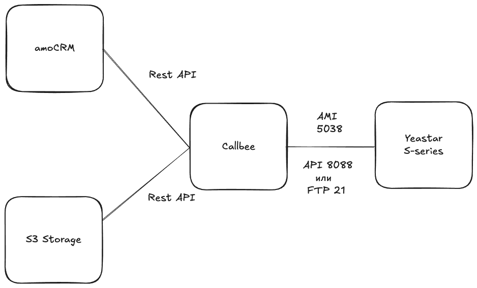

## Необходимые требования
*   IP-АТС серии S (S20, S50, S100, S300).
*   Статический IP-адрес
*   Личный кабинет Callbee.
*   Активная лицензия amoCRM.
*   Доступ к TCP портам 5038, 8088 либо (21 для S20) IP-АТС Yeastar с разрешенных адресов сервиса.
*   Настроенное хранилище S3 (если применимо для вашей модели АТС и задач).
---
## 1. Установка виджета Callbee | FreePBX и Yeastar в amoCRM
*  Находим виджет **Callbee | FreePBX и Yeastar** в amoМаркет.
    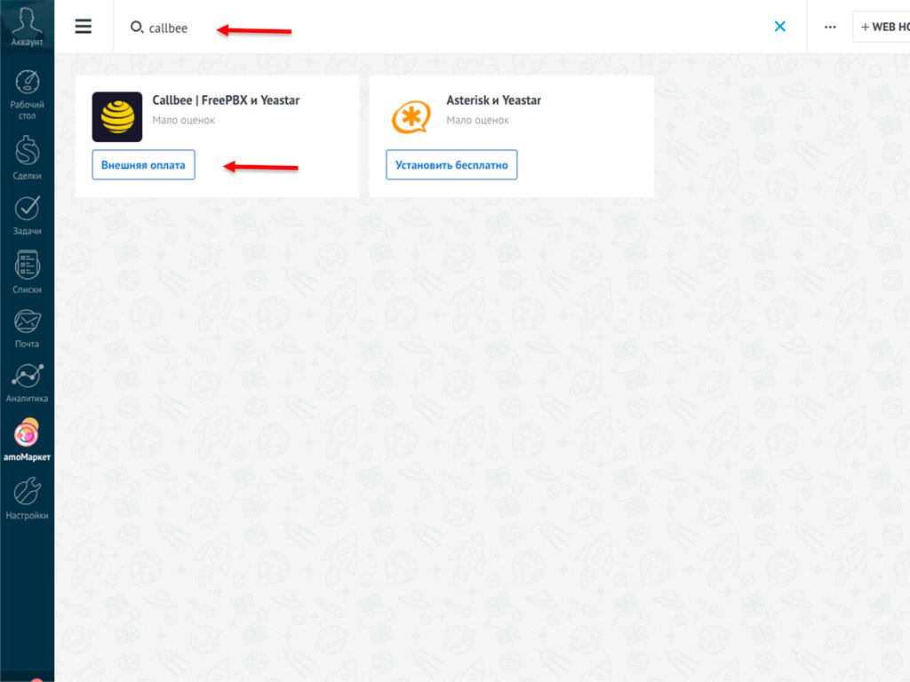
*  Устанавливаем виджет, подтвердив согласие с политикой обработки персональных данных и нажав кнопку **"Внешняя оплата"**.
    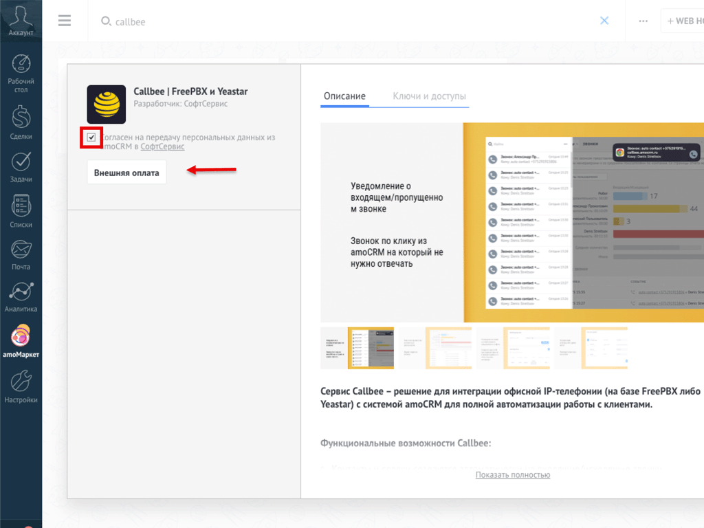
*  После успешной установки виджета нажмите кнопку **"Сохранить"**.
    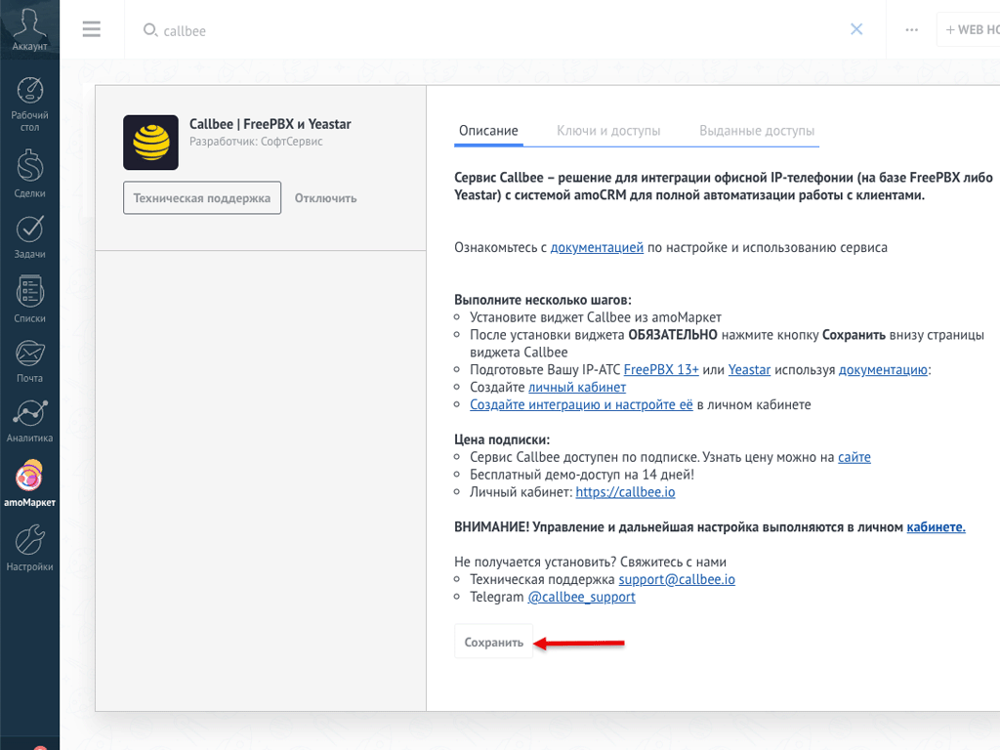
**Поздравляем!** Вы установили виджет Callbee | FreePBX и Yeastar.
## 2. Настраиваем подключение сервиса к IP-АТС

  

    

      &#9432;
    

    

      

        Успешность интеграции зависит от корректной настройки подключения сервиса к AMI, а также к API или FTP станции Yeastar. Пожалуйста, помните, что для модели S20 API недоступно.
      

    

  

### 2.1 Настройка сетевых служб - AMI

Шаги для активации и настройки AMI IP-ATC:

-  **Откройте** админ-панель IP-АТС и перейдите в раздел **Настройки** &gt; **Система** &gt; **Безопасность**.
  На вкладке **Сетевые службы** найдите и **активируйте пункт "Включить AMI"**.
-  **Измените стандартные "Имя пользователя" и "Пароль"** для AMI. Эти учетные данные потребуются для указания в личном кабинете Callbee.
-  В появившемся поле **"Разрешённые IP/Маска"** пропишите IP-адреса из списка адресов сервиса.
    
-  **Измените протокол с HTTPS на HTTP** (только если на АТС не установлен валидный SSL-сертификат).
    
-  **Сохраните** внесенные изменения, нажав кнопку **"Сохранить"**.
### 2.2 Настройки Yeastar API

Шаги для активации и настройки API Yeastar:

-  **Откройте** админ-панель IP-АТС и перейдите в раздел **Настройки** &gt; **АТС** &gt; **API**.
-  На вкладке **API** найдите и **активируйте опцию "Активировать API"**.
-  **Задайте "Имя пользователя API" и "Пароль API"**. Эти учетные данные понадобятся вам для настройки подключения в личном кабинете Callbee.
-  **Сохраните** внесенные изменения, нажав кнопку **"Сохранить"**.
    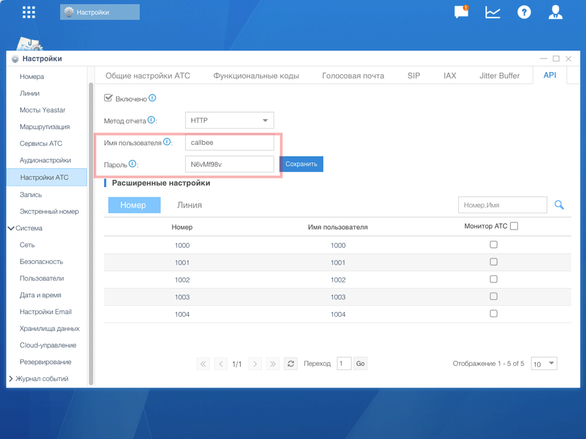
### 2.3 Настройка хранилища данных (FTP) **Только Yeastar S20**

Шаги для активации FTP:

-  **Перейдите** в раздел **Настройки** &gt; **Система** &gt; **Хранилища данных**.
-  Во вкладке **File Share** найдите и **активируйте опцию "Активировать FTP доступ"**.
-  **Сохраните** внесенные изменения, нажав кнопку **"Сохранить"**.
    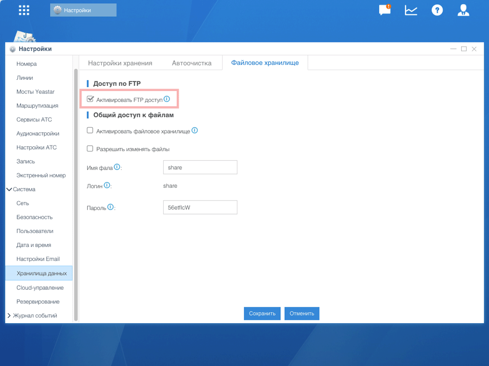

**Получение пароля FTP**:

Данные доступа к FTP совпадают с данные подключения к SSH. Логин **support**.
Пароль нужно получить при активации SSH. 

-  **Откройте** админ-панель IP-АТС и перейдите в раздел **Настройки** &gt; **Система** &gt; **Безопасность**.
- На вкладке **Сетевые службы** найдите и **активируйте пункт "Включить SSH"**. Эти учетные данные потребуются для указания в личном кабинете Callbee при настройке FTP.
    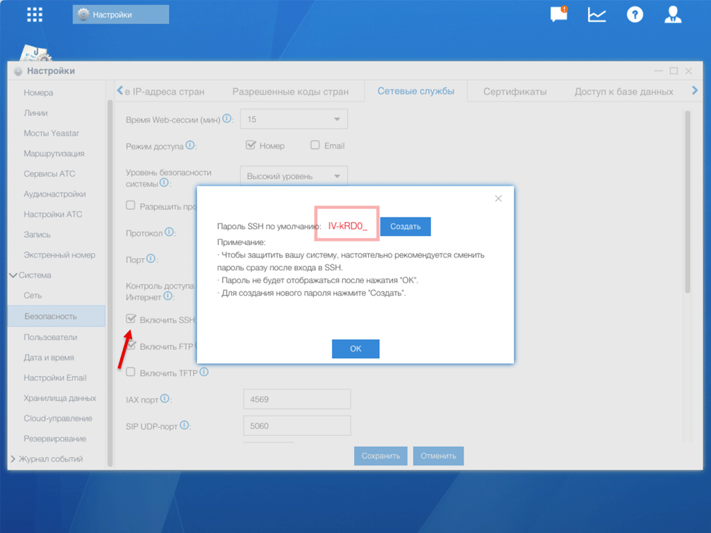
---
## 3. Сетевые настройки
Для того, чтобы интеграция могла подключиться к вашей АТС, у вас обязательно должен быть **статический IP-адрес** и проброшены через NAT к АТС следующие порты:

-   **5038 TCP** – для доступа к AMI Yeastar.
-   **21 TCP** – для доступа к FTP Yeastar (для Yeastar S20).
-   **8088 (порт к WEB интерфейсу по умолчанию) HTTP/HTTPS** – для доступа к API Yeastar.
---
## 4. Создание и подключение сервиса в личном кабинете my.callbee.io
Следуйте этим шагам для настройки сервиса в личном кабинете:

-  Войдите в личный кабинет `my.callbee.io`.
-  Запустите установщик, который поможет создать сервис.
    
-  **В разделе выбора CRM системы**:
    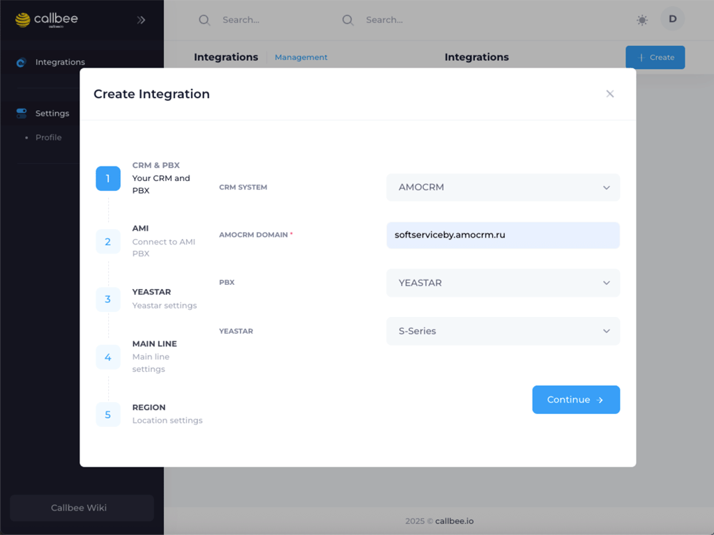
    *   Выберите **"amoCRM"** из списка.
    *   Введите адрес вашей amoCRM в поле **"AMOCRM DOMAIN"**.
    *   Выберите **"IP-ATC Yeastar"**.
    *   Укажите серию вашей IP-АТС Yeastar (например, **"S"**).
    *   Нажмите **"Continue"** для перехода к следующему шагу.
-  **Настраиваем подключение к AMI**:
    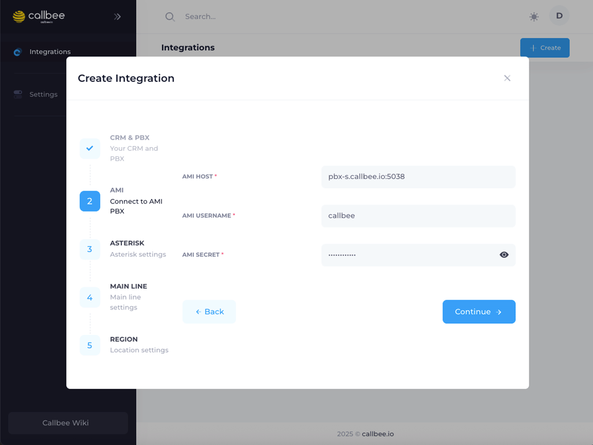
    *   Введите **адрес и порт** для подключения к AMI (обычно `5038`).
    *   Укажите **AMI USERNAME** и **AMI SECRET**, которые вы задали в пункте 2.1.
    *   Нажмите **"Continue"** для перехода к следующему шагу.
-  **Настраиваем подключение к API**:
    
    *   **Укажите внешний IP-адрес вашей IP-АТС в поле "API HOST"**. Этот адрес должен быть доступен для адресов сервиса Callbee. (обычно `8088`)
    *   Укажите **API USERNAME** и **API SECRET**, которые вы задали в пункте 2.2.
    *   Нажмите **"Continue"** для перехода дальше.
-  **Для S20: Настраиваем подключения к FTP:**:
  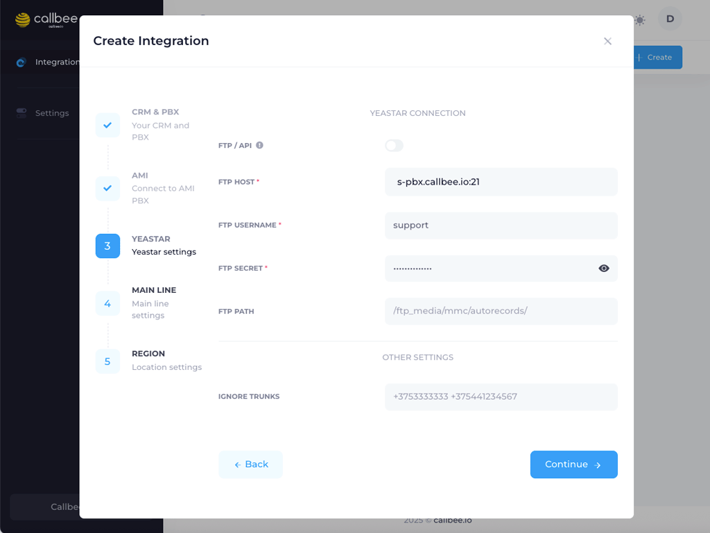
    *   Введите внешний IP-адрес вашей IP-АТС в поле **FTP HOST**  и порт (обычно `21`). 
    *   Укажите **FTP USERNAME** и **FTP SECRET**, которые вы задали в пункте 2.3 (при наличии).

-  **Настройка правил создания сущностей:**
  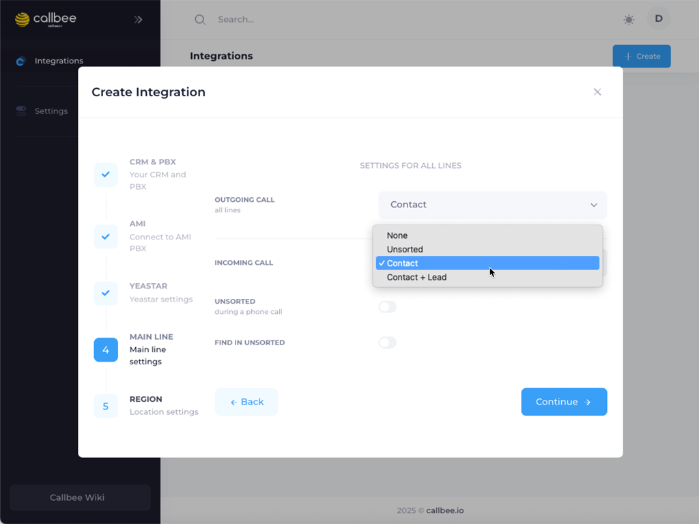
    * Настройте правила для автоматического создания **сделок** или **контактов** в amoCRM. Здесь вы можете определить, при каких условиях будет создаваться новая сущность (например, при первом звонке от неизвестного номера).
    *   Сохраните внесенные изменения, нажав кнопку **"Continue"**.

-  **Настройка расположения и часового пояса сервиса:**
  

    *  Выберите **регион расположения сервиса**, наиболее близкий к вашему местоположению или местоположению ваших сотрудников. Доступны следующие опции: **Беларусь, Россия, Казахстан, Нидерланды**.
    * Укажите **часовой пояс**, в котором работают ваши сотрудники. Эта настройка критически важна для корректной работы функции умной маршрутизации звонков.
    *   Сохраните внесенные изменения, нажав кнопку **"Continue"**.

**Поздравляем!** Вы создали и запустили сервис  Callbee.

[def]: img/amo