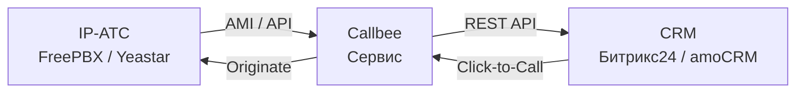

# Как работает Callbee

## Схема взаимодействия

## Принцип работы

### Входящий звонок

1. Клиент звонит на ваш номер
2. АТС принимает звонок и уведомляет Callbee через **AMI**
3. Callbee проверяет номер в CRM
4. Если контакт найден — звонок маршрутизируется на **ответственного сотрудника**
5. В CRM отображается **всплывающая карточка** клиента
6. После завершения — **запись разговора** сохраняется в CRM

### Исходящий звонок (Click-to-Call)

1. Сотрудник нажимает на номер телефона в CRM
2. CRM отправляет команду в Callbee
3. Callbee отправляет команду **Originate** в АТС
4. АТС звонит на внутренний номер сотрудника
5. Сотрудник снимает трубку — АТС набирает номер клиента
6. Запись разговора сохраняется в CRM

## Подключение к АТС

||| FreePBX
Подключение через **Asterisk Manager Interface (AMI)** — порт 5038 TCP. Записи разговоров публикуются через веб-сервер (nginx в Docker).
||| Yeastar S-серия
Подключение через **AMI** (порт 5038) + **API Yeastar** (порт 8088). Для модели S20 — дополнительно **FTP** (порт 21) для доступа к записям.
|||
