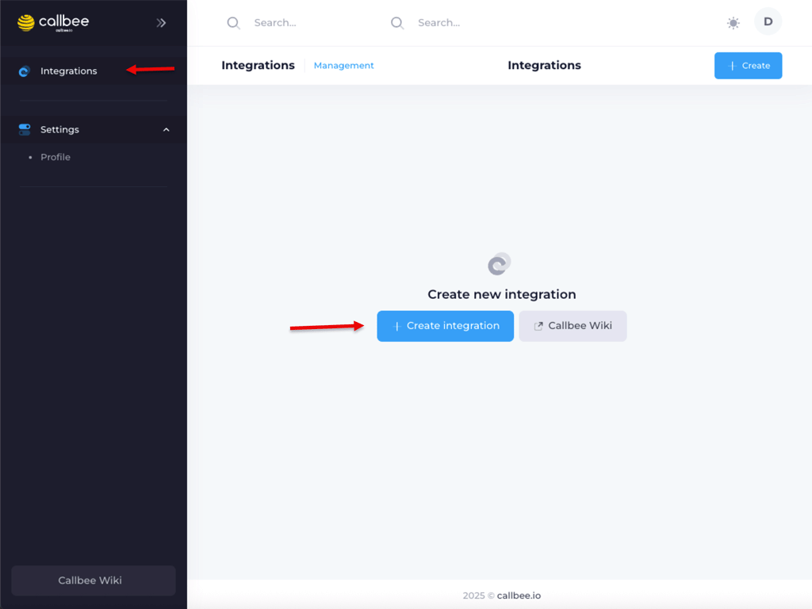

# Создание интеграции в личном кабинете

На предыдущем шаге вы настроили АТС — открыли порт AMI и опубликовали записи разговоров. Теперь свяжите АТС с CRM через личный кабинет **my.callbee.io**: это и есть ваш **сервис Callbee**, который маршрутизирует звонки и синхронизирует данные.

## Перейдите в установщик

1. Войдите в [личный кабинет my.callbee.io](https://my.callbee.io)
2. Нажмите **«Создать сервис»** на главной странице
3. Следуйте мастеру установки

## Выберите связку АТС + CRM

Перейдите к подробной инструкции по вашей комбинации — мастер в ЛК спросит те же параметры, а в инструкции они разобраны с примерами и скриншотами:

+++ FreePBX 13+
- [FreePBX + Битрикс24](/setup/freepbx/bitrix24/)
- [FreePBX + amoCRM](/setup/freepbx/amocrm/)
- [FreePBX + 1С 8.3.27+](/setup/freepbx/1c/)
- [FreePBX + ROISTAT](/setup/freepbx/roistat/)
+++ Yeastar S-серия
- [Yeastar S + Битрикс24](/setup/yeastar/bitrix24/)
- [Yeastar S + amoCRM](/setup/yeastar/amocrm/)
+++ Yeastar P-серия
> [!WARNING] В разработке
> Интеграция Yeastar P-серии через App Center тестируется. [Напишите в поддержку](mailto:support@callbee.io) чтобы попасть в пилот.
+++

## Что нужно будет указать

Чтобы мастер не останавливал вас, подготовьте заранее:

|   |   |
|---|---|
| **Домен CRM** | `company.bitrix24.ru` / `company.amocrm.ru` / `company.roistat.com` |
| **Адрес АТС** | IP-адрес или домен вашего сервера |
| **AMI логин и пароль** | созданные в [настройке AMI](/quickstart/pbx-setup/) |
| **URL записей** | `https://pbx.company.ru/monitor` — из [публикации записей](/setup/freepbx/recording-publish/) |
| **Регион и часовой пояс** | для корректной работы умной маршрутизации |

---

> [!SUCCESS] Сервис создан?
> Переходите к [первому тестовому звонку](/quickstart/first-call/) из карточки CRM.
