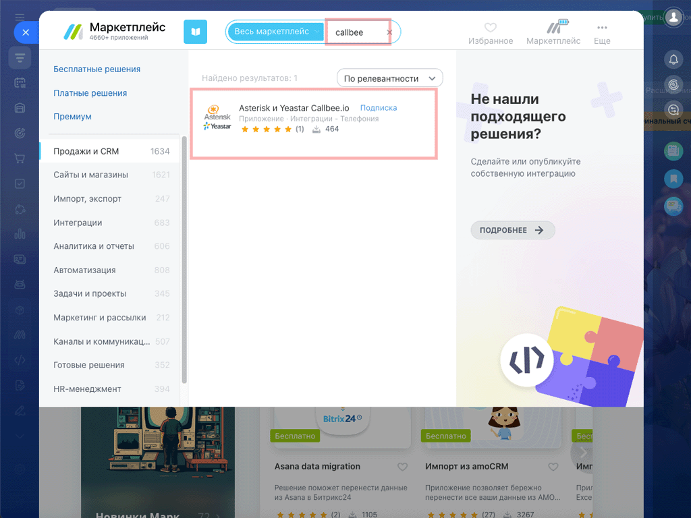
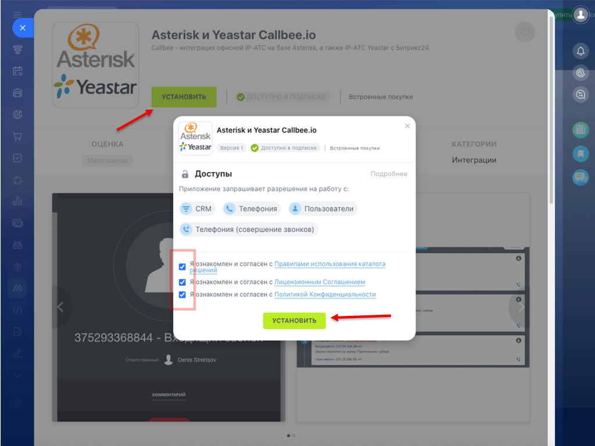
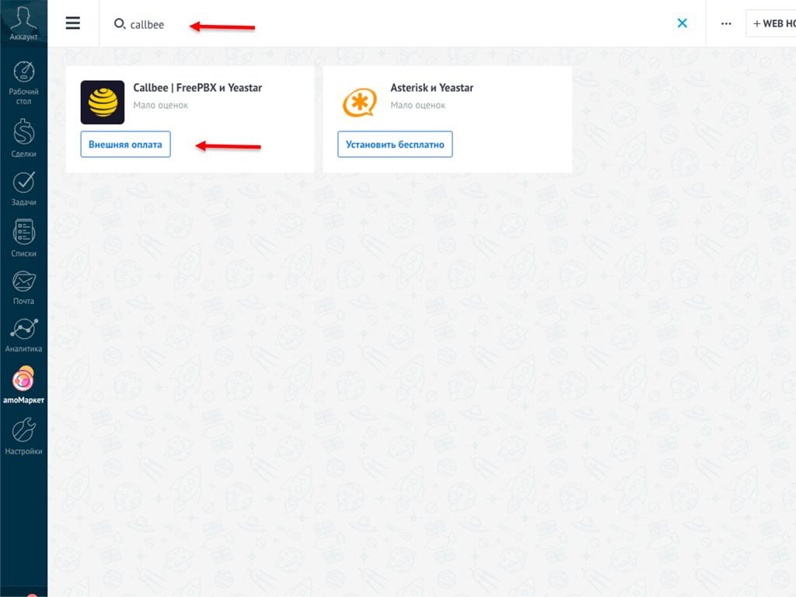
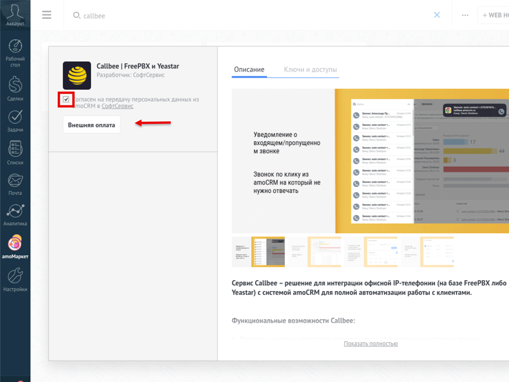
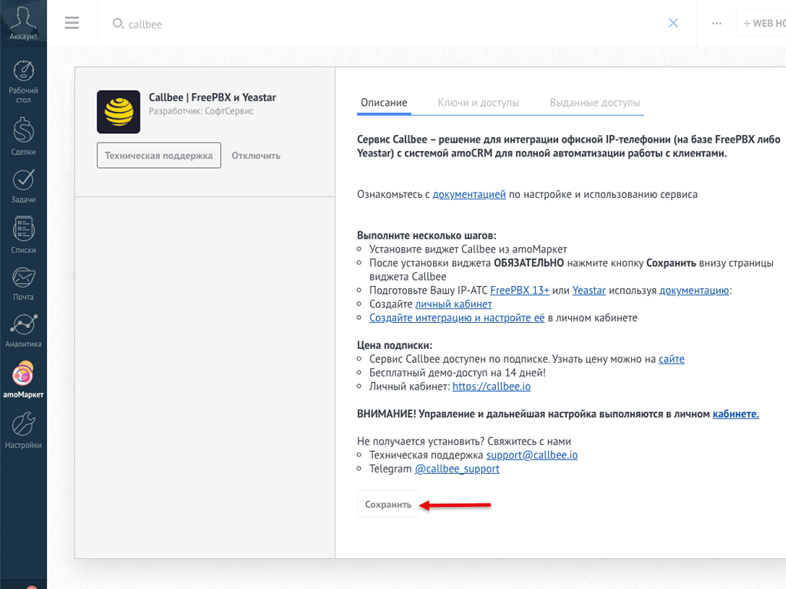

# Установка приложения в CRM

Выберите вашу CRM-систему:

+++ Битрикс24

> [!NOTE] Требования
> - Портал Битрикс24 с ролью **Администратор**
> - Тариф **Стандартный** или выше (нужна поддержка Телефонии и Маркетплейса)

### Шаг 1. Откройте Битрикс24.Маркет

Войдите на ваш портал Битрикс24 и перейдите в раздел **«Приложения»** → **«Маркет»** в левом меню.

В строке поиска введите **«Callbee»** или **«Asterisk Yeastar»** — приложение **«Asterisk и Yeastar Callbee.io»** появится в результатах.

> [!TIP] Быстрый путь
> Откройте прямую ссылку на приложение: [Callbee в Битрикс24.Маркет](https://www.bitrix24.ru/apps/?app=callbee.callbee).

### Шаг 2. Установите приложение

Нажмите зелёную кнопку **«Установить»** на карточке приложения.

Откроется окно **«Доступы»** — приложение запросит разрешения на работу с:

- **CRM** — чтение и создание контактов, сделок, лидов
- **Телефония** — регистрация входящих и исходящих звонков
- **Пользователи** — получение списка сотрудников
- **Телефония (совершение звонков)** — инициация звонков из карточек

Отметьте все **три чекбокса** согласия:

- Правила использования каталога решений
- Лицензионное Соглашение
- Политика Конфиденциальности

Нажмите зелёную кнопку **«Установить»** в окне доступов. Установка занимает 5–10 секунд.

> [!WARNING] «Недостаточно прав для установки»
> Ошибка появляется, если вы не администратор портала. Попросите владельца портала установить приложение или выдать вам роль администратора в разделе **«Сотрудники → Структура компании»**.

### Шаг 3. Проверьте установку

После установки приложение появится в разделе **«Приложения → Установленные»**.

> [!NOTE] У приложения нет интерфейса
> Callbee для Битрикс24 работает «в фоне» — открывать его на портале не нужно. Приложение лишь регистрирует необходимые разрешения (CRM, Телефония) и webhook для обмена данными с сервисом Callbee. Вся настройка и управление — в [личном кабинете my.callbee.io](https://my.callbee.io).

+++ amoCRM

1. Откройте **amoМаркет**
2. Найдите виджет **«Callbee | FreePBX и Yeastar»**
   
3. Установите виджет, нажав **«Внешняя оплата»**
   
4. Нажмите **«Сохранить»**
   

+++ 1С 8.3.27+

> [!NOTE] Требования
> Платформа 1С версии **8.3.27** или выше.

1. Откройте конфигуратор 1С и перейдите в **Администрирование → Интернет-поддержка и сервисы → Маркетплейс расширений**
2. Найдите расширение **«Callbee | FreePBX и Yeastar»**
3. Нажмите **«Установить»** и подтвердите загрузку расширения
4. Перезапустите сеанс пользователя для активации

+++ ROISTAT

1. Войдите в аккаунт ROISTAT и откройте **Каталог интеграций**
2. Найдите интеграцию **«Callbee | FreePBX и Yeastar»**
3. Нажмите **«Подключить»**
4. Введите API-ключ ROISTAT и номер проекта для связки с Callbee

+++

> [!SUCCESS] Готово!
> Теперь нужно [создать сервис в личном кабинете](/quickstart/first-call/) — связать портал Битрикс24 с вашей АТС.
