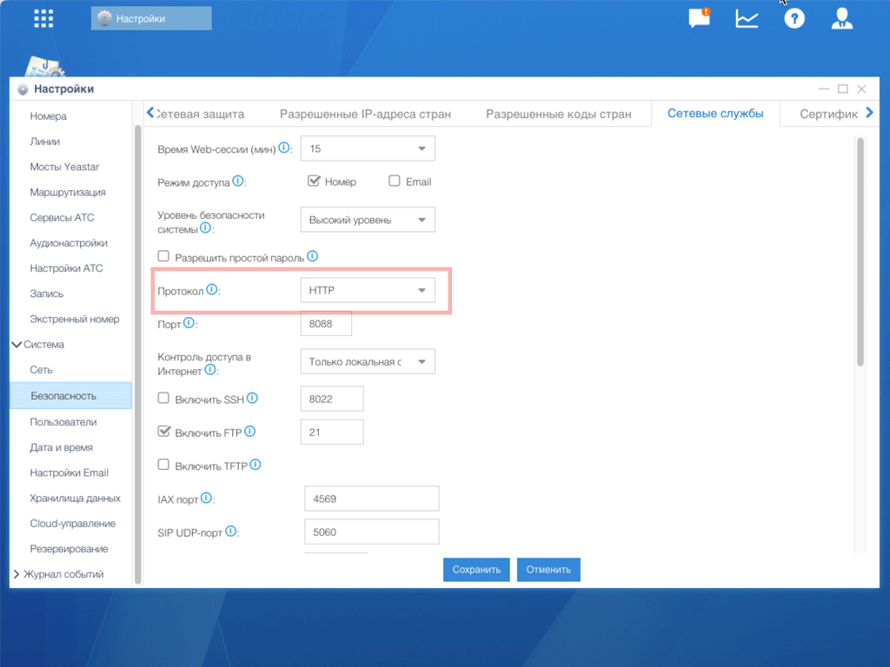

# Настройка AMI для Yeastar S-серия

## Шаг 1. Включение AMI

1. Откройте **админ-панель IP-АТС**
2. Перейдите в **Настройки** → **Система** → **Безопасность**
3. На вкладке **Сетевые службы** активируйте **«Включить AMI»**
4. Измените стандартные **Имя пользователя** и **Пароль** для AMI

> [!WARNING]
> Запомните эти учётные данные — они потребуются при настройке сервиса в личном кабинете Callbee.

## Шаг 2. Разрешённые IP-адреса

В поле **«Разрешённые IP/Маска»** пропишите [IP-адреса сервиса Callbee](/ip-addresses/).

## Шаг 3. Протокол подключения

Если на АТС **не установлен** валидный SSL-сертификат, измените протокол с HTTPS на HTTP:

## Шаг 4. Сохранение

Нажмите **«Сохранить»** для применения настроек.

---

> [!SUCCESS] Готово!
> AMI настроен. Переходите к:
> - [Настройке API](/setup/yeastar/api-setup/) (S50, S100, S300)
> - [Настройке FTP](/setup/yeastar/ftp-setup/) (только S20)
