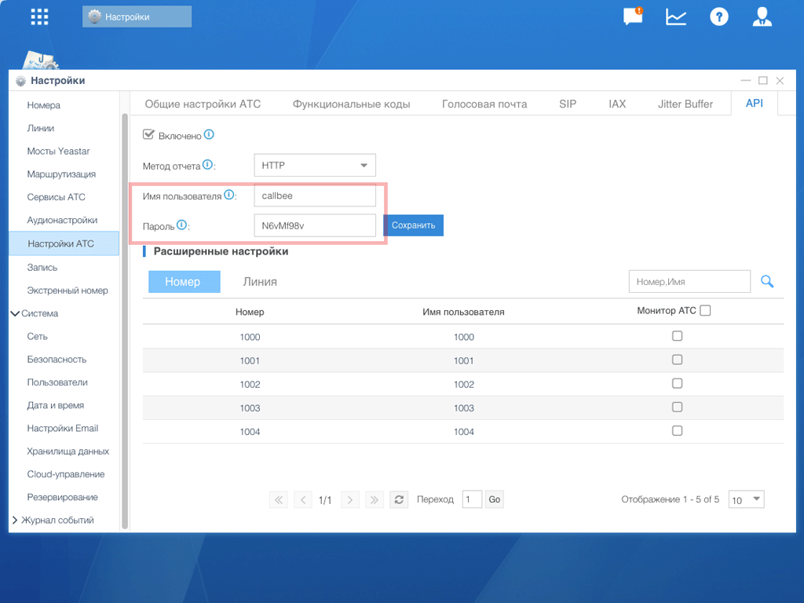

# Настройка API Yeastar

> [!NOTE]
> API доступен на моделях **S50, S100, S300**. Для модели **S20** используйте [FTP](/setup/yeastar/ftp-setup/).

## Активация API

1. Откройте **админ-панель IP-АТС**
2. Перейдите в **Настройки** → **АТС** → **API**
3. Активируйте опцию **«Активировать API»**
4. Задайте **Имя пользователя API** и **Пароль API**
5. Нажмите **«Сохранить»**

> [!WARNING]
> Запомните учётные данные API — они потребуются при настройке сервиса в личном кабинете Callbee.

---

> [!SUCCESS] Готово!
> API настроен. Переходите к [сетевым настройкам](/setup/yeastar/network/).
