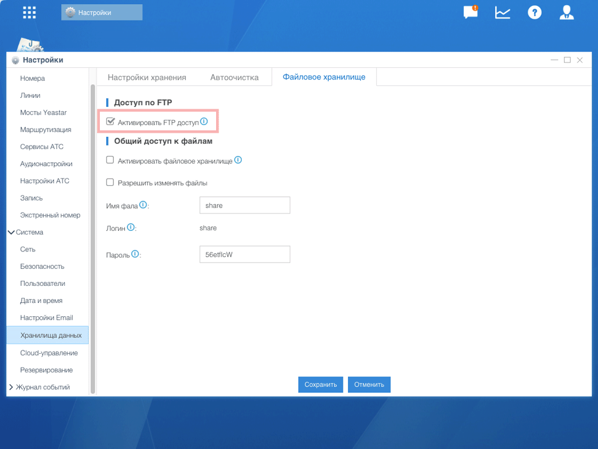
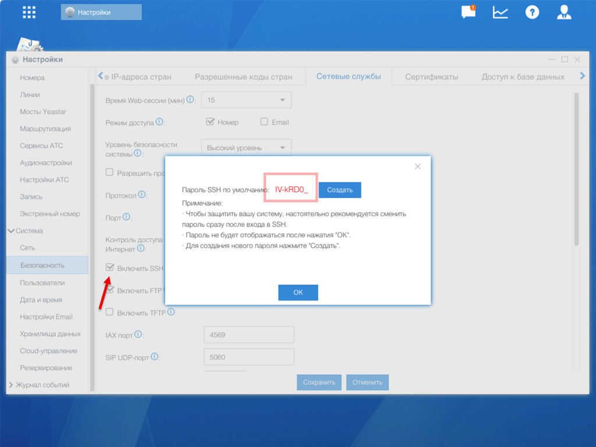

# Настройка FTP для Yeastar S20

> [!CAUTION]
> Этот раздел только для модели **Yeastar S20**. Модели S50, S100, S300 используют [API](/setup/yeastar/api-setup/).

## Шаг 1. Активация FTP

1. Перейдите в **Настройки** → **Система** → **Хранилища данных**
2. На вкладке **Файловое хранилище** активируйте **«Активировать FTP доступ»**
3. Нажмите **«Сохранить»**

## Шаг 2. Получение пароля FTP

Данные доступа к FTP совпадают с данными SSH. Логин: **support**.

Для получения пароля:

1. Перейдите в **Настройки** → **Система** → **Безопасность**
2. На вкладке **Сетевые службы** активируйте **«Включить SSH»**
3. Скопируйте отображённый пароль

> [!WARNING]
> Запомните эти учётные данные — они потребуются при настройке FTP в личном кабинете Callbee.

---

> [!SUCCESS] Готово!
> FTP настроен. Переходите к [сетевым настройкам](/setup/yeastar/network/).
