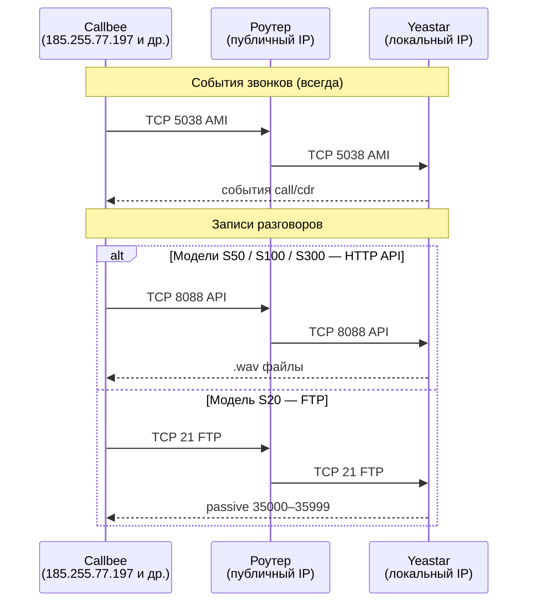

# Сетевые настройки для Yeastar

Чтобы Callbee мог общаться с вашей АТС, сервис должен **видеть АТС снаружи** — подключаться к ней через интернет по служебным портам. Для этого нужен либо **статический публичный IP** на АТС, либо **проброс портов на роутере**, за которым стоит АТС.

Эта страница — центральная по сети. Если что-то «не подключается» — обычно ответ здесь.

## Как работает сетевое взаимодействие



## Необходимые порты

| Порт | Протокол | Назначение | Модели | Куда открыть |
|---|---|---|---|---|
| **5038** | TCP | AMI (события звонков) | Все | [IP Callbee](/ip-addresses/) |
| **8088** | TCP | HTTP API (скачивание записей) | S50, S100, S300 | [IP Callbee](/ip-addresses/) |
| **21** | TCP | FTP (скачивание записей) | Только S20 | [IP Callbee](/ip-addresses/) |
| **35000–35999** | TCP | FTP passive range | Только S20 | [IP Callbee](/ip-addresses/) |

> [!CAUTION] Не открывайте всему интернету
> Каждый порт открывайте **только для IP-адресов Callbee**. AMI и FTP — частые цели автоматических сканеров. Открытый AMI с слабым паролем — это прямой путь к фроду (исходящие звонки на премиум-номера за ваш счёт).

## Варианты размещения АТС

+++ За роутером с белым IP (типичный случай)

АТС в локальной сети офиса, роутер имеет **публичный статический IP** от провайдера. Нужно пробросить порты (см. [раздел ниже](#проброс-портов-на-роутере)).

> [!TIP] Проверка своего публичного IP
> ```bash
> curl ifconfig.me
> ```
> Если видимый IP **не совпадает** с IP роутера — провайдер даёт вам **серый IP** за его NAT. В этом случае проброс портов не поможет — нужен другой вариант (см. ниже).

+++ АТС с белым IP напрямую (редкий случай)

АТС подключена к интернету напрямую без роутера. Проброс не нужен, но **обязательно** включите firewall внутри АТС (Settings → System → Security → Firewall Rules) и разрешите только [IP Callbee](/ip-addresses/).

+++ Серый IP / мобильный интернет

Провайдер даёт серый IP (CGNAT) — проброс невозможен. Решения:

1. **Попросите провайдера** выдать белый IP (обычно 100–300 руб./мес)
2. **Поднимите VPN** между АТС и VPS с белым IP (WireGuard, OpenVPN) — АТС будет видна через адрес VPS
3. **Используйте reverse-tunnel** (ngrok, cloudflared) — только для тестирования, нестабильно

> [!WARNING] VPN между АТС и Callbee не поддерживаем
> Callbee не подключается к вашему VPN. Нужно поднимать VPN **до роутера в нашу сторону нет**, вариант только «АТС → ваш VPS с белым IP → Callbee подключается к VPS».

+++ Динамический белый IP

IP меняется при переподключении — раз в сутки/неделю. Callbee не успевает переключаться. Используйте **DDNS-сервис**:

- [noip.com](https://noip.com) — бесплатно, с ежемесячным подтверждением
- [dyndns.com](https://dyndns.com) — платно
- [duckdns.org](https://duckdns.org) — бесплатно, без подтверждений
- [ClouDNS](https://cloudns.net) — платно, с SLA

Получаете домен вида `company.ddns.net`, настраиваете обновление на роутере. В личном кабинете Callbee указываете домен вместо IP.

+++

---

## Проброс портов на роутере

Ниже — пошаговые инструкции для популярных моделей.

+++ MikroTik (RouterOS)

Через WinBox / WebFig / терминал. Через терминал:

```routeros
/ip firewall nat
add chain=dstnat protocol=tcp dst-port=5038 action=dst-nat to-addresses=<LOCAL-IP-АТС> to-ports=5038 src-address-list=callbee comment="Callbee AMI"
add chain=dstnat protocol=tcp dst-port=8088 action=dst-nat to-addresses=<LOCAL-IP-АТС> to-ports=8088 src-address-list=callbee comment="Callbee API"

/ip firewall address-list
add list=callbee address=185.255.77.197
add list=callbee address=77.105.155.20
add list=callbee address=31.44.1.160
add list=callbee address=178.123.180.59
```

Для S20 добавьте также правила для порта 21 и диапазона 35000–35999.

+++ Keenetic

Веб-интерфейс → **Переадресация** → **Добавить правило**:

| Поле | Значение |
|---|---|
| **Вход** | Интернет-соединение |
| **Протокол** | TCP |
| **Порт входящего соединения** | `5038` |
| **IP-адрес назначения** | локальный IP Yeastar |
| **Порт назначения** | `5038` |
| **Разрешить доступ** | По списку адресов → создать список с IP Callbee |

Повторите для портов 8088 (S50/S100/S300) или 21 + 35000–35999 (S20).

+++ pfSense / OPNsense

**Firewall → NAT → Port Forward → Add**:

| Поле | Значение |
|---|---|
| **Interface** | WAN |
| **Protocol** | TCP |
| **Destination** | WAN address |
| **Destination port range** | `5038` – `5038` |
| **Redirect target IP** | локальный IP Yeastar |
| **Redirect target port** | `5038` |
| **Source** | Alias `CallbeeNetworks` с IP-адресами Callbee |

Создайте alias `CallbeeNetworks` в **Firewall → Aliases** со всеми 4 IP.

+++ Ubiquiti EdgeRouter / UniFi

**UniFi Network → Settings → Firewall & Security → Port Forwarding → Create**:

| Поле | Значение |
|---|---|
| **Name** | `Callbee AMI` |
| **Forward Rule** | Enabled |
| **Interface** | WAN |
| **From** | Limited → `185.255.77.197/32` и другие IP Callbee |
| **Port** | `5038` |
| **Forward IP** | локальный IP Yeastar |
| **Forward Port** | `5038` |
| **Protocol** | TCP |

+++ TP-Link / ASUS / D-Link (домашние роутеры)

В большинстве домашних роутеров раздел называется **Virtual Server** или **Port Forwarding**:

1. **Service Port (External)**: `5038`
2. **Internal IP**: локальный IP Yeastar
3. **Internal Port**: `5038`
4. **Protocol**: TCP
5. **Enable**: галочка

> [!WARNING] Source IP часто недоступен
> Домашние роутеры **не позволяют ограничить источник** — порт откроется для всего интернета. В этом случае обязательно включите **firewall внутри Yeastar** (`Settings → System → Security → Firewall Rules`) и разрешите только [IP Callbee](/ip-addresses/) на уровне АТС.

+++

---

## Проверка снаружи

После проброса проверьте что порты доступны из интернета.

### С локального компьютера (в другой сети)

Подключитесь к мобильному интернету или выйдите из офисной сети. Выполните:

```bash
nc -vz <ПУБЛИЧНЫЙ-IP-ИЛИ-DDNS> 5038
```

Ожидаемый ответ: `Connection to <IP> 5038 port [tcp/*] succeeded!`

Повторите для 8088 (или 21 для S20).

### Через онлайн-сервисы

Если нет доступа к внешнему соединению:

- [portchecker.co](https://portchecker.co) — проверяет один порт
- [canyouseeme.org](https://canyouseeme.org) — проверяет один порт с логами
- [ping.eu/port-chk](https://ping.eu/port-chk/) — проверка нескольких портов

> [!NOTE] Ограничение сервисов проверки
> Онлайн-чекеры работают с собственных IP. Если вы **ограничили источник** только IP Callbee, сервисы получат отказ — это нормально. Для такой проверки временно снимите whitelist, проверьте, верните обратно.

---

## Безопасность — обязательный минимум

1. **Whitelist по IP** на роутере — только [IP Callbee](/ip-addresses/)
2. **Стандартные пароли** `admin`/`admin`, `cdr`/`cdr`, `support`/`support` — **смените немедленно**
3. **SIP-порт 5060** — закройте если нет SIP-провайдеров снаружи (fraud-боты сканируют именно его)
4. **Fail2ban внутри АТС** (`Settings → System → Security → Auto Defense`) — блокирует IP после N неудачных попыток
5. **Уведомления о безопасности** — включите email-оповещения при сбросе правил
6. **Резервная копия конфига** — перед настройкой сделайте бэкап (Maintenance → Backup)

---

## Частые проблемы

**`nc` снаружи даёт `Connection refused`**
Порт не проброшен или service на АТС не включён. Зайдите на АТС из локальной сети — если там `nc localhost 5038` работает, проблема в роутере.

**`nc` снаружи даёт `timeout`**
Firewall роутера или провайдера блокирует пакет. Проверьте что правило в NAT — **перед** блокирующим правилом (порядок правил в iptables/MikroTik важен).

**Провайдер блокирует порт**
Некоторые провайдеры (особенно мобильные) блокируют порты 21, 25, 80, 135, 445. Если порт 5038 закрыт провайдером — перенастройте AMI на **нестандартный порт** в Yeastar и пробросьте его.

**IP Callbee изменился — whitelist устарел**
Проверьте актуальный список на странице [IP-адреса сервиса](/ip-addresses/). Мы анонсируем изменения в [Changelog](/changelog/) за 30 дней.

**После обновления прошивки правила firewall сбросились**
Yeastar при обновлении прошивки иногда восстанавливает defaults. **Перед обновлением** сохраните backup (Maintenance → Backup), **после обновления** проверьте правила.

**DDNS обновился, Callbee не подхватил**
Callbee обновляет IP домена каждые 5 минут. Если больше 15 минут — откройте сервис в [личном кабинете](https://my.callbee.io) и нажмите **«Обновить подключение»**.

---

> [!SUCCESS] Сеть настроена!
> Переходите к подключению CRM:
> - [Битрикс24](/setup/yeastar/bitrix24/)
> - [amoCRM](/setup/yeastar/amocrm/)
