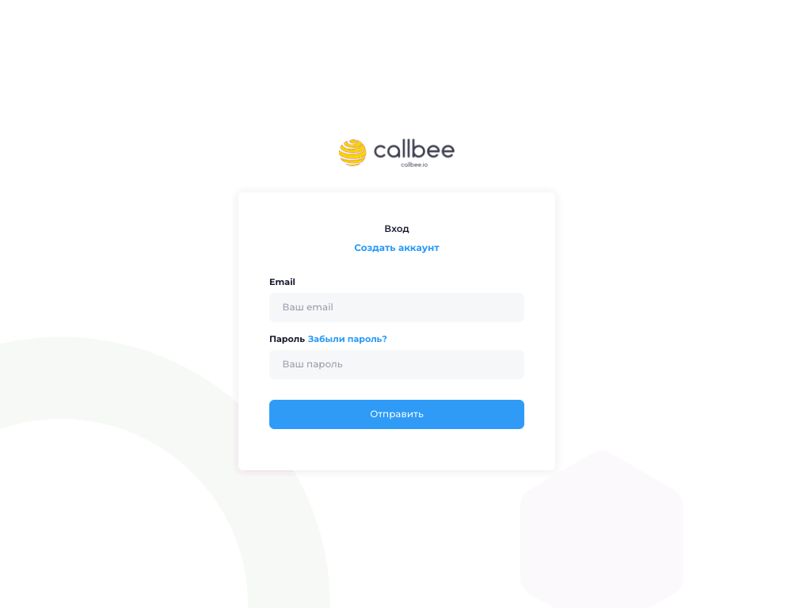
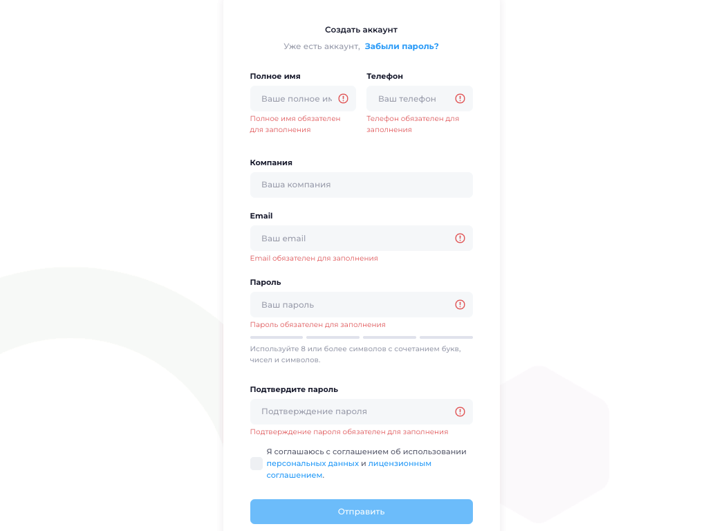
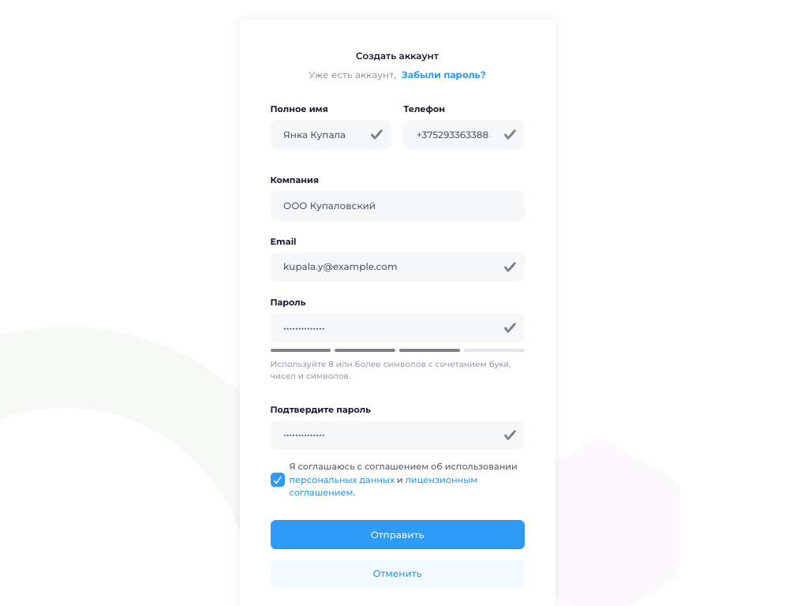

# Регистрация в Callbee

Личный кабинет Callbee — это центр управления вашими АТС, CRM-интеграциями и сервисами. Регистрация занимает около минуты.

> [!TIP] Что потребуется
> - Действующий **email** — на него придёт ссылка для подтверждения
> - **Номер телефона** — для уведомлений о важных событиях
> - **Название компании** — будет отображаться в личном кабинете

## Шаг 1. Откройте страницу регистрации

Перейдите на [my.callbee.io](https://my.callbee.io) — откроется страница входа.

Нажмите ссылку **«Создать аккаунт»** над формой входа.

## Шаг 2. Заполните форму

Откроется форма регистрации. Заполните все поля — все они обязательные.

|   |   |
|---|---|
| **Полное имя** | ФИО контактного лица (`Янка Купала`) |
| **Телефон** | Мобильный или рабочий номер с кодом страны (`+375 29 336-33-88`) |
| **Компания** | Название вашей организации (`ООО Купаловский`) |
| **Email** | Корпоративный email — на него придёт подтверждение (`kupala.y@example.com`) |
| **Пароль** | 8+ символов: буквы, цифры и спецсимволы |
| **Подтвердите пароль** | Повторите тот же пароль |

Отметьте чекбокс согласия с [соглашением об использовании персональных данных](https://callbee.io/doc/personal_data_license.pdf) и [лицензионным соглашением](https://callbee.io/doc/license_agreement.pdf).

> [!WARNING] Надёжный пароль
> Индикатор под полем пароля показывает надёжность. Зелёные деления — пароль подходит. Не используйте пароль от других сервисов.

Нажмите **«Отправить»**.

## Шаг 3. Подтвердите email

После отправки формы на указанный email придёт письмо со ссылкой для подтверждения.

> [!TIP] Письма нет?
> 1. Проверьте папку **«Спам»** или **«Промоакции»**
> 2. Убедитесь, что email введён без опечаток
> 3. Запросите письмо повторно через форму входа
> 4. Напишите в поддержку: [support@callbee.io](mailto:support@callbee.io)

Откройте письмо и нажмите кнопку **«Подтвердить email»** — вы автоматически войдёте в личный кабинет.

## Шаг 4. Первый вход

После подтверждения вы попадёте на главную страницу личного кабинета. Здесь доступны:

- **Сервисы** — список подключённых АТС
- **CRM** — подключённые CRM-системы
- **Пользователи** — сотрудники вашей компании
- **Тарифы** — управление подпиской и оплата

> [!SUCCESS] Аккаунт создан!
> Переходите к [установке приложения в CRM](/quickstart/install-app/).
