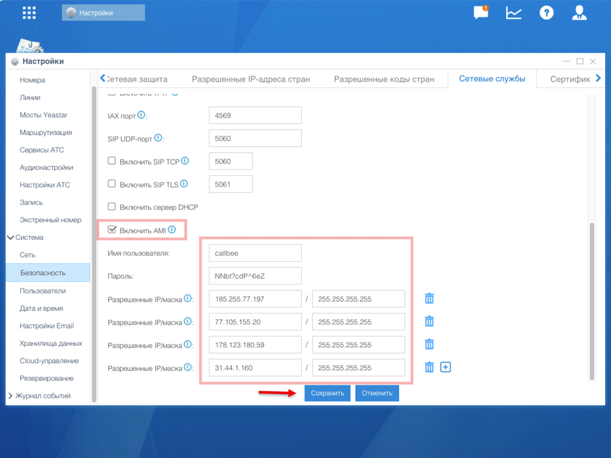

# Настройка AMI для Yeastar S-серия

**Asterisk Manager Interface (AMI)** — встроенный в Yeastar S-серию служебный интерфейс, через который Callbee получает события о звонках (начало, ответ, завершение) и управляет вызовами (инициирует исходящие, переадресацию). Без AMI интеграция работать не будет.

В отличие от FreePBX, в Yeastar S-серии AMI настраивается **через веб-интерфейс АТС** — без SSH и редактирования конфигурационных файлов.

> [!CAUTION] Безопасность — главное
> AMI даёт **полный контроль** над вашей АТС. Никогда не открывайте порт 5038 для всего интернета, всегда ограничивайте доступ по IP и не используйте стандартные логин/пароль (`cdr`/`cdr`).

> [!NOTE] АТС за NAT
> Если Yeastar стоит в локальной сети за роутером, порт **5038/TCP** нужно пробросить на роутере: внешний `5038` → локальный IP АТС, порт `5038`. Ограничьте источник [IP-адресами Callbee](/ip-addresses/). Настройки для конкретных моделей роутеров вы делаете самостоятельно.

## Что понадобится

|   |   |
|---|---|
| **Веб-доступ к АТС** | обычно `https://<IP-АТС>` или `http://<IP-АТС>` |
| **Учётные данные администратора** | учётка с правом изменения системных настроек |
| **Статический IP или проброс портов** | порт **5038/TCP** должен быть виден Callbee |
| **Надёжный пароль** | 16+ символов, буквы/цифры/спецсимволы |

---

## Шаг 1. Войдите в админ-панель Yeastar

Откройте браузер и перейдите по адресу АТС:

```
https://<IP-адрес-АТС>
```

Войдите под учётной записью **администратора**. Стандартный логин `admin` — если вы его не меняли, **смените перед настройкой Callbee**.

## Шаг 2. Откройте настройки AMI

Перейдите в **Настройки → Система → Безопасность → Сетевые службы**.

На странице найдите блок **AMI**:



## Шаг 3. Включите AMI и задайте учётные данные

1. Поставьте галочку **«Включить AMI»**
2. В поле **«Имя пользователя»** введите логин — например `crm-to-callbee`
3. В поле **«Пароль»** введите сгенерированный пароль (16+ символов)

> [!CAUTION] Пароль
> - **Длина** — не меньше 16 символов
> - **Нельзя** использовать логин пользователя AMI, `admin`, `password`, `cdr`, номер телефона, имя компании
> - **Сохраните** пароль в менеджере паролей — он потребуется при создании сервиса в личном кабинете Callbee

## Шаг 4. Ограничьте доступ по IP

В поле **«Разрешённые IP/Маска»** пропишите [IP-адреса сервиса Callbee](/ip-addresses/):

```
185.255.77.197/255.255.255.255
77.105.155.20/255.255.255.255
31.44.1.160/255.255.255.255
178.123.180.59/255.255.255.255
```

> [!WARNING] Не оставляйте `0.0.0.0/0.0.0.0`
> Эта маска открывает AMI для всего интернета. Это критическая уязвимость — злоумышленник с валидными credentials сможет инициировать международные звонки с вашей АТС (fraud).

## Шаг 5. Выберите протокол подключения

Если на АТС **не установлен валидный SSL-сертификат**, измените протокол AMI с **HTTPS** на **HTTP**:


> [!NOTE] HTTPS или HTTP
> Callbee поддерживает оба варианта. По умолчанию Yeastar S использует самоподписанный SSL-сертификат — Callbee его примет, но для надёжности удобнее HTTP внутри доверенной сети с белым списком IP.

## Шаг 6. Сохраните и примените настройки

Нажмите **«Сохранить»**. Yeastar попросит **применить изменения** — подтвердите, АТС перезапустит модуль AMI (обрыва звонков не будет).

## Шаг 7. Проверьте подключение

На компьютере в той же сети (или с пробросом портов) выполните:

```bash
nc -vz <IP-АТС> 5038
```

Ожидаемый ответ: `Connection to <IP-АТС> 5038 port [tcp/*] succeeded!`

Если `Connection refused` или `timeout` — вернитесь к:
- [Шагу 3](#шаг-3-включите-ami-и-задайте-учётные-данные) — проверьте что AMI включён и настройки сохранены
- [Шагу 4](#шаг-4-ограничьте-доступ-по-ip) — ваш IP не в белом списке (для локальной проверки добавьте свой IP)
- Пробросу портов на роутере

---

## Частые проблемы

**`Authentication failed` в логах Callbee**
Пароль в настройках AMI не совпадает с указанным в личном кабинете. Проверьте отсутствие пробелов в начале/конце, откройте сервис в [my.callbee.io](https://my.callbee.io) и введите пароль заново.

**События звонков не приходят**
Ваш белый список IP в **«Разрешённые IP/Маска»** не содержит все IP Callbee — адреса могут обновляться. Сверьтесь со списком на странице [IP-адреса сервиса](/ip-addresses/).

**После перезагрузки АТС интеграция отваливается**
Некоторые версии прошивки Yeastar при холодной перезагрузке сбрасывают флаг **«Включить AMI»**. Обновите прошивку до последней стабильной или включите AMI заново.

**Не видно раздела «Сетевые службы»**
Раздел доступен только **администратору**. Если вы вошли под ограниченной учёткой (оператор, IP-телефонист) — попросите владельца АТС выдать вам права администратора или сделать настройку за вас.

**Через роутер порт не открывается**
На роутерах **MikroTik** и **Keenetic** часто требуется отключить **UPnP** и явно добавить правило **Destination NAT → Masquerade** в разделе `IP → Firewall → NAT` (MikroTik) или **Переадресация** (Keenetic).

---

> [!SUCCESS] AMI настроен!
> Переходите к следующему шагу в зависимости от модели вашей АТС:
> - **S50 / S100 / S300** — [Настройка API](/setup/yeastar/api-setup/) (для доступа к записям разговоров и расширенным функциям)
> - **S20** — [Настройка FTP](/setup/yeastar/ftp-setup/) (API в S20 отсутствует, записи публикуются через FTP)
