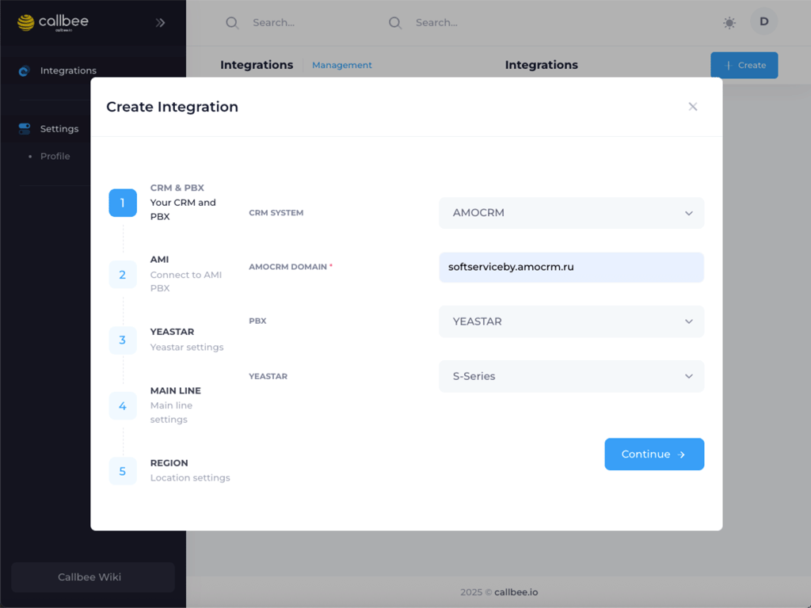
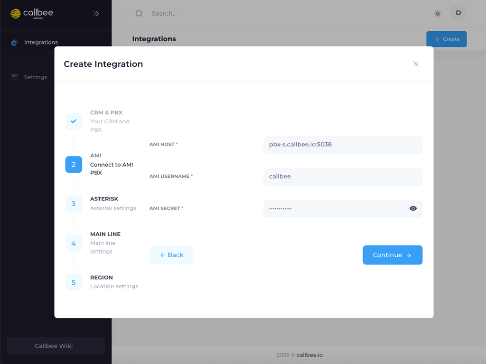
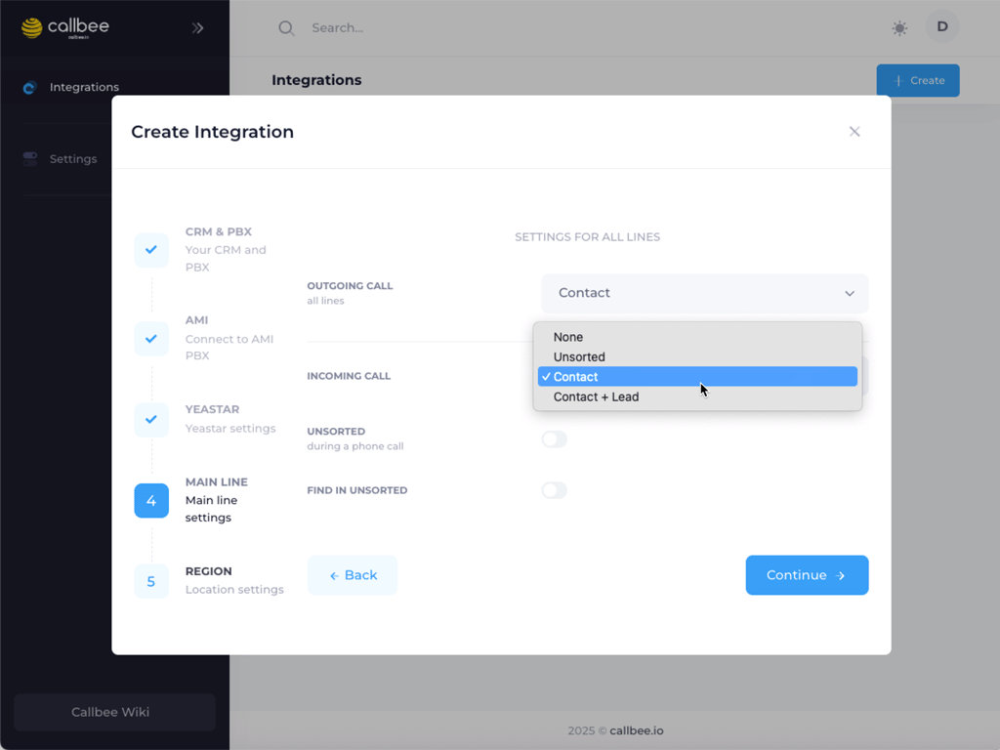

# Yeastar S-серия + amoCRM

> [!CAUTION] Перед началом
> Убедитесь, что вы выполнили:
> 1. [Настройку AMI](/setup/yeastar/ami-setup/)
> 2. [Настройку API](/setup/yeastar/api-setup/) (S50/S100/S300) или [FTP](/setup/yeastar/ftp-setup/) (S20)
> 3. [Сетевые настройки](/setup/yeastar/network/)
> 4. [Установку виджета в amoCRM](/quickstart/install-app/)

> [!NOTE] Дополнительные требования
> - Активная лицензия amoCRM

## Создание сервиса в личном кабинете

1. Войдите в [личный кабинет my.callbee.io](https://my.callbee.io)
2. Запустите **установщик** для создания сервиса
   

### Шаг 1. Выбор CRM и АТС

- Выберите **«amoCRM»** из списка CRM
- Введите адрес amoCRM в поле **«AMOCRM DOMAIN»**
- Выберите **«IP-ATC Yeastar»**
- Укажите серию АТС — **«S»**
- Нажмите **«Continue»**

### Шаг 2. Подключение AMI

- Введите **внешний IP-адрес** АТС и порт **5038**
- Укажите **AMI USERNAME** и **AMI SECRET** из [настройки AMI](/setup/yeastar/ami-setup/)
- Нажмите **«Continue»**

### Шаг 3. Подключение API или FTP

+++ S50, S100, S300 — API

- Укажите внешний IP-адрес АТС в поле **«API HOST»** и порт **8088**
- Введите **API USERNAME** и **API SECRET** из [настройки API](/setup/yeastar/api-setup/)
- Нажмите **«Continue»**

+++ S20 — FTP

- Укажите внешний IP-адрес АТС в поле **«FTP HOST»** и порт **21**
- Введите **FTP USERNAME** (`support`) и **FTP SECRET** из [настройки FTP](/setup/yeastar/ftp-setup/)
- Нажмите **«Continue»**

+++

### Шаг 4. Правила создания сущностей

- Настройте правила автоматического создания **сделок** или **контактов**
- Определите условия создания новой сущности
- Нажмите **«Continue»**

### Шаг 5. Расположение и часовой пояс

> [!CAUTION] Важно
> Эта настройка критически важна для корректной работы умной маршрутизации звонков.

- Выберите **регион**: Беларусь, Россия, Казахстан или Нидерланды
- Укажите **часовой пояс** ваших сотрудников
- Нажмите **«Continue»**

---

> [!SUCCESS] Поздравляем!
> Вы создали и запустили сервис Callbee для Yeastar + amoCRM.
