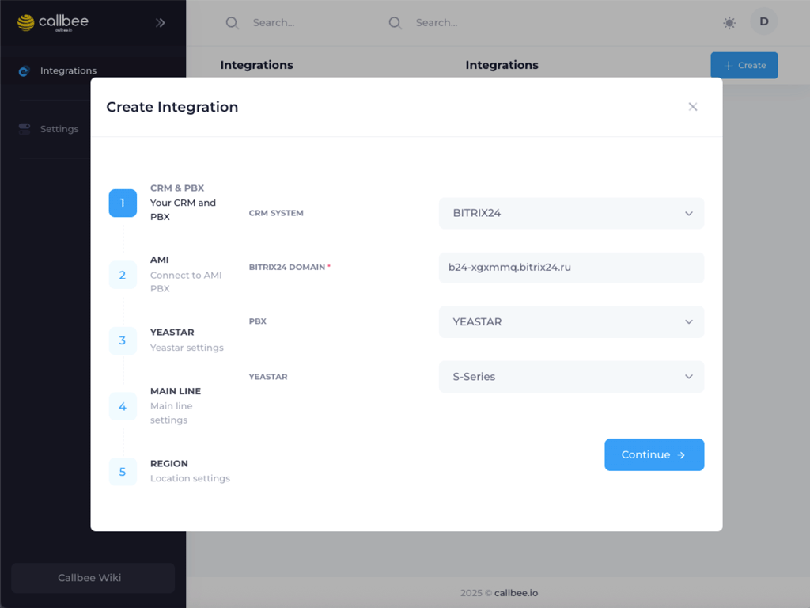
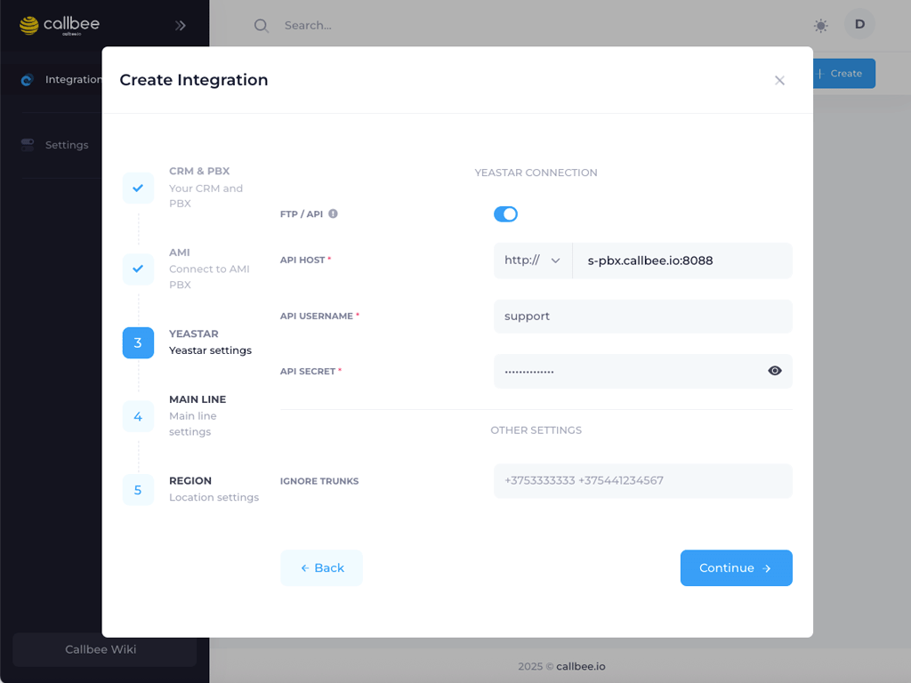
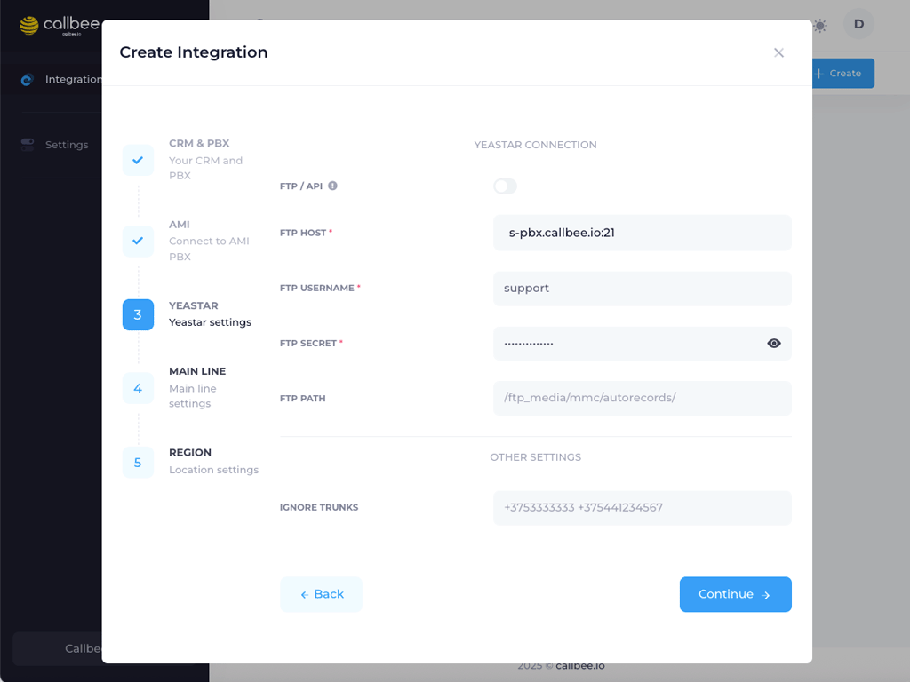
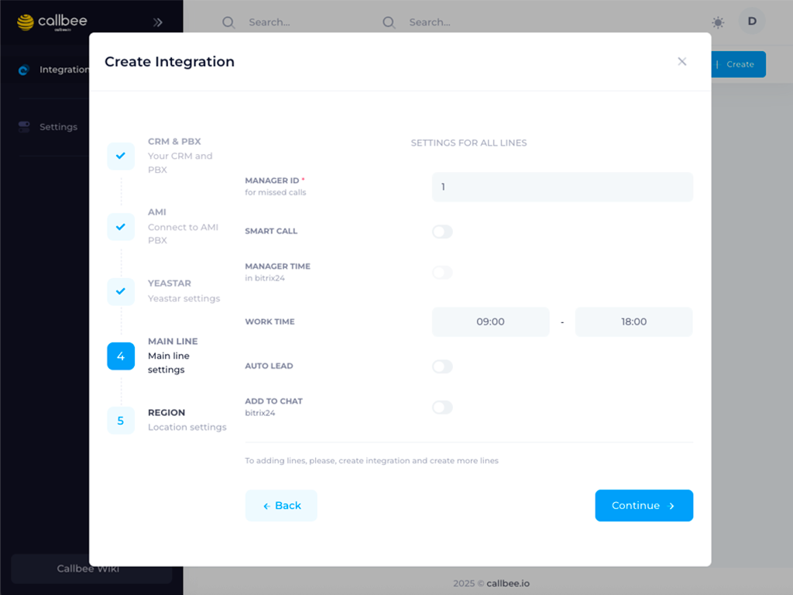
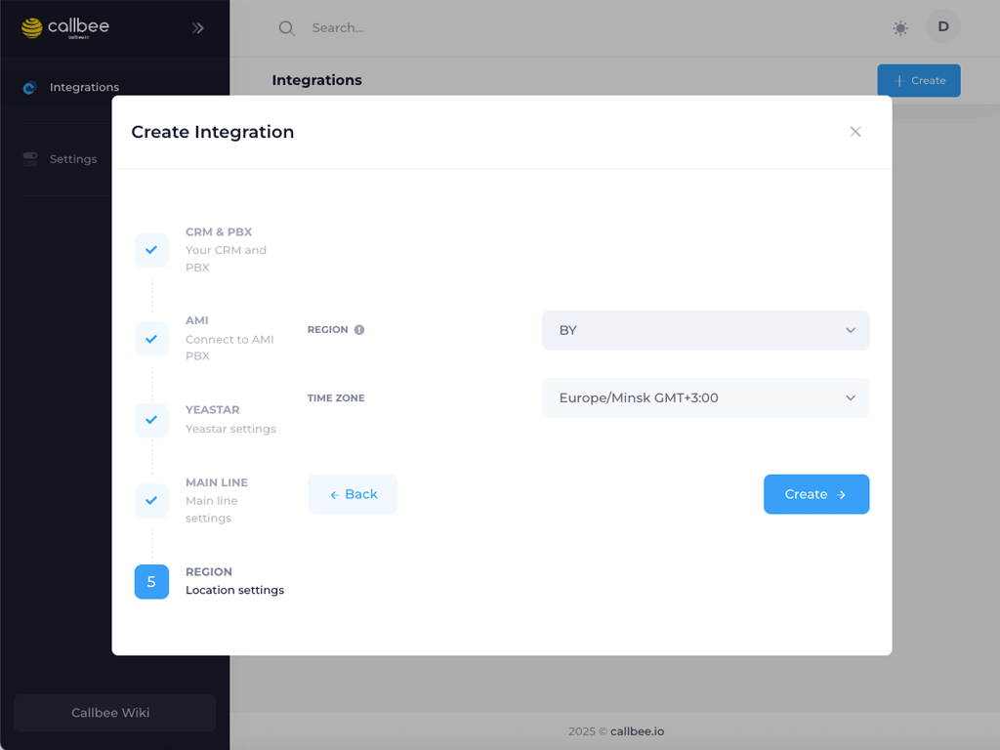

# Yeastar S-серия + Битрикс24

Финальный шаг: свяжем АТС Yeastar и портал Битрикс24 в **сервисе Callbee**. После этого в Битрикс24 начнут всплывать карточки звонков, сохраняться записи и автоматически создаваться лиды.

> [!CAUTION] Предварительный чек-лист
> Убедитесь что вы выполнили всё из этого списка — мастер запросит все эти данные подряд:
> 1. [Настройка AMI](/setup/yeastar/ami-setup/) — пользователь + пароль + белый список IP
> 2. Публикация записей — [API](/setup/yeastar/api-setup/) для S50/S100/S300 **или** [FTP](/setup/yeastar/ftp-setup/) для S20
> 3. [Сетевые настройки](/setup/yeastar/network/) — проброс портов 5038 + 8088 (или 21 + 35000–35999)
> 4. [Установка приложения в Битрикс24](/quickstart/install-app/) — разрешения CRM/Телефония выданы

## Что понадобится заранее

|   |   |
|---|---|
| **Адрес портала Битрикс24** | например `mycompany.bitrix24.ru` (без `https://`) |
| **Внешний адрес АТС** | публичный IP или DDNS, например `pbx.company.ru` |
| **AMI логин/пароль** | из [настройки AMI](/setup/yeastar/ami-setup/) |
| **API или FTP логин/пароль** | из публикации записей |
| **«Игнорируемые транки»** | список номеров, которые не логировать (например тестовые) |
| **Регион и часовой пояс** | для умной маршрутизации и рабочего времени |

---

## Шаг 1. Создайте сервис в личном кабинете

Войдите в [my.callbee.io](https://my.callbee.io) → раздел **Integrations** → кнопка **«Create»** справа сверху.

Откроется мастер **«Create Integration»** из **5 шагов**.

## Шаг 2. CRM & PBX — выбор системы

Заполните поля:

| Поле | Значение |
|---|---|
| **CRM SYSTEM** | `BITRIX24` |
| **BITRIX24 DOMAIN** | адрес вашего портала, например `mycompany.bitrix24.ru` |
| **PBX** | `YEASTAR` |
| **YEASTAR** | `S-Series` |

Нажмите **«Continue»**.

> [!WARNING] Домен Битрикс24 — точный адрес
> Не добавляйте `https://`, `/` в конце или путь к странице. Только хост: `mycompany.bitrix24.ru`. Неправильный домен = отсутствие связи с порталом.

## Шаг 3. AMI — подключение к АТС

| Поле | Значение | Пример |
|---|---|---|
| **AMI HOST** | адрес АТС + порт через `:` | `pbx.company.ru:5038` |
| **AMI USERNAME** | логин из [Шага 3 настройки AMI](/setup/yeastar/ami-setup/#шаг-3-включите-ami-и-задайте-учётные-данные) | `crm-to-callbee` |
| **AMI SECRET** | пароль из той же страницы | `••••••••••••` |

Нажмите **«Continue»**.

> [!TIP] Как проверить AMI заранее
> Перед этим шагом — сделайте `nc -vz pbx.company.ru 5038` с компьютера в публичной сети. Если `succeeded` — мастер пройдёт. Если нет — [сетевые настройки](/setup/yeastar/network/).

## Шаг 4. YEASTAR — публикация записей

Выберите свой вариант — API (новые модели) или FTP (только S20).

+++ API (S50 / S100 / S300)

1. Включите переключатель **«FTP / API»** в положение **API** (синий)

| Поле | Значение | Пример |
|---|---|---|
| **Протокол** (dropdown) | `http://` или `https://` | `http://` |
| **API HOST** | адрес АТС + порт 8088 | `pbx.company.ru:8088` |
| **API USERNAME** | логин из [настройки API](/setup/yeastar/api-setup/) | `support` |
| **API SECRET** | пароль из той же страницы | `••••••••••••` |
| **IGNORE TRUNKS** | номера через пробел, которые не фиксировать | `+37533xxxxxxx +37544xxxxxxx` |

2. Нажмите **«Continue»**

+++ FTP (только S20)

1. Оставьте переключатель **«FTP / API»** в положении **FTP** (серый)

| Поле | Значение | Пример |
|---|---|---|
| **FTP HOST** | адрес АТС + порт 21 | `pbx.company.ru:21` |
| **FTP USERNAME** | фиксированное `support` | `support` |
| **FTP SECRET** | пароль SSH из [настройки FTP](/setup/yeastar/ftp-setup/) | `••••••••••••` |
| **FTP PATH** | путь к записям, **обязательно** такой как показан | `/ftp_media/mmc/autorecords/` |
| **IGNORE TRUNKS** | номера через пробел | `+37533xxxxxxx` |

2. Нажмите **«Continue»**

+++

> [!NOTE] Что такое IGNORE TRUNKS
> Если у вас есть **служебные** или **тестовые** транки (например номер техподдержки оператора, внутренний номер IVR-робота, аналитический пул) — звонки с/на них не попадут в CRM. Формат: список номеров через пробел, без `+` или с `+` — как записано в настройках АТС.

## Шаг 5. MAIN LINE — правила обработки звонков

Блок **«Settings for all lines»** — базовые правила для всех входящих звонков:

| Поле | Значение | Что делает |
|---|---|---|
| **MANAGER ID for missed calls** | ID менеджера в Битрикс24, например `1` | Куда создаётся задача о пропущенном звонке |
| **SMART CALL** | toggle | Умная маршрутизация: входящий идёт ответственному за контакт, а не на общую линию |
| **MANAGER TIME in bitrix24** | toggle | Учитывать рабочее время из календаря Битрикс24 (вместо WORK TIME ниже) |
| **WORK TIME** | `09:00 – 18:00` | Рабочие часы менеджеров (если MANAGER TIME выключен) |
| **AUTO LEAD** | toggle | Автоматически создавать **лид** при звонке с незнакомого номера |
| **ADD TO CHAT (bitrix24)** | toggle | Присылать уведомления о звонках в корпоративный чат Битрикс24 |

Нажмите **«Continue»**.

> [!TIP] Рекомендуемый старт
> Для первой настройки включите **SMART CALL** и **AUTO LEAD** — это ядро автоматизации, ради которого Callbee обычно и покупают. **MANAGER TIME** и **ADD TO CHAT** добавляйте позже, когда привыкнете к потоку звонков.

> [!NOTE] Manager ID — где взять
> В Битрикс24 откройте профиль сотрудника (ЛК → Сотрудники) — в URL будет `.../company/personal/user/123/` — `123` и есть Manager ID. Укажите ID ответственного за пропущенные (обычно — руководитель отдела продаж).

## Шаг 6. REGION — регион и часовой пояс

| Поле | Значение |
|---|---|
| **REGION** | `BY` (Беларусь), `RU` (Россия), `KZ` (Казахстан) или `NL` (Нидерланды) |
| **TIME ZONE** | часовой пояс вашего офиса, например `Europe/Minsk GMT+3:00` |

> [!CAUTION] Почему это критично
> Регион определяет правила парсинга номеров (код страны, формат мобильных/стационарных) и рабочее время. Ошибка здесь — и номера в CRM появятся в неверном формате, smart call не сможет найти контакт, задачи о пропущенных упадут в нерабочее время менеджеров.

Нажмите **«Create»**.

---

## После создания сервиса

Вы попадёте на страницу сервиса — статус должен быть **Active** (зелёный). Если статус **Error** — проверьте раздел ниже.

### Проверка

1. Совершите **тестовый звонок** с телефона сотрудника на рабочий номер
2. В Битрикс24 у ответственного всплывёт **карточка звонка**
3. После завершения — в карточке появится **запись** (иконка `play`)
4. Откройте **Мой офис → Задачи** и убедитесь что при пропуске создалась задача

### Если что-то не работает

| Проблема | Куда смотреть |
|---|---|
| Статус **Error: AMI auth** | неправильный пароль AMI — [ami-setup.md](/setup/yeastar/ami-setup/) |
| Статус **Error: connection refused** | порт 5038 не проброшен — [network.md](/setup/yeastar/network/) |
| Карточки всплывают, но без записей | API/FTP не настроен или неверный путь — [api-setup.md](/setup/yeastar/api-setup/) или [ftp-setup.md](/setup/yeastar/ftp-setup/) |
| Звонки идут на общую линию вместо ответственного | Smart Call выключен — откройте сервис → редактирование → включите |
| Записи скачиваются, но не прикрепляются в Б24 | Проверьте что в URL записей используется `/` в конце — Битрикс24 чувствителен к формату |

---

## Что дальше

- **Добавьте линии** — если у вас несколько городских номеров, в разделе сервиса → **Lines** → **Add Line**
- **Настройте сопоставление пользователей** Yeastar ↔ Битрикс24 — [config/users](/config/users/)
- **Правила создания лидов** — [config/lead-rules](/config/lead-rules/)

> [!SUCCESS] Поздравляем!
> Сервис Callbee для Yeastar S + Битрикс24 активен. Теперь звонки автоматически фиксируются в CRM с записями, а умная маршрутизация направляет клиента сразу к нужному менеджеру.
